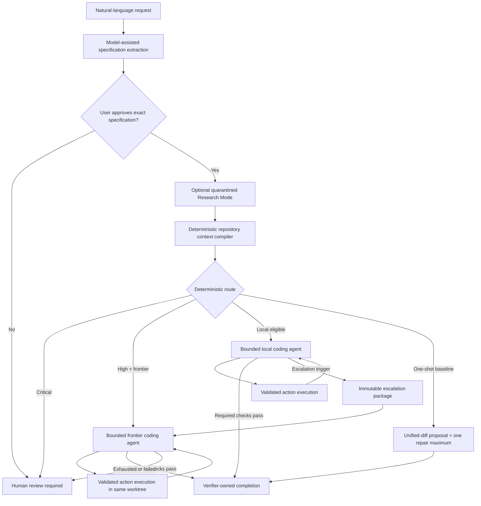

# Apoapsis Harness: Living Architecture and Project Handoff

This is the canonical, living handoff for Apoapsis Harness. Read it before changing
the project. Keep it synchronized with the implementation in the same change
that alters architecture, workflow behavior, configuration, safety policy,
audit artifacts, evaluation evidence, or current project status.

The ADRs in `docs/adr/` are the immutable decision history. This document is
the current system map. `README.md` is the user-facing guide. When they differ,
the implementation and tests are the operational truth, and the documentation
must be corrected before the change is considered complete.

The owner-oriented, plain-English explanation is
`docs/architecture-explained.md`; it explains the system and held-out oracle
without replacing this canonical coding-agent handoff.

## Snapshot

| Item | Current value |
| --- | --- |
| Last verified | 2026-07-20 |
| Working-tree version | `1.0` plus ADR 0013 Windows local-model lifecycle, ADR 0014 first local operator-interface slice, ADR 0015 verification layers and acceptance coverage, ADR 0016's corrective follow-up, ADR 0017's worktree-fingerprint/explicit-acceptance-designation hardening, the opt-in `local-strict` evaluation lane with its first live result, ADR 0018's acceptance-failure-evidence/bounded-specification-correction fixes, ADR 0019's Architect Mode planning foundation plus its Plans UI surface, ADR 0020's deterministic human-review-and-resume CLI and UI, ADR 0021's review/resume integrity hardening, ADR 0022's explicit human-authorized fresh frontier stage, ADR 0023's durable new-task intake (CLI/service seam and New Task UI screen), ADR 0024's durable post-approval task execution (CLI/service seam and control-room UI), ADR 0025's shared operation-lease and recovery-integrity hardening across all three operation ledgers, ADR 0026's immutable execution authorization and truthful live UI, ADR 0027's approved-plan to single-slice execution (CLI/service seam plus the Plans UI slice experience, Commit D3b), ADR 0028's planning comparison framework (Commit D4a) plus its Commit D4b live evaluation (0/6 completions, a consistent model-logic failure -- see Snapshot), ADR 0029's D4c diagnostic-probe infrastructure (a forensic diagnosis of the D4b read-loop plus evaluation-only single-slice prompt-condition/alternate-model probe infrastructure) plus its two completed live observations (a `progress_advisory` probe and an unmodified-production control, both `COMPLETE` on `SLICE-JOBS-001` -- see Snapshot), the D5a Docker-sandbox diagnostic-readiness pass (ADR 0009 amendment), and ADR 0030's D5b hosted-frontier spend ceiling (required, enforced before and after every hosted call; no live hosted call made) |
| Checked-out branch | `main` |
| Repository state | The 1.0/lifecycle baseline, the ADR 0014 UI slice, the ADR 0015 acceptance-coverage milestone, the ADR 0016 correction, the ADR 0017 hardening, the `local-strict` lane, the ADR 0018 fixes, ADR 0019's Architect Mode foundation (CLI + Plans UI), ADR 0020's review/resume CLI and UI, ADR 0021's hardening, ADR 0022's `authorize_frontier_stage` action, ADR 0023's `apoapsis intake` seam, ADR 0024's `apoapsis execute` seam and control-room UI, ADR 0025's lease/recovery hardening, ADR 0026's execution-authorization hardening, ADR 0027's `apoapsis plan slice` seam plus its Plans UI slice experience (Commit D3b), ADR 0028's `apoapsis eval-planning` seam and `download-service-v2` fixture (Commit D4a), ADR 0029's `apoapsis eval-planning-probe` seam (D4c), the D5a Docker-sandbox diagnostic-readiness pass (ADR 0009 amendment), and ADR 0030's hosted-frontier spend ceiling (D5b) are all committed on `main`; live evaluation evidence is committed separately. `DESIGN.md` is preserved as a separate, committed user-supplied design reference. Run `git status` and `git log -1 --oneline` for the exact current state. |
| Preserved substrate tag | `substrate-v0.1` at `4c2e735` |
| Full deterministic suite | 601 tests, 0 failures, 0 errors, 10 intentional skips (2 live-network, 5 live-Docker gated on `APOAPSIS_RUN_LIVE_DOCKER_TESTS=1`, 3 machine currently lacks the Windows privilege to create symlinks) -- includes 28 tests for ADR 0029's D4c diagnostic-probe infrastructure, 12 tests from the D5a Docker-sandbox diagnostic-readiness pass (ADR 0009 amendment), and 25 new tests from the D5b hosted-spend-ceiling readiness pass (ADR 0030), all deterministic fake-provider/fake-process/pure-function coverage, distinct from the two live local observations below and from the still-unrun live-Docker/live-hosted gates |
| Syntax check | `python -m compileall -q src tests` passed |
| Diff check | `git diff --check` passed; Git reported only expected LF-to-CRLF working-copy warnings |
| Live local coding result | Qwen3-Coder-Next Q4 completed the controlled download-service task in 10 turns and 3 verification runs |
| Live STRICT evaluation result (round 1, 2026-07-18) | Three fresh `--lane local-strict` attempts (Qwen3-Coder-Next Q4, 64k): 0/3 `COMPLETE` (2 `HUMAN_REVIEW_REQUIRED`, 1 specification-extraction failure). Both attempts that reached the mechanism genuinely proposed correct acceptance-catalog mappings, but a harness gap (a failing `acceptance = true`, `required = false` command produced no failure evidence or accurate summary) prevented a fair repair attempt. See `docs/evaluation/apoapsis-strict-live-evaluation-2026-07-18.md`. |
| Live STRICT evaluation result (round 2, 2026-07-19, after ADR 0018) | Three more fresh attempts, identical conditions: **1/3 reached `COMPLETE`, and the held-out oracle independently confirmed it correct** -- the first genuine true success across both rounds (6 attempts total). The other two attempts both received accurate failure evidence and made real further edits (a materially different, more diagnosable failure mode than round 1), but ran out of their 12-turn budget before finishing. 0/3 specification failures this round (too small a sample to call a reliability change). See `docs/evaluation/apoapsis-strict-live-evaluation-2026-07-19.md`. |
| Local model lifecycle result | `STOP_APOAPSIS.cmd` ran successfully against this machine's real Ollama service and explicitly unloaded both configured model names while leaving the service running. Start/warmup is covered against a fake loopback Ollama server, and was also live-run for the STRICT evaluation above. |
| Local UI result | `apoapsis ui` was exercised against the real checkout and a disposable initialized repository at 1440px and 1100px. Home/models/specification/control views rendered without browser errors; a two-step UI approval advanced `SPEC_DRAFTED -> SPEC_APPROVED` and appended the expected user event. No model call was made. |
| Live New Task intake result | The New Task screen (`#/new`) was exercised end to end against a disposable initialized repository and a real local Ollama model: a typed natural-language request reached `SPEC_DRAFTED` via one real extraction call (no correction needed), and the two-step approval on the linked task page advanced it to `SPEC_APPROVED` -- confirmed via `apoapsis inspect`'s event log (`task_created -> specification_updated -> intake_specification_drafted -> specification_approved`). A real bug (`INTAKE_OPERATION_STAGE` referenced before being defined) was caught by this live check, not by the deterministic suite, and fixed before commit. |
| Live control-room execution result | The control room (`#/task/<id>/control`) was exercised end to end against a disposable initialized repository and a real local Ollama model: "Start coding" showed a real, accurate preview (predicted route, real configured local model, real budgets/policy/sandbox/verification commands), submitted a real execution operation, and the task genuinely ran through routing/worktree/bounded-agent stages to a real `HUMAN_REVIEW_REQUIRED` stop with an accurate error message. The new "Open the Human Review case" link was clicked and correctly opened the full, real review case detail view. This live check found and fixed a second real, pre-existing bug: two unrelated `app.js` functions were both named `reviewView` (JavaScript's last-declaration-wins semantics meant the top-level `#/review/<task-id>` route always executed the wrong one and crashed on `detail.task`), invisible to every existing test because none execute `app.js`. Fixed by renaming the task-page sub-tab placeholder to `taskReviewTabView(detail)`. |
| Live hosted escalation result | Not yet run. A repeatable harness (`apoapsis eval download-service --lane forced-escalation` / `--lane hybrid`) now exists to run it once real `[models.frontier_coder]` credentials are configured; the complete two-provider path is otherwise still only covered with fake providers. D5b (2026-07-20, ADR 0030) added a required `--max-hosted-spend-usd` aggregate ceiling, enforced both before any call (a pessimistic worst-case estimate) and after every call (the real recorded cost) -- a hosted lane now refuses outright without it, and refuses before any lane starts if the run's own configured worst-case allowance already exceeds it. Readiness/infrastructure only, built and tested exclusively against fake providers; no live hosted call has been made. |
| Live Plans UI slice-experience result | Exercised end to end against a disposable initialized repository with a real approved plan (one CLI-created and CLI-approved plan, no model call needed for the plan itself): Plans list -> plan detail (live slice status rendered) -> Implementation Slices tab -> Inspect -> "Package this slice" (immutable preview rendered, real inherited constraint shown) -> two-step Approve (intent, then confirm) -> derived-task links rendered -> the existing, unmodified control room correctly showed the slice-derived task at `SPEC_APPROVED` with its real approval history and its normal "Start coding" action present and untouched. No JavaScript errors observed. |
| Live planning-comparison result (D4b, 2026-07-20) | Three monolithic and three planned live attempts against `qwen3-coder-next:q4_K_M`, using a plan produced in a genuinely separate session (Gemini 3.1 Pro) and independently corrected once before approval (a missing hard-constraint representation and missing acceptance-criterion links, caught by deterministic validation and this milestone's own STRICT-policy design, respectively). **0/6 completions.** All six attempts stopped at `HUMAN_REVIEW_REQUIRED` after exhausting a 12-turn budget having called a verification command zero times -- a repeatable model-logic failure (one edit, then a `read_file` loop), not a harness, specification, or oracle defect; every mechanical part of the framework (budget accounting, escalation classification, dependency gating, oracle withholding) behaved correctly. No completion-rate or Architect Mode advantage claim is supported by this round; see `docs/evaluation/apoapsis-planning-comparison-2026-07-20.md` for full detail and next steps. |
| D4c forensic diagnosis and diagnostic-probe infrastructure (ADR 0029, 2026-07-19) | A read-only forensic pass over all six preserved D4b turn/call artifacts found the read loop is a byte-for-byte identical repeated `read_file` action after the one accepted edit, present in 6/6 attempts, but **absent from every other preserved live Qwen3-Coder-Next Q4 session** (ten sessions across `local-strict-*`, `smoke-local`, `priority-a-64k*`/`128k*`) -- the model reliably calls verification elsewhere, so this is fixture/prompt-specific, not a general capability gap. Two independent, non-causal issues were found and deliberately deferred (not fixed in this change): `search_repository` fails with a raw `[WinError 2]` (missing fallback when `rg` cannot be resolved by `CreateProcess`, unlike the context compiler's own lexical fallback) and a turn's evidence can show an unlabeled stale pre-edit copy of a file alongside the fresh post-edit one (confirmed present in a prior successful session too, so not the loop's cause) -- **both remain unresolved**, not addressed by this change or by the live probes below. Built evaluation-only infrastructure to isolate the cause with a single independent variable at a time: an advisory (never action-forcing) prompt variant, and a fail-closed (explicitly authorized, actually installed, *and* genuinely different from the project's own configured model) alternate-model substitution -- both scoped to `apoapsis eval-planning-probe` (no `--context-profile`, so it cannot introduce a second unrecorded variable), with a dedicated, pure `validate_single_independent_variable()` check (enforced both by the orchestration function itself and independently by the CLI) rejecting any request that would vary both the prompt and the model at once, and touching product code only via two additive, default-`None`/default-production-function constructor parameters proven inert by regression test when omitted. See ADR 0029 and `docs/evaluation/apoapsis-d4c-forensic-diagnosis-2026-07-19.md`. |
| D4c live evidence (2026-07-20, `SLICE-JOBS-001`, `qwen3-coder-next:q4_K_M`) | Two of the D4c probes above were run once each against the exact same slice D4b exercised. **Progress-advisory probe** (`progress_advisory`): 8 turns, one `v2-jobs-tests` run (passed), `AC-JOBS-STATE` proven, `COMPLETE`; 53,039 input / 876 output / 0 cached tokens, 151.4s. **Unmodified-production control** (`production`, same configured model and slice, run through this same probe infrastructure): 5 turns, one `v2-jobs-tests` run (passed), `COMPLETE`; 31,965 input / 803 output / 0 cached tokens, 109.4s. Both escaped D4b's read loop, edited, invoked verification, passed, and reached real `COMPLETE`. **The production control succeeded without the advisory prompt and in fewer turns** -- these two observations give no basis for changing the production prompt (`_AGENT_STEP_STATIC_PREFIX` untouched) or for attributing either success to the advisory note. They do show this model can solve and verify this slice: D4b's read loop is not a hard capability limitation. The contrast with D4b's 0/6 remains unexplained -- run-to-run or setup sensitivity is itself unmeasured. Covers only `SLICE-JOBS-001`, not the full three-slice plan or the held-out cross-slice oracle; no completion rate, reliability rate, or planning advantage is claimed. Probe 3 (alternate model) was not run. See ADR 0029's and `docs/evaluation/apoapsis-d4c-forensic-diagnosis-2026-07-19.md`'s live-evidence addenda. |

Update this table whenever its claims change. Never describe an uncommitted
version as a committed release. Never claim that a provider path was proven
live when only fake-provider coverage exists.

## Product thesis and end goal

Apoapsis is a local-first, auditable control plane for verified AI coding. It should
make smaller or local models useful by giving them bounded opportunities to
inspect, edit, test, and iterate, while reserving a stronger frontier model for
deterministically authorized escalation. Models remain untrusted patch
proposers. Apoapsis—not a model—owns state transitions, context selection, constraint
coverage, tool execution, patch safety, retry budgets, verification, audit
recording, and completion.

The intended user experience is one command:

```bash
apoapsis run "Add resumable downloads without changing the public API"
```

Apoapsis extracts a structured specification, asks the user to approve it, retrieves
reproducible repository context, routes the task, runs the selected bounded
coding stage or stages in an isolated Git worktree, verifies all required
commands, and writes a complete usage and audit report.

## Non-negotiable authority boundary

| Decision or capability | Authority |
| --- | --- |
| Interpret natural language into a candidate specification | Model may propose; Pydantic validation and the user approve |
| Preserve active hard constraints | Deterministic schema validation; exact source text is retained |
| Select repository context | Deterministic context compiler |
| Choose local/frontier/human route | Deterministic risk and configuration rules |
| Request an agent action | Model may propose one typed action |
| Read/search/edit/run checks | Apoapsis validates and executes the action |
| Apply a patch | Unified-diff parser, policy validator, and Git applier |
| Decide whether tests passed | Verification runner |
| Retry or escalate | Fixed configuration and controller rules |
| Mark a task complete | Verification engine after all required checks pass; under the strict completion policy (ADR 0015/0016, the default policy for `apoapsis init` projects, but never with an automatically acceptance-designated command -- ADR 0017), additionally only after every active acceptance criterion is deterministically computed as Proven from configured, user-approved acceptance-designated commands that actually passed **for the current shared worktree fingerprint** (tracked and untracked files, ADR 0017) -- a model may propose a criterion's mapping only from the harness-published acceptance-command catalog at specification time, but only the harness computes and grants Proven/Failed/Unproven status, and a stale, earlier-fingerprint pass never counts |
| Record evidence and usage | Deterministic audit and reporting layers |
| Decompose a large idea into implementation slices (Architect Mode, ADR 0019) | An external model may only propose an `ArchitecturePlan` via manual export/import; it has no status/approval/execution field, cannot invent a verification-command name or escape the repository in a suggested path, and cannot mark itself validated, approved, or executed -- only `SQLitePlanStore`'s deterministic, optimistic-versioned transitions do that, and approval never executes a slice |
| Resume a task from HUMAN_REVIEW_REQUIRED (ADR 0020) | A model may only propose search/read/patch/verify actions inside a resumed, harness-bounded agent turn exactly as before; it cannot choose which action is eligible, expand its own budget, pick a workflow transition, or claim completion -- `review.execution.execute_review_action()` alone checks eligibility/version/fingerprint/ceilings and owns every resulting transition |

No provider adapter may bypass this boundary. A larger or hosted model receives
more capability only through a separately configured budget and context package;
it does not receive shell, Git, filesystem, network, workflow, or completion
authority.

## End-to-end architecture



### Primary execution sequence

1. `VerticalSliceRunner` creates a task record in SQLite and a per-task audit
   directory.
2. The configured backwards-compatible `models.frontier` provider drafts the
   `TaskSpecification`. Every extracted hard constraint must retain an exact,
   case-sensitive source substring from the user's request.
3. Apoapsis writes the candidate specification and waits for explicit approval unless
   `--yes` was supplied for controlled automation.
4. Optional Research Mode runs after approval and before coding context is
   compiled. Only a compact brief and evidence IDs can enter coding context.
5. The context compiler analyzes the repository at a recorded commit and writes
   provenance-bearing evidence.
6. Agent mode selects a route. A route that requires human review stops before
   creating a worktree. Otherwise Apoapsis creates `.apoapsis/worktrees/<task-id>` on a
   dedicated `apoapsis/<task-id>` branch.
7. The local or frontier agent proposes exactly one typed action per turn. Apoapsis
   validates and executes it, then returns a bounded observation in the next
   immutable request package.
8. Every edit passes the same diff parser, policy checks, and `git apply --check`
   process. The model never writes directly.
9. Required configured verification commands decide success. A model message
   saying it is finished has no effect.
10. If the local stage stops and the selected route permits it, Apoapsis writes the
    escalation package before the first frontier coding call. The frontier stage
    continues in the same worktree with independent budgets.
11. A frontier stop, failure, or exhausted budget requires human review. There
    is no recursive escalation.
12. Apoapsis writes `report.json` with outcome, calls, tokens, cached tokens, estimated
    cost, latency, transmitted files/lines, changed files, verification results,
    and artifact locations.

### Retained one-shot baseline

`execution.mode = "one_shot"` preserves the original controlled comparison. It
requests only a unified diff, validates and applies it, runs verification, and
permits one targeted repair. A rejected first patch consumes that repair budget.
This path is useful as an evaluation baseline, not the preferred local-model
architecture.

## Component map

### CLI and configuration

- `src/apoapsis/cli/app.py` owns `apoapsis init`, `ui`, `run`, `task`, `approve`, `inspect`,
  `worktree-create`, `verify`, `rollback`, and Research Mode commands.
- `src/apoapsis/config.py` is the strict TOML schema and cross-provider validation.
- `.apoapsis/config.toml` is generated per target repository; `.apoapsis/apoapsis.db` stores
  task state and workflow events.
- The distribution is `apoapsis-harness`, the import package and CLI are
  `apoapsis`, product environment variables use `APOAPSIS_`, and managed task
  branches use `apoapsis/`. No pre-release compatibility alias is provided.
- Legacy `.sol/` audit data remains ignored and excluded from every model,
  patch, context, and research surface. It is immutable history, not active
  Apoapsis state, and is not rewritten during the namespace migration.
- Context profiles `16k`, `32k`, `64k`, `128k`, and `256k` jointly change the native Ollama
  context window and deterministic evidence budget. They do not alter Research
  Mode's separate context budget.

### Local operator interface

- `src/apoapsis/ui/application.py` is the deterministic application boundary.
  It exposes repository/configuration/task/event/report/evaluation/lifecycle/
  plan/review facts and typed mutations: optimistic specification approval,
  optimistic plan approval, and human-review operation submission -- all
  through their respective existing stores. The service itself never calls
  a provider, shell command, patch application, verification runner, or
  arbitrary filesystem API directly; `submit_review_operation()` validates
  and durably records an operation, then hands it to `ReviewWorker`
  (`review/worker.py`), a background thread that performs the actual work
  outside any request.
- `src/apoapsis/ui/server.py` serves packaged offline assets on loopback for
  `apoapsis ui`. Each run generates an ephemeral session capability; API calls
  require it, foreign origins are rejected, CORS is disabled, and responses use
  CSP, no-referrer, no-frame, and no-sniff headers. See ADR 0014. `GET /api/
  plans`, `GET /api/plans/<id>`, `POST /api/plans/<id>/approve` (ADR 0019
  Commit B2), `GET /api/reviews`, `GET /api/reviews/<id>`,
  `POST /api/reviews/<id>/operations`, and
  `GET /api/reviews/<id>/operations/<operation-id>` (ADR 0020 Commit C2) all
  sit behind the exact same checks as every other route.
- `src/apoapsis/ui/static/` implements the accepted black/orange/purple product
  language for Home, specification, control, changes/verification, review,
  report, evaluations, models/environment, Plans (index + overview/slices
  detail), and Human Review (queue + case detail) states. All displayed task,
  model, plan, and review values come from Apoapsis services; the Claude
  prototype runtime and illustrative model names are not shipped.
- Read-only task/report/plan/review views, deterministic specification/plan
  approval, deterministic human-review continuation (abandon, retry
  verification, continue locally/with frontier), durable natural-language
  new-task intake (New Task screen, ADR 0023), and durable post-approval task
  execution with a two-step, immutably-authorized "Start coding" confirmation
  and live running progress (control room, ADR 0024, hardened by ADR 0026)
  are all live -- a user can go from a typed request to a completed or
  Human-Review-stopped task entirely from the browser. Plan-slice execution
  and native desktop packaging remain unavailable until their resumable
  service and authority contracts are implemented.

### Owner model lifecycle

- `START_APOAPSIS.cmd` and `STOP_APOAPSIS.cmd` are the obvious Windows owner
  entrypoints; both invoke `src/apoapsis/operator_lifecycle.py` from this checkout.
- Targets are derived from the known `.apoapsis/config.toml` model roles, filtered
  to `provider = "ollama"`, loopback-validated again, and deduplicated by endpoint
  and model. Hosted endpoints are never contacted.
- Start checks installation, may launch only the default local `ollama serve`
  endpoint when it is unavailable, and warms coding models for 30 minutes at the
  configured context window. Research-only models require `--include-research`;
  models are never pulled automatically.
- Stop sends `keep_alive = 0` to every configured installed Ollama model, including
  research. It leaves the shared Ollama service running and never stops Docker,
  tasks, or worktrees. The last result is atomically recorded in the ignored
  `.apoapsis/runtime/` directory. See ADR 0013.

### Specification and constraints

- `src/apoapsis/specification/schema.py` defines strict traceable task, acceptance,
  risk, and hard-constraint records.
- `src/apoapsis/specification/extractor.py` builds and validates model-assisted
  extraction. If the first response fails schema/Pydantic/verbatim/catalog
  validation, `VerticalSliceRunner.run()` makes exactly one bounded
  correction call (`build_correction_prompt()`, ADR 0018) containing the
  exact validation errors, the model's own prior response, and the same
  schema/catalog/rules as the original prompt. If the correction also
  fails, the task stops deterministically at `FAILED` -- never a second
  correction, never coerced/nulled fields, never weakened validation.
- `src/apoapsis/models/base.py` rejects model requests that omit a disposition for
  any active hard constraint.
- Constraint wording, interpreted meaning, source, scope, status, verification
  method, and supersession are distinct fields. Do not collapse them.

### Workflow persistence

- `src/apoapsis/workflow/states.py` is the source of truth for allowed transitions.
- `src/apoapsis/workflow/engine.py` persists tasks and append-only events in SQLite
  using atomic transactions and optimistic version checks.
- The normal spine is `INTAKE -> SPEC_DRAFTED -> SPEC_APPROVED ->
  REPOSITORY_ANALYZED -> CONTEXT_COMPILED -> ROUTED -> IMPLEMENTING ->
  PATCH_READY -> VERIFYING -> COMPLETE`.
- Controlled branches include `LOCAL_REPAIR`, `ESCALATION_REQUIRED`,
  `HUMAN_REVIEW_REQUIRED`, `FAILED`, and `ROLLED_BACK`.
- Providers never call the transition API.

### Architect Mode planning foundation (ADR 0019)

- `src/apoapsis/architect/schema.py` defines `ArchitecturePlan`,
  `ArchitectureDecision`, `ImplementationSlice`, `PlannerRequestPackage`,
  `PlannerResponseEnvelope`, `PlanValidationResult`, `PlanEvent`, and
  versioned `PlanRecord`/`PlanStatus`. `ArchitecturePlan` has no status,
  approval, or execution field of any kind (`extra="forbid"` rejects any
  attempt to smuggle one in).
- `src/apoapsis/architect/validation.py`'s `validate_plan()` is the sole
  deterministic authority on plan well-formedness (unique IDs, no
  dependency cycles/missing dependencies, no unknown constraint/criterion
  references, no invented verification-command names, every active hard
  constraint represented, every slice has executable verification intent,
  configurable ceilings, non-escaping repository-relative paths). It
  returns findings rather than raising, so an invalid plan is still stored
  and inspectable.
- `src/apoapsis/architect/package.py` builds a reproducible
  `PlannerRequestPackage` for a free-text idea, reusing
  `ContextCompiler`/`ContextPackage`/`GitRepository` exactly rather than a
  parallel evidence format, plus the configured verification catalog,
  documentation references, the plan JSON schema, and fixed authority
  rules.
- `src/apoapsis/architect/store.py`'s `SQLitePlanStore` mirrors
  `workflow.engine.SQLiteTaskStore`'s optimistic-versioning discipline
  exactly, in its own `.apoapsis/architect-plans.db`. Revisions bump the
  version and reset to `PROPOSED` rather than overwriting an approved
  plan's immutable snapshot.
- `src/apoapsis/architect/audit.py` and `src/apoapsis/architect/importer.py`
  provide the same atomic-write audit discipline as `audit.store
  .TaskAuditStore`, and reject an imported planner response whose
  `request_package_sha256` does not match the stored request package
  exactly.
- CLI: `apoapsis plan export/import/validate/inspect/approve`
  (`src/apoapsis/cli/app.py`). Manual, subscription-friendly workflow: no
  API credentials, no hosted-provider adapter added.
- A read-only Plans surface on the local UI (Commit B2, ADR 0014 boundary):
  Plans index, plan detail (overview: idea, architecture summary, decisions,
  validation findings, package/provenance; slices: dependency-ordered slice
  cards), and a deterministic approve action. See "Local operator interface"
  above.
- Does not execute any slice, and does not change `workflow/`, `agent/`, or
  `vertical_slice.py` in any way.

### Deterministic human review and resume (ADR 0020)

- `src/apoapsis/review/schema.py`, `classify.py`, `case.py` define
  `ReviewCase` -- a deterministic projection (never a model's claim) of a
  task currently at `HUMAN_REVIEW_REQUIRED`: exact stop reason (one of five
  known scenarios or `UNKNOWN`, fail-closed), current diff/worktree
  fingerprint/repository HEAD (recomputed fresh every time), consumed vs.
  configured local/frontier budgets, and the harness-computed
  `eligible_actions` (`inspect_only`, `abandon`, `verification_only_retry`,
  `local_continuation`, `frontier_continuation`,
  `authorize_frontier_stage`). `frontier_available`/`frontier_model` are
  always computed against the *current* config, never cached from the
  original stop.
- `src/apoapsis/agent/session.py`'s `BoundedAgentSession.resume()` seeds a
  session's turns/observations/verification state from a prior
  `AgentSessionResult` so a continuation adds turns without ever resetting
  what was already consumed.
- `src/apoapsis/review/execution.py` splits validation from execution:
  `prepare_review_operation()` is fast and synchronous (checks optimistic
  task version, eligible action, worktree-fingerprint match, and
  continuation ceilings via the shared `_validate_operation_preconditions`,
  then durably records the operation, including
  `expected_worktree_fingerprint`) and is safe to call from an HTTP
  handler; `run_review_operation()` takes only an `operation_id`, marks it
  `RUNNING` before anything else (including provider construction), then
  freshly re-projects a `ReviewCase` and re-runs the *same* precondition
  check against the operation's own recorded expectations immediately
  before dispatching to any action handler (ADR 0021) -- never trusting
  state computed at submission time. `execute_review_action()` composes
  both for synchronous callers (the CLI). Every continuation writes an
  immutable `ReviewContinuationPackage` (`review/package.py`) before any
  resumed model call, and drives the same `IMPLEMENTING -> PATCH_READY ->
  VERIFYING -> COMPLETE` / `... -> ESCALATION_REQUIRED ->
  HUMAN_REVIEW_REQUIRED` edges the original run used -- no changes to
  `workflow/states.py` were needed; every edge already existed. `abandon`
  transitions to `ROLLED_BACK` (version-checked) *before* any destructive
  worktree cleanup, never after.
- `src/apoapsis/review/store.py`'s `ReviewOperationStore` is a small SQLite
  idempotency ledger (`.apoapsis/review-operations.db`): a caller-supplied
  `operation_id` can never be submitted twice for a *terminal* operation
  (`DuplicateOperationError`), only one `RECORDED`/`RUNNING` operation may
  exist per task at a time (`ActiveOperationExistsError`, checked
  atomically inside the same transaction as the insert), and an operation
  stuck `RUNNING` can never be silently re-entered
  (`OperationAlreadyRunningError`) -- only explicit recovery ever moves it
  forward, into the terminal `AMBIGUOUS` status.
- `src/apoapsis/review/recovery.py`'s `recover_stale_operations()` (ADR
  0021) is the explicit crash-recovery path: reclaims `RECORDED` operations
  (nothing was ever transmitted for them), marks `RUNNING` operations
  stale beyond a configurable expiry as `AMBIGUOUS` (terminal, inspectable,
  never auto-repeated), and returns a task stranded outside
  `HUMAN_REVIEW_REQUIRED` back to it via a `review_operation_recovery_
  requires_human` event that makes no claim about the interrupted call's
  outcome. Runs automatically at `ReviewWorker` startup and explicitly via
  `apoapsis review recover`.
- `src/apoapsis/review/worker.py`'s `ReviewWorker` (Commit C2, simplified by
  ADR 0021) runs `run_review_operation(operation_id=...)` on a background
  thread, owned by `ApoapsisUIService`, never inside an HTTP request
  handler -- its queue carries only the `operation_id`. Submission via
  `ApoapsisUIService.submit_review_operation()` validates and records the
  operation synchronously, then hands the id to the worker and returns
  immediately (`202 Accepted`) -- a browser disconnect after that point
  cannot cancel, duplicate, or repeat it.
- `src/apoapsis/review/execution.py`'s `_execute_authorize_frontier_stage`
  (ADR 0022) is a distinct action, `AUTHORIZE_FRONTIER_STAGE` -- separate
  from `FRONTIER_CONTINUATION`, which only ever resumes a frontier session
  that already exists. It starts a *fresh* frontier stage using the full,
  unmodified `config.execution.frontier_agent` budget (no
  `additional_turns` input), built via `workflow/escalation.py`'s
  `build_local_to_frontier_escalation()` -- the exact same function the
  automatic in-process local-to-frontier escalation path
  (`VerticalSliceRunner._run_frontier_escalation`) now also calls, so both
  paths build byte-identical packages. Only offered while
  `frontier_available` and no `frontier-agent-session.json` exists yet for
  the task (`ReviewCase.frontier_stage_exists`); once one exists, only
  `FRONTIER_CONTINUATION` is offered from then on. The package is written
  to `review-frontier-stage-<operation_id>.json` before the first frontier
  call.
- CLI: `apoapsis review list/inspect/abandon/retry-verification/
  continue-local/continue-frontier/authorize-frontier-stage/recover`
  (`src/apoapsis/cli/app.py`); `authorize-frontier-stage` takes
  `--expected-version`/`--expected-fingerprint`/`--operation-id` only -- no
  turns/budget flag, since a fresh stage always uses the full configured
  budget.
- UI (Commit C2): a Human Review queue (`#/reviews`) and case-detail view
  (`#/review/<task-id>`) on the existing ADR 0014 boundary --
  `GET /api/reviews`, `GET /api/reviews/<id>`,
  `POST /api/reviews/<id>/operations`, and
  `GET /api/reviews/<id>/operations/<operation-id>` for polling. Every
  mutating action requires two-step confirmation; continuation actions
  additionally take an authorized `additional_turns` value.
  `authorize_frontier_stage`'s confirmation panel displays the exact
  configured frontier model and turn/patch/verification-run ceiling (fresh,
  never cached) before the user can confirm; the browser persists the
  in-flight `operation_id` in `sessionStorage` and resumes polling it on
  reconnect rather than re-submitting.
- `ReviewCase.current_diff` (`review/case.py`) is built from the shared
  `RepositoryInspector.diff()` machinery, so permitted untracked text files
  and binary/symlink path-only placeholders appear exactly as they do to
  the bounded agent loop (ADR 0017) -- not a plain `git diff`. Verification
  results/acceptance coverage prefer the freshest evidence a retry or
  continuation actually produced over the original, never-updated
  `report.json` snapshot, chosen by the same newest-event classification
  `stop_reason_kind` uses.
- A continuation always resumes the exact agent session (local or frontier)
  that already exists for the task; it never launches a fresh frontier
  session from a local-only stop. Does not change one-shot mode's own
  execution path.

### Durable model-assisted new-task intake (ADR 0023)

- `src/apoapsis/intake/` is a small package structurally mirroring
  `review/` exactly, reusing the same crash-safety discipline ADR
  0020/0021 already proved out rather than inventing a second one.
  `intake/schema.py`'s `IntakeOperationRecord` carries a caller-supplied
  `operation_id`, a deterministically allocated `task_id` (the same
  `TASK-<hex>` convention every other task-creation path uses), the
  exact, verbatim request text, its sha256 hash, the task version
  observed at creation, the provider role, and `IntakeOperationStatus`
  (`recorded`/`running`/`pending_specification_approval`/`failed`/
  `ambiguous`).
- `src/apoapsis/intake/store.py`'s `IntakeOperationStore` is the same
  SQLite idempotency ledger shape as `ReviewOperationStore`
  (`.apoapsis/intake-operations.db`): a resubmitted `operation_id` is
  rejected once terminal, only one `RECORDED`/`RUNNING` operation may
  exist per task, and a stuck `RUNNING` operation is never silently
  re-entered.
- `src/apoapsis/intake/execution.py`'s `prepare_intake_operation()`
  allocates the task id, creates the task row at `INTAKE` with the exact
  request text as its preliminary objective, and durably records the
  operation -- all synchronous, fast, and safe to call from an HTTP
  handler, before any model call. `run_intake_operation()` takes only
  `operation_id`, marks it `RUNNING` before provider construction, freshly
  rechecks the task's identity/state/version, then calls the *unmodified*
  `SpecificationExtractor` (the same class, same catalog, same
  exact-verbatim-substring and acceptance-catalog checks `apoapsis run`
  uses) with the same one-bounded-correction-attempt contract as ADR
  0018. A double failure stops deterministically at `FAILED` (returned
  normally, not raised); any other exception marks the operation `FAILED`
  and re-raises. On success it calls the same
  `SQLiteTaskStore.update_specification()`/`transition()` methods
  `VerticalSliceRunner.run()` calls, reaching `SPEC_DRAFTED` through the
  pre-existing edge -- `workflow/states.py` did not change.
  `execute_intake_operation()` composes both for synchronous callers (the
  CLI).
- `src/apoapsis/intake/recovery.py`'s `recover_stale_intake_operations()`
  mirrors `review.recovery.recover_stale_operations()`: reclaims
  `RECORDED` operations, marks stale `RUNNING` ones `AMBIGUOUS`, and --
  only if the task is still stuck at `INTAKE` -- returns it to
  `HUMAN_REVIEW_REQUIRED` via a new, unrecognized-by-`review.classify`
  event type, so an operator can inspect and `apoapsis review abandon` a
  stranded intake task through the existing, completely unmodified review
  machinery (a genuine reuse: `build_review_case` already handles a task
  with no worktree, the same shape `specification_not_approved` stops
  already have).
- `src/apoapsis/intake/worker.py`'s `IntakeWorker` mirrors
  `review.worker.ReviewWorker`: a background thread whose queue carries
  only an `operation_id`, running one recovery pass at startup.
- CLI: `apoapsis intake submit "<request>" --operation-id ID` (synchronous;
  runs `execute_intake_operation()` in the foreground, exactly like
  `apoapsis run`/`review continue-local` already do), `apoapsis intake
  inspect <operation-id>`, `apoapsis intake recover` -- a full CLI/service
  seam that creates, inspects, and recovers intake operations without
  requiring `apoapsis ui`.
- **Does not execute the approved task.** Approval still only reaches
  `SPEC_APPROVED` through the exact same, unmodified `apoapsis approve` /
  `ApoapsisUIService.approve_specification()` transition every other
  task-creation path already uses. New-task execution orchestration
  remains the next, separately reviewed milestone.
- **UI (Commit D1b):** `ApoapsisUIService.submit_intake_operation()` /
  `intake_operation_status()` mirror the review-operation service methods
  exactly -- submission validates and durably records via `prepare_intake
  _operation()`, then hands the id to a lazily-constructed `IntakeWorker`
  (mirroring `_worker()`/`ReviewWorker`) and returns immediately; the
  service itself never calls a model. `POST /api/intake/operations` /
  `GET /api/intake/operations/<operation-id>` sit behind the same
  session/origin checks as every other route (`ui/server.py`). The New
  Task screen (`#/new`, `src/apoapsis/ui/static/app.js`) replaces the
  prior disabled placeholder: a natural-language request form submits and
  persists `sessionStorage`-backed polling (mirroring the review
  operation's reconnect pattern) through `recorded`/`running` to either
  `pending_specification_approval` or `failed`/`ambiguous`. Once drafted,
  it shows the operation's provider role, extraction-attempt count (derived
  from whether `specification-extraction-failure-001.json` appears in the
  operation's own `audit_artifact_locations`), and audit-artifact list,
  then links straight to the existing, completely unmodified task detail
  page (`#/task/<id>/spec`) for the full candidate review and two-step
  approval action -- no second approval implementation was added. Live-
  verified end to end against a real local Ollama model: a typed request
  reached `SPEC_DRAFTED` and was approved to `SPEC_APPROVED` through the
  browser, confirmed via `apoapsis inspect`'s event log.

### Durable post-approval task execution (ADR 0024)

- `src/apoapsis/workflow/vertical_slice.py`'s `VerticalSliceRunner.run()`
  is split at the `SPEC_APPROVED` boundary into a shared private
  continuation, `_run_from_approved(task_id, specification, *,
  approved_version)`, containing the entire post-approval spine (optional
  Research Mode, context compilation, deterministic routing, worktree
  creation, the selected coding stage with escalation, verification, and
  reporting) verbatim -- moved, not rewritten. `run()` now ends by calling
  it after drafting/approval; a new public method,
  `execute_approved_task(task_id: str) -> FinalTaskReport`, is the entry
  point the durable execution service uses: it loads an already-approved
  task from the store and calls the exact same continuation. No routing,
  context, worktree, agent, patch, verification, escalation, or reporting
  logic exists in two places, and the full existing test suite passes
  unchanged against the refactor, confirming `apoapsis run` and one-shot
  mode are byte-for-byte behavior-preserved.
- `src/apoapsis/execution/operation_schema.py`/`operation_store.py`
  define `ExecutionOperationRecord`/`ExecutionOperationStatus`
  (`recorded`/`running`/`succeeded`/`failed`/`ambiguous`) and
  `ExecutionOperationStore` (`.apoapsis/execution-operations.db`),
  structurally mirroring `ReviewOperationStore`/`IntakeOperationStore`
  exactly: a caller-supplied `operation_id` can never be resubmitted for
  an active or terminal operation, and only one `RECORDED`/`RUNNING`
  operation may exist per task at a time. `SUCCEEDED` means the operation
  itself reached *any* deterministic conclusion -- the task may have
  reached `COMPLETE`, `FAILED`, or `HUMAN_REVIEW_REQUIRED`, all legitimate
  outcomes read from the task record/`report.json`, not the operation
  status; only an operation-level exception (a crash, not a normal
  task-level stop) marks the operation `FAILED`, mirroring
  `review.execution`'s own `_execute_authorize_frontier_stage` convention.
- `src/apoapsis/execution/operation_service.py`'s
  `prepare_execution_operation()` requires the task to be at
  `SPEC_APPROVED` at exactly the caller-supplied `expected_version`,
  captures the current repository HEAD, and durably records the
  operation -- fast, synchronous, model-call-free, HTTP-handler-safe.
  `run_execution_operation()` takes only `operation_id`, marks it
  `RUNNING` before provider construction, then rechecks the task's
  state/version *and* the repository HEAD (catching a parent-repository
  commit landing between approval and a queued operation's actual start,
  before any worktree is created) before constructing a
  `VerticalSliceRunner` and calling `execute_approved_task()`.
  `execute_execution_operation()` composes both for synchronous callers
  (the CLI). Research Mode is explicitly not wired in yet (disclosed
  scope limit; `apoapsis run` remains the only Research Mode path).
- `src/apoapsis/execution/operation_recovery.py`'s
  `recover_stale_execution_operations()` mirrors review/intake recovery
  exactly. Critically, **it never touches the task's worktree** -- a
  stale `RUNNING` operation becomes `AMBIGUOUS` and, if the task is stuck
  anywhere between `SPEC_APPROVED` and a terminal state, is returned to
  `HUMAN_REVIEW_REQUIRED` (every intermediate state already has that
  edge) via a new `execution_operation_recovery_requires_human` event
  that `review.classify` doesn't recognize (correctly `UNKNOWN`,
  `inspect_only`/`abandon` only) -- an operator inspects and abandons a
  crashed execution through the existing, completely unmodified review
  machinery, with the worktree exactly as the crash left it.
- `src/apoapsis/execution/operation_worker.py`'s `ExecutionWorker`
  mirrors `ReviewWorker`/`IntakeWorker`: a background thread whose queue
  carries only an `operation_id`, running one recovery pass at startup.
- CLI: `apoapsis execute start <task-id> --expected-version N
  --operation-id ID` (synchronous; runs `execute_execution_operation()`
  in the foreground, exactly like `apoapsis run` already does),
  `apoapsis execute inspect <operation-id>`, `apoapsis execute recover` --
  a full CLI/service seam usable without `apoapsis ui`.
- **Does not automatically commit, merge, or clean up a successful
  worktree** -- unchanged from today's behavior. Does not add plan-slice
  execution (Phase D3, separately reviewed).
- **UI (Commit D2b):** `ApoapsisUIService.task_detail()` gained three
  read-only fields: `execution_preview` (route/models/budgets/completion-
  policy/sandbox, computed with the exact same `select_agent_route()` the
  real service uses), `active_execution_operation` (via `find_active_for
  _task()` -- the primary reconnect mechanism, needing no client-side
  storage), and `recent_agent_turns` (the last 20 turn records parsed
  directly from the `agent-turn-*.json`/`frontier-agent-turn-*.json`
  files the bounded agent already writes incrementally -- genuine live
  progress while an operation is still `RUNNING`). `_available_actions()`
  now returns `["start_execution"]` at `SPEC_APPROVED`.
  `submit_execution_operation()`/`execution_operation_status()` mirror
  the review/intake service methods exactly. `POST /api/tasks/<id>/
  execute` / `GET /api/execution/operations/<operation-id>` sit behind
  the same session/origin checks as every other route. The control room
  (`#/task/<id>/control`) adds a two-step "Start coding" confirmation
  showing the full preview, background submission with automatic
  reconnect, a live tool-action feed, a usage/telemetry panel once a
  report exists, and a direct link into the existing, unmodified Human
  Review case detail view when a task stops there. Live-verified in a
  real browser against a real local Ollama model. This verification also
  found and fixed a genuine, pre-existing bug: two unrelated functions in
  `app.js` were both named `reviewView` (JavaScript's last-declaration-
  wins semantics meant the top-level `#/review/<task-id>` route always
  executed the wrong one and crashed) -- invisible to every existing test
  because none of them execute `app.js`. Fixed by renaming the task-page
  sub-tab placeholder to `taskReviewTabView(detail)`.

### Operation lease and recovery integrity (ADR 0025)

- `src/apoapsis/operations/lease.py` is new, deliberately shared code (the
  one intentional exception to review/intake/execution's usual mirroring
  convention): table-name-parameterized `claim_lease()`/`renew_lease()`/
  `release_lease()`/`expire_lease_to_ambiguous()`/`ensure_lease_columns()`,
  each a single atomically-guarded `UPDATE ... WHERE` -- never a
  read-then-write -- plus `LeaseHeartbeat`, a daemon-thread ticker that
  renews on a fixed wall-clock interval independent of how long the
  underlying model call or agent turn actually takes.
- All three operation records
  (`Review`/`Intake`/`ExecutionOperationRecord`) gained `lease_owner_id`/
  `lease_expires_at` (additive SQLite migration, `ensure_lease_columns()`,
  safe against both fresh and pre-existing databases). `mark_running()`
  now requires `owner_id` and claims the lease; `mark_succeeded()`/
  `mark_failed()`/`mark_pending_approval()` require the same `owner_id`
  and release it atomically, raising `LeaseLostError` if a different
  owner or recovery already won the row (a row still at `RECORDED`
  instead raises the store's own domain error -- an invalid transition,
  not a lease race). Each `run_*_operation()` function claims a fresh
  `owner_id`, starts a `LeaseHeartbeat` renewing it, and stops the
  heartbeat in a `finally` block regardless of outcome.
- Recovery (`recover_stale_operations`/`recover_stale_intake_operations`/
  `recover_stale_execution_operations`) no longer guesses staleness from
  `updated_at` plus a fixed `running_expiry` window; it reads each
  `RUNNING` record's own `lease_expires_at` and takes an injectable
  `now: datetime | None = None` for deterministic tests. A long-but-healthy
  operation renewed by its own heartbeat survives arbitrarily many former
  15-minute staleness windows; a lease that stops being renewed is
  reclaimed and marked `AMBIGUOUS` exactly once, atomically, with the
  original (now-expired) owner permanently locked out of overwriting that
  outcome. A legacy `RUNNING` row with `NULL` lease columns (written
  before this migration) is treated as unconditionally expired -- fail
  closed, since there is no signal to prove such a row's owner is alive.
- `ApoapsisUIService.start_background_workers()` is new:
  `create_ui_server()` calls it immediately after constructing the
  service, eagerly constructing all three operation workers (each running
  its own startup recovery pass) before the HTTP server ever accepts a
  request. This closes two gaps at once: a stranded `RECORDED` operation
  is reclaimed and queued the moment `apoapsis ui` starts, not only when
  an unrelated new submission happens to lazily construct that worker for
  the first time; and the previous duplicate-enqueue race (preparing a
  `RECORDED` row, then lazily constructing a worker whose own startup scan
  discovers and enqueues that same row a second time, right alongside the
  caller's own explicit `.submit()`) is structurally closed, since the
  worker now always already exists by the time any record is prepared.
- CLI: `apoapsis review/intake/execute recover` stays report-only by
  default (unchanged). A new `--resume-recorded` flag makes running
  reclaimed work an explicit, foreground, opt-in CLI action -- for every
  reclaimed `RECORDED` id, the CLI process itself calls the matching
  `run_*_operation()` synchronously and returns the results under
  `result["resumed"]`. Recovering *data* (what happened) is never
  conflated with authorizing a *model* to run.
- New `tests/test_operation_lease.py` (22 tests: the shared primitives
  directly; `LeaseHeartbeat`'s renewal/lease-lost behavior on injected
  millisecond intervals; and one shared parametrized base class proving
  review/intake/execution all exhibit identical lease semantics -- long
  healthy survival across simulated staleness windows, heartbeat-stops-
  then-ambiguous, old-owner-locked-out-after-recovery-wins, and
  duplicate-claim rejection). `tests/test_execution_ui.py` gained a test
  proving `start_background_workers()` alone reclaims and completes a
  stranded operation with no submission call at all.
  `tests/test_intake_cli.py` gained two tests for `--resume-recorded`
  (report-only leaves the operation untouched; with the flag and a
  patched fake provider, the operation actually runs to completion).
  Full suite: 478 tests, 0 failures, 6 intentional skips.

### Immutable execution authorization and truthful live UI (ADR 0026)

- `src/apoapsis/execution/authorization.py` is new:
  `build_execution_authorization_package()` deterministically computes,
  with zero model calls or mutating side effects, exactly what a "Start
  coding" confirmation would authorize right now -- task id/version and a
  sha256 of the specification; the full parent-repository fingerprint
  (`compute_worktree_fingerprint()`, ADR 0017 -- tracked diff *and*
  untracked files, not `git rev-parse HEAD` alone) plus the repository
  root and HEAD commit; a sha256 of the effective configuration; the
  predicted route/reason (`select_agent_route()`, the exact function the
  real service uses); provider kinds and model names per role; the
  local/frontier `AgentLoopConfig` budgets and `ContextCompilerConfig`
  ceilings verbatim; completion policy; verification backend and
  command-name catalog plus a sha256 of the full verification
  configuration; a fixed list of authority-rule statements; and
  `package_sha256`, a sha256 over the whole package excluding
  `generated_at` and `operation_id` (a fresh id is chosen client-side only
  once the user confirms, so excluding it lets the same content hash a
  preview showed be reproduced against the real id at submission and run
  time). `_safe_config_payload()` strips
  `VerificationCommand.environment`'s raw values (replaced by sorted key
  names) before any hashing or serialization -- the one place a user could
  put a literal secret into configuration; `FrontierProviderConfig
  .api_key_env` only ever names an environment variable, never the secret
  itself, so the rest of `ApoapsisConfig` is already safe.
- The same function is called from three places, so there is exactly one
  definition of "the same authorization": the UI preview
  (`_execution_preview()`, placeholder `operation_id`, never writes
  anything); `prepare_execution_operation()` (now requires `config:
  ApoapsisConfig`), which writes the package to
  `execution-authorization-<operation-id>.json` and persists its hash as
  the new `authorization_sha256` column on `ExecutionOperationRecord`
  (additive migration, legacy rows simply skip the recheck); and
  `run_execution_operation()`, which recomputes the package fresh and
  compares hashes -- before `_build_providers()` is ever called -- raising
  the new `ExecutionAuthorizationDriftError` on any mismatch.
- `submit_execution_operation()` now requires `expected_authorization_
  sha256`: it rebuilds the package from current state and rejects on
  mismatch before `prepare_execution_operation` even runs, so before any
  audit write. `POST /api/tasks/<id>/execute` requires the field in its
  body (400 if absent, 409 on drift, matching existing precondition
  checks). `app.js`'s confirmation panel displays the hash and carries it
  on the "Confirm & start" button. **A live-browser pass against a real
  local Ollama model caught a real gap here first**: the backend was
  written and unit-tested before `app.js` was updated to actually send the
  new field, so every real "Start coding" click would have failed with a
  400 -- fixed before this ADR closed, with a bundled-asset regression
  test now guarding against it recurring silently.
- `src/apoapsis/repository/readiness.py` is new:
  `require_clean_parent_repository()` raises `DirtyParentRepositoryError`
  whenever the parent repository has any uncommitted tracked or untracked
  changes -- addressing a real mismatch where `_run_from_approved()`
  compiles initial context from the parent checkout while the task
  worktree is created from clean HEAD, so a dirty parent could silently
  make the two disagree about what the repository contains.
  `run_execution_operation()` calls this before `_build_providers()`.
  Deliberately scoped to the durable execution service only, not
  `apoapsis run`'s direct synchronous path (a separately-reviewable,
  larger change against that path's own large pre-existing test suite).
  Never stashes, resets, deletes, or commits anything automatically.
- `pollExecutionOperation()` in `app.js` no longer skips refreshing
  `store.task` while `RUNNING` -- it now refreshes persisted workflow
  events and recent agent turns on every poll tick, not only once the
  operation reaches a terminal status, so the control room's timeline and
  tool-action feed are genuinely live. `_recent_agent_turns()`'s sort was
  `(stage, turn)`, alphabetically ordering "frontier" before "local" --
  the opposite of actual execution order, since a session always exhausts
  local turns (if any) before ever escalating; fixed with an explicit
  stage-priority sort.
- New `tests/test_app_js_regression.py`: deterministic, Node-independent
  static checks (no duplicate top-level function declarations -- exactly
  the bug class ADR 0024's live pass found by accident when two functions
  were both named `reviewView`; route-dispatch targets exist and are
  unique) that always run, plus Node-based syntax/boot smoke tests
  (skipped with a clear reason, not silently passed, when Node is
  unavailable) using only Node's built-in `vm` module -- no npm dependency
  added anywhere.
- Full real-browser smoke pass against a real local Ollama model
  (`qwen3-coder-next:q4_K_M`): New Task extraction, approval, "Start
  coding" (showing the real authorization hash), live running progress
  updating in real time without a reload, local-budget exhaustion
  correctly stopping at `HUMAN_REVIEW_REQUIRED`, and the "Open the Human
  Review case" link correctly opening the real case detail view. No
  console errors observed.
- New `tests/test_execution_authorization.py` (11 tests: package-hash
  stability and operation-id independence; no raw secret ever present in
  the package; authorization drift for a tracked edit, an untracked edit,
  a model change, a budget change, a verification-command change, a
  completion-policy change, and a backend change, each verified to be
  rejected before `_build_providers()` is ever called; a negative control
  confirming an unmodified re-authorization is not flagged).
  `tests/test_execution_ui.py` gained a preview-vs-confirm drift test, a
  turn-ordering test, and the bundled-asset authorization-field guard.
  Full suite: 497 tests, 0 failures, 6 intentional skips.

### Approved-plan to single-slice execution (ADR 0027)

- New `src/apoapsis/architect/slice_schema.py`/`slice_package.py`/
  `slice_store.py`/`slice_service.py` bridge ADR 0019's plans and ADR
  0024's durable execution service with zero duplicated routing/context/
  worktree/agent/patch/verification/escalation/reporting logic --
  "starting a slice" is, at the moment it actually runs, the existing,
  unmodified `execute_execution_operation()`/`submit_execution_operation
  ()` acting on a perfectly normal derived task.
- `build_plan_slice_execution_package()` deterministically compiles what
  approving one slice would authorize -- no model call, no task created,
  no repository mutation: requires the plan `APPROVED` at exactly the
  expected version; confirms the plan's originating `PlannerRequest
  Package` still exists and matches the current repository root;
  revalidates the plan against *current* configuration (`validate_plan()`
  again, never trusting a stale result); proves every dependency slice
  (below); copies the slice's exact inherited `HardConstraint`/
  `AcceptanceCriterion` objects verbatim into a freshly compiled
  `TaskSpecification` (failing closed if a reference cannot be recovered
  exactly -- provably unreachable through the normal approval gate, but
  tested directly as the real mechanism providing that guarantee); and
  hashes the result (`package_sha256`, ADR 0026's own exclude-the-fresh-
  identifiers convention: `package_id`/`generated_at` excluded, plus a
  *deterministic* derived task id -- `sha256(plan_id:slice_id:plan_
  version)`, never random -- so repackaging an unchanged slice reproduces
  the same hash).
- **Dependency readiness is proven, never trusted from a status flag --
  and a real subtlety here was caught by the test suite itself.**
  Apoapsis never auto-merges or auto-commits a worktree (ADR 0024,
  unchanged), so there is no shared "plan workspace" to chain slices
  through; a dependency is satisfied only if its derived task's real,
  current state (read fresh from `SQLiteTaskStore`, never a second,
  independently-stored copy) is `COMPLETE` *and* its worktree branch is a
  git-ancestor of current HEAD. A first attempt compared against
  `WorktreeManager.describe()`'s own `base_commit` field -- which turns
  out to mean the worktree's *current* HEAD, not its original creation-
  time base -- making the ancestry check trivially always true regardless
  of whether anything was ever committed or merged, exactly the "never
  claim a dependency satisfied merely because another isolated worktree
  reached COMPLETE" failure the requirements warned against. Fixed by
  reading the *true* original base commit back from the dependency's own
  `ExecutionOperationRecord.expected_repository_head` (ADR 0024) instead.
  A human must commit, then merge, a completed dependency slice's work
  through their own ordinary git workflow before a dependent slice can be
  packaged -- Apoapsis proves this happened; it never does it itself.
  This design was chosen specifically because it closes the "abandoning
  one slice must never silently delete a shared plan workspace with
  prior completed work" hazard structurally: there is no shared
  workspace, so there is nothing to accidentally delete.
- `PlanSliceExecutionStore` (its own database file) deliberately only
  ever persists `PACKAGED`/`APPROVED` -- the two transitions entirely
  under harness control before any task exists. `RUNNING`/`COMPLETE`/
  `HUMAN_REVIEW`/`FAILED` are never separately stored; `project_slice_
  status()` computes them live, every time, from the derived task's own
  real workflow state, so this status can never drift from the truth the
  background execution worker (ADR 0024/0025) is actually advancing
  asynchronously. At most one slice per plan may be `APPROVED` at a time.
- Approval (`approve_slice()`) is the one explicit action that creates
  the derived task -- the normal `INTAKE -> SPEC_DRAFTED -> SPEC_APPROVED`
  transitions, no new workflow edge -- and never starts it. Starting
  (`start_slice()`) is a separate, later, explicit action containing no
  execution logic of its own, only a lookup and a hand-off. Nothing here
  ever auto-starts a next slice, auto-merges, auto-commits, or marks a
  plan `EXECUTED`.
- CLI: `apoapsis plan slice list/inspect/package/approve/status/start`.
- New `tests/test_architect_slice.py` (17 tests): package determinism and
  operation/package-id independence; exact constraint/criterion
  propagation; stale-version, unapproved-plan, and changed-repository
  rejection; a defense-in-depth unit test for an unrecoverable
  constraint reference; advisory-path/symbol freedom (the derived spec
  has no field that could restrict agent-touchable paths); the full
  dependency-evidence matrix (never packaged, complete-but-uncommitted,
  complete-and-committed-but-unmerged, genuinely satisfied); package-
  hash-mismatch and duplicate-approval/start rejection; success and
  Human-Review status projection from real task state; and proof that
  approving one slice never auto-approves or auto-starts a dependent
  one. Full suite: 514 tests, 0 failures, 6 intentional skips.

### Plans UI slice experience (ADR 0027, Commit D3b)

- `ApoapsisUIService.plan_detail()` gains a `slices` array, and a new
  `plan_slice_detail(plan_id, slice_id)` composes the slice definition, its
  live status (the exact `project_slice_status()` D3a already built), its
  latest package (`read_latest_slice_package()`, `None` before packaging),
  and the derived task's own state/links once approved -- zero new
  persisted state, zero new status computation.
- `package_plan_slice()`/`approve_plan_slice()` are thin service wrappers
  around D3a's own `package_slice()`/`approve_slice()`; the HTTP handlers in
  `ui/server.py` (`GET /api/plans/<id>/slices/<id>`, `POST .../package`,
  `POST .../approve`, all inserted *before* the generic plan-level routes
  since a slice-approve URL also ends in `/approve`) only validate, call the
  one matching service function, and translate its typed exceptions to
  status codes -- no direct model/command/Git call, no invented state, no
  routing/budget/completion decision.
- New UI surface: the Implementation Slices tab now shows real per-slice
  status; an Inspect view renders an immutable package preview (exact
  inherited constraints/criteria, verification commands, repository
  fingerprint, dependency evidence, advisory hints, nothing re-derived in
  JavaScript) behind a "Package this slice" action, then a two-step
  Approve action (`intent -> confirm`, mirroring ADR 0026's own preview/
  confirm discipline). Once approved, the view links to the derived task's
  existing, completely unmodified control room, changes/verification view,
  and report/audit view rather than duplicating any of that machinery.
  No "Run all" button, no scheduler.
- New `tests/test_architect_slice_ui.py` (12 tests): live status
  projection before/after packaging; package-then-approve through the
  service layer creating a real derived task at `SPEC_APPROVED`; package-
  hash-mismatch rejection; dependency reasons surfaced pre-packaging; the
  full HTTP lifecycle (401 unauthenticated -> package -> approve -> plan
  detail reflects `approved`); 409 on hash mismatch; 400 on an unknown
  slice or missing fields; and a bundled-asset guard confirming `app.js`
  ships the new slice-action hooks. Full suite: 526 tests, 0 failures, 6
  intentional skips.
- Verified live in a real browser against a disposable project end to end:
  Plans list -> plan detail -> Implementation Slices tab -> Inspect ->
  package preview -> two-step approve -> derived-task links -> the
  existing control room correctly showing the slice-derived task at
  `SPEC_APPROVED` with its real approval history and its normal "Start
  coding" action present, untouched.

### Planning comparison framework (ADR 0028, Commit D4a)

- New, physically separate `examples/download-service-v2/` fixture -- an
  extension of the ADR 0012 fixture family, not a second, unrelated one:
  `examples/download-service`'s own files, tests, held-out oracle, and
  historical evaluation path stay byte-for-byte untouched. Three genuine
  architecture-boundary slices with a real dependency: Slice A (`jobs.py`,
  durable job-record bookkeeping), Slice B (`downloader.py`, resumable +
  retrying + progress-reporting downloads, injectable clock, no real
  sleep/network), and Slice C (`service.py`, integrates A and B, verifies a
  SHA-256 checksum before completion), Slice C depending on both A and B.
  Each slice has its own agent-visible dev test; Slice C also has a
  model-visible integration acceptance test; a held-out cross-slice oracle
  (`tests/test_v2_holdout_acceptance.py`, excluded from every agent-visible
  copy) covers adversarial combinations none of the per-slice checks see
  together (partial data with `Range` honored/ignored, transient-failure
  retry, byte accounting across resume+retry, non-double-counted progress,
  matching/mismatching checksums, no corrupted file reported complete,
  correct failure state, restart/recovery consistency).
- **Both conditions use `STRICT` completion policy** -- a documented
  deviation from every existing evaluation lane's forced `BASELINE` (ADR
  0012): each slice's derived task's own inherited acceptance criterion
  gates it on exactly its own command via `AcceptanceCriterion.
  verification_method`, never on an unrelated slice's not-yet-implemented
  one, reusing ADR 0015-0018's coverage machinery unchanged.
  `v2-jobs-tests` (Slice A's own command, which always runs first in this
  fixed DAG) is the one command marked `required = true`, satisfying
  `VerticalSliceRunner`'s "at least one required command" safety floor
  without ever blocking an unrelated slice.
- **A real, previously-latent bug in ADR 0027's own mechanism was found and
  fixed while building this**: `PlanSliceExecutionStore.approve()` rejected
  approving *any* slice of a plan once *any other* slice of that plan had
  *ever* been approved -- not just while still running -- because this
  store never persists a slice's status past `APPROVED` and a query over
  its own `status` column cannot distinguish "still running" from "finished
  long ago." Fixed by moving the "at most one active at a time" check into
  `slice_service.approve_slice()`, which resolves every other `APPROVED`
  slice's *real, current* task state before approving; only a genuinely
  unresolved one still blocks. `ActiveSliceExecutionExistsError` still
  fires for a real concurrent conflict; the existing duplicate-approval
  test still passes unchanged. A live product user sequentially approving
  slice B after slice A finished would have hit this exact bug.
- New, parallel schemas (`evaluation/planning_schemas.py`) deliberately
  never touch `EvalLane`/`EvalLaneResult`/`EvalComparisonReport`/
  `aggregate_evaluations`. `PlannerProvenance` records the planner model
  and method separately from the coding model, always supplied by the
  caller -- this framework contains no code path that calls a planner or
  authors a plan itself; a manually-pasted subscription session records
  `planner_tokens_status = UNMEASURED` with a stated reason, never a
  fabricated zero.
- `evaluation/planning_harness.py`: `run_monolithic_condition()` (a
  deliberately separate wrapper around `VerticalSliceRunner`, since every
  existing lane forces `BASELINE`) and `run_planned_condition()` (advances
  an already-approved, fixed plan's slices strictly in topological order
  through the exact, unmodified `package_slice`/`approve_slice`/
  `start_slice` functions, stopping immediately with no auto-repair the
  moment one fails to reach `COMPLETE`; commits and merges a completed
  slice's worktree into the shared base via plain git before packaging any
  dependent slice, mirroring exactly what ADR 0027 already requires a human
  to do; runs the held-out oracle once against the final merged state via a
  new `run_held_out_oracle_against_worktree()` shared with the single-task
  oracle path). Auto-advance across slices exists only inside this
  evaluation-only module, gated on an already-approved fixed plan; it is
  never reachable from product CLI/UI paths.
- `evaluation/planning_aggregate.py`'s `summarize_planning_comparisons()`
  computes true completion, false success, per-slice completion/Human
  Review, calls/turns/patch/verification attempts, tokens, context,
  latency, cost, policy rejections, and cross-slice integration failure
  (every slice individually `COMPLETE` but the held-out oracle still
  failing) -- from persisted reports only, refusing to mix comparisons from
  different scenario/version tags.
- New `apoapsis eval-planning download-service-v2 --plan-id ... --expected-
  plan-version N --planned-project-root ... --planner-model ...` -- requires
  a project directory where the fixed plan was already exported, imported,
  validated, and approved through the existing, unmodified `apoapsis plan
  ...` workflow; never generates a plan itself.
- New `tests/test_planning_evaluation.py` (10 tests): monolithic completion
  with all three criteria proven and the oracle passing; oracle absence
  from every agent-visible copy; all three slices completing in order with
  real git merges and the oracle passing; a dependent slice still correctly
  blocked before its dependencies merge; a slice stopping at Human Review
  halting the whole plan with no auto-repair/auto-advance; a genuine
  integration failure detected (a progress-accounting bug invisible to a
  single-chunk dev test, caught by the held-out oracle's multi-chunk case);
  and the aggregate summarizer's formulas and scenario-mixing refusal. Full
  suite: 536 tests, 0 failures, 6 intentional skips.
- **No live model evidence anywhere in this commit.** Every test uses a
  deterministic fake provider. Commit D4b (live local evidence against a
  genuinely externally-produced plan) is deliberately deferred to its own
  review.

### Live planning comparison, D4b (2026-07-20)

Three monolithic and three planned live attempts against
`qwen3-coder-next:q4_K_M`, using a plan produced in a genuinely separate
session (Gemini 3.1 Pro) via the manual export/import/validate/approve
workflow -- this harness never generated or authored the plan. The first
plan response had a real defect (an unrepresented hard constraint and
missing per-slice acceptance-criterion links); it was sent back to the same
external session for correction and re-validated cleanly (zero findings)
before any live attempt ran.

**Result: 0/6 completions, a single consistent model-logic failure.** Every
attempt -- both conditions, all three runs -- stopped at
`HUMAN_REVIEW_REQUIRED` after exhausting its 12-turn budget having called a
verification command zero times: the model made exactly one edit, then
spent every remaining turn re-issuing `read_file` against files it had
already read. The planned condition never advanced past the first,
dependency-free slice in any attempt. Every harness mechanism (turn/patch/
verification accounting, escalation classification, dependency-evidence
gating, oracle withholding) behaved correctly throughout; this is not a
framework, specification, or oracle defect. See
`docs/evaluation/apoapsis-planning-comparison-2026-07-20.md` for the full
per-attempt table, aggregate metrics, and failure-mode classification.

**No completion-rate or Architect-Mode-advantage claim is supported by this
round** -- both conditions failed identically for the identical reason,
which measures a model-behavior question, not a planning-vs-monolithic
one. Next step (not taken here): investigate the model's read-loop behavior
directly before re-running this comparison.

### D4c: forensic diagnosis and diagnostic-probe infrastructure (ADR 0029, 2026-07-19)

A read-only forensic pass over all six preserved D4b turn/call artifacts
(`docs/evaluation/apoapsis-d4c-forensic-diagnosis-2026-07-19.md`) found
the read loop's exact shape: after the one accepted edit, every session's
raw model output is **byte-for-byte identical** across every remaining
turn (`{"action": "read_file", "path": "...jobs.py", "start_line": 1,
"end_line": 30}`, repeated verbatim). Every mechanical harness part
(budgets, evidence dedup, diff/verification-command visibility) behaved
correctly -- the model's own repeated output, not missing information, is
the loop.

**The decisive new finding**: this loop is absent from every one of ten
other preserved live Qwen3-Coder-Next Q4 sessions (`local-strict-*`,
`smoke-local`, `priority-a-64k*`/`128k*`) -- the same model, same
decoding settings, reliably transitions from an edit to `run_check`/
`inspect_diff` within one or two turns elsewhere, so this is fixture/
prompt-specific behavior, not a general capability gap. Two independent,
non-causal issues were found and *deliberately not fixed* in this change
(recorded as follow-ups, see ADR 0029): `search_repository` fails with a
raw `[WinError 2]` on this machine (no lexical fallback, unlike the
context compiler's own), confirmed unrelated to the loop by a clean
natural control (the three planned attempts never called it and looped
identically); and a turn's evidence can show an unlabeled stale pre-edit
file copy alongside the fresh one, confirmed present in a prior
*successful* session too, so not fixture-specific either.

Built evaluation-only D4c diagnostic-probe infrastructure to isolate the
cause one variable at a time, gated on your separate authorization before
any live run:

- `src/apoapsis/agent/session.py`'s `BoundedAgentSession.__init__`/
  `.resume()` gained `agent_step_prompt_fn: AgentStepPromptBuilder =
  agent_step_prompt` -- defaults to the exact, unmodified production
  function; no product call site passes anything else.
  `src/apoapsis/workflow/vertical_slice.py`'s `VerticalSliceRunner
  .__init__` gained `agent_step_prompt_fn: AgentStepPromptBuilder | None
  = None`, only added to its `BoundedAgentSession(...)` construction when
  not `None`. Both defaults were chosen so "parameter omitted" and
  "today's behavior" are the same code path, proven by regression test,
  not merely equivalent output.
- New `src/apoapsis/evaluation/diagnostic_probe.py`: `PromptCondition`
  (`production`/`progress_advisory`); `progress_advisory_agent_step_
  prompt()`, which calls the unmodified production prompt builder first
  and only ever appends one short, explicitly advisory, never
  action-forcing note (repeating a no-evidence read doesn't help; inspect
  the diff and run the right check after an edit; escalate rather than
  repeat); `AlternateModelSpec`/`alternate_model_provider_config()`
  (clones the project's own coding-model config with only `.model`
  changed, so decoding settings stay identical); `verify_alternate_model_
  authorized()`, which fails closed on two independent conditions (an
  explicitly caller-supplied authorized-name match, *and* a live,
  read-only, injectable "is this actually installed" check) before any
  provider is built, plus a separate check (in the CLI, right after
  configuration loads) rejecting an alternate model identical to the
  project's already-configured one; `validate_single_independent_
  variable()`, the single authoritative, pure check that a probe never
  pairs `PROGRESS_ADVISORY` with an alternate model (called both by the
  orchestration function itself, first, and independently by the CLI on
  the raw arguments before any filesystem access); `ProbeBehaviorSummary`/
  `summarize_diagnostic_probe()` (pure, no I/O: `invoked_run_check`/
  `invoked_submit_for_verification`, `first_no_progress_turn` -- the
  first turn that is accepted, a repeated inspection action, exactly
  repeats an earlier turn's `(action, summary)`, *and* adds zero new
  evidence; a legitimate post-edit reread that adds real new evidence is
  never flagged even though its `(action, summary)` text matches an
  earlier turn, since `summary` encodes only the path/line-range, not
  file content -- and `max_identical_action_streak`); and
  `run_single_slice_diagnostic_probe()`, which reuses the exact,
  unmodified `package_slice`/`approve_slice` (ADR 0027) for one
  already-approved slice, then calls `VerticalSliceRunner
  .execute_approved_task()` directly -- deliberately bypassing
  `start_slice`'s durable execution-operation ledger, which is orthogonal
  crash/drift bookkeeping that never alters the specification, context,
  configuration, or agent session a live run experiences (the same
  equivalence `run_monolithic_condition`, ADR 0028, already relies on).
- New `src/apoapsis/evaluation/diagnostic_probe_report.py` mirrors
  `planning_report.py`'s JSON/Markdown convention; every persisted
  `DiagnosticProbeResult` always records `prompt_condition` and
  `model.{model,source}` as explicit top-level fields.
- New CLI: `apoapsis eval-planning-probe download-service-v2 --plan-id
  ... --expected-plan-version N --planned-project-root ... --slice-id
  ... --prompt-condition production|progress_advisory
  [--alternate-model NAME --authorize-alternate-model NAME]` -- requires
  an already-approved disposable project exactly like `apoapsis
  eval-planning`; never generates or approves a plan itself; never writes
  back to the harness checkout's own `.apoapsis/config.toml` (the one
  config change, an alternate model, is an in-memory `model_copy`).
  **Deliberately has no `--context-profile` flag** (an experiment-
  integrity correction from review) -- this narrowly scoped command
  always inherits the project's baseline configuration, including context
  window, completely unchanged, so it can never introduce a second,
  unrecorded independent variable alongside the one it claims to isolate.
- `tests/test_diagnostic_probe.py` (28 tests, all deterministic): the
  advisory prompt is exactly the production prompt plus one appended
  non-forcing note; the behavior summary correctly detects both the
  D4b-shaped read loop and a normal verify-and-complete session,
  including the corrected fresh-reread-vs-genuine-repeat distinction
  above (a dedicated regression test encodes the exact four-turn
  sequence: initial read, edit, fresh reread with new evidence, identical
  reread with none -- the fourth turn, not the third, is the first
  no-progress turn); the alternate-model authorization fails closed on
  either missing condition and only passes when both hold;
  `validate_single_independent_variable()` is exercised directly for all
  four combinations; the CLI rejects an unrecognized `--context-profile`,
  an alternate model paired with `progress_advisory`, and an alternate
  model identical to the real, `apoapsis init`-created project's
  configured model; **regression coverage proving the injection point is
  inert by default** -- a `BoundedAgentSession` with no override produces
  a prompt byte-for-byte identical to calling `agent_step_prompt`
  directly, and an ordinary, no-new-argument `VerticalSliceRunner(...)`
  construction never emits the advisory note; both probe conditions run
  end-to-end against a real one-slice plan with fake providers; and the
  persisted artifacts explicitly record the prompt condition and model
  identity for both valid combinations, plus a test that the one invalid
  combination is rejected end to end. See ADR 0029 for full detail.

**Live evidence addendum (2026-07-20).** Two of the two probes above have
now been run once each against `qwen3-coder-next:q4_K_M` on
`SLICE-JOBS-001`: the `progress_advisory` probe (8 turns, one
`v2-jobs-tests` run, `AC-JOBS-STATE` proven, `COMPLETE`; 53,039 input /
876 output / 0 cached tokens, 151.4s) and an unmodified-production
control run through this same infrastructure (5 turns, one
`v2-jobs-tests` run, `COMPLETE`; 31,965 input / 803 output / 0 cached
tokens, 109.4s). Both escaped the read loop this section diagnosed --
edited, inspected the diff, invoked real verification, passed, and
reached genuine slice-level `COMPLETE`. The production control succeeded
**without** the advisory prompt and in **fewer** turns than the advisory
condition, so neither observation supports changing the production
prompt or attributing either success to the advisory note. What they do
show is that this model can solve and verify `SLICE-JOBS-001` -- D4b's
read loop is not a hard, unconditional capability limitation. The
contrast between D4b's 0/6 and these two successful observations remains
unexplained; possible run-to-run or setup sensitivity is itself
unmeasured. Both observations cover only the first slice, not the full
three-slice plan or the held-out cross-slice oracle -- no completion
rate, reliability rate, or planning advantage is claimed. Probe 3 (the
alternate-model probe) has not been run and remains gated on separate,
explicit authorization, as does re-running the full D4b comparison or
beginning D5 -- see `NEXT_STEPS.md` for the exact proposed commands. The
two deferred defects above (`search_repository`'s `[WinError 2]`,
unlabeled stale/fresh evidence duplication) remain unresolved and were
not touched by these runs. Full detail:
`docs/evaluation/apoapsis-d4c-forensic-diagnosis-2026-07-19.md`'s own
live-evidence addendum.

### Verification layers and acceptance coverage (ADR 0015, corrected by ADR 0016, hardened by ADR 0017/0018)

- `VerificationCommandResult.acceptance: bool` (ADR 0018) carries whether a
  command was acceptance-designated *at the time it ran* into the
  immutable result record, so audit consumers and failure-evidence logic
  never reconstruct authority from current, mutable configuration. A
  failing command that is `acceptance = true` but `required = false`
  (`FailureNormalizer.extract()`, `BoundedAgentSession._verify()`,
  `_record_verification()`) now always produces real normalized failure
  evidence, an accurate turn summary, and (once a required command also
  passes at the same fingerprint) failed acceptance coverage -- it is
  never again reported as `"deterministic verification passed"`.
  `VerificationRunner`'s aggregate `status` computation is unchanged: an
  optional acceptance command's failure still never fails the aggregate
  result or becomes a required development gate.
- `src/apoapsis/repository/fingerprint.py` (`compute_worktree_fingerprint()`,
  ADR 0017) is the single, shared, deterministic notion of "current code"
  used to scope verification caching, command results, and acceptance
  proof: HEAD identity, the canonical zero-context tracked diff, and every
  permitted untracked path's exact content hash and type/mode (regular
  files hashed by raw bytes; symlinks hashed by their literal target text
  via `os.readlink()`, never dereferenced). A brand-new untracked file --
  the ordinary byproduct of a patch that was never `git add`ed -- changes
  the fingerprint exactly as a tracked edit would, closing a gap where the
  prior `git diff HEAD`-only digest could not see it. Untracked entries
  inside `.git`/`.apoapsis`/`.sol` are never fingerprinted, matching
  existing path-safety policy.
- `src/apoapsis/workflow/acceptance.py` defines `AcceptanceCoverageStatus`
  (`PROVEN`/`FAILED`/`UNPROVEN`), `AcceptanceCoverage`, and
  `compute_acceptance_coverage()`/`acceptance_coverage_satisfied()` --
  deterministic, stateless functions over a specification, the configured
  verification commands, and a `dict[str, VerificationStatus]` of what each
  command's most recent execution actually did **at the current worktree
  fingerprint only**. Never executed → Unproven; executed and failed/timed
  out/errored → Failed; executed and passed → Proven. A result recorded
  against an earlier fingerprint is never visible once the worktree changes
  (tracked or untracked) -- `BoundedAgentSession.command_results` and
  one-shot's per-call `VerificationResult` are both scoped to the exact
  current state, so proof cannot outlive the code it was proven against
  (ADR 0016, digest scope hardened by ADR 0017).
- `RepositoryInspector.diff()`/`inspect_diff` (ADR 0017) now also represents
  every permitted untracked file as a bounded, synthetic "new file" unified
  diff, so a model can inspect the same untracked-file state the
  fingerprint is sensitive to. Untracked binary content and symlink targets
  fail closed -- a path-only placeholder line, never raw bytes or a real
  symlink target -- consistent with `read`'s existing binary refusal and
  `patches/validator.py`'s unconditional symlink/binary-change rejection.
- A model may propose `AcceptanceCriterion.verification_method` at
  specification-drafting time only from the deterministic
  `ACCEPTANCE_COMMAND_CATALOG` supplied with the extraction prompt (name,
  category, description, `acceptance_designated`, rebuilt from real
  `[verification.commands]` config every call); `SpecificationExtractor
  .parse()` rejects any other value. It may only request a configured
  command by name via `run_check`; it has no path to mark a command
  `acceptance`-designated or assert a status directly. The specification
  view in the local UI shows the proposed mapping so approval is informed.
- `VerificationCommand.acceptance: bool` (`verification/runner.py`, default
  `False`) marks a subset of already-configured commands as strong enough to
  prove a criterion -- distinct from ordinary, model-visible development
  verification. `VerificationCommand.description` is a plain, non-executed
  string shown only in the extraction catalog.
- `config.CompletionPolicy` (`BASELINE`/`STRICT`; Pydantic field default
  stays `BASELINE` for backward compatibility, but `apoapsis init`'s
  generated config now explicitly writes `STRICT` -- the practical default
  for ordinary product runs, ADR 0016) gates whether `COMPLETE`
  additionally requires `acceptance_coverage_satisfied()`. Its one
  generated command is **never** marked `acceptance = true` automatically
  (ADR 0017 reverses ADR 0016's auto-grant): acceptance designation is
  always an explicit owner decision, made after deciding a command's pass
  is real product proof, with inline setup guidance in the generated
  config. `apoapsis doctor` and the UI overview both warn when `STRICT` has
  no acceptance-designated command, and separately when `BASELINE` is
  selected at all -- reported facts only, never a silent migration of an
  existing configuration.
  `BoundedAgentSession._check_completion` is the single place a turn may
  declare itself complete; under `STRICT` an unsatisfied gap attaches one
  synthetic `EV-ACCEPTANCE-GAP` evidence entry and returns control to the
  model, exactly like an ordinary verification failure, until budget
  exhausts or coverage is proven. One-shot mode's two `VERIFYING ->
  COMPLETE` sites divert to `HUMAN_REVIEW_REQUIRED`
  (`acceptance_coverage_incomplete`) instead, without spending its single
  repair budget on coverage.
- `evaluation/lanes.py`'s `apply_lane_overlay()` explicitly forces every
  lane's `completion_policy` to `BASELINE`, regardless of what the caller's
  real project config selects, so false-success measurement stays
  comparable even as ordinary projects default to `STRICT` -- a deliberate,
  audited override, not silent inheritance (ADR 0016). It is recorded on
  every persisted `FinalTaskReport.completion_policy` and as a "Completion
  Policy" column in `apoapsis eval`'s comparison Markdown.
- `FinalTaskReport` carries `completion_policy`, `acceptance_coverage`,
  `local_agent_budget`/`frontier_agent_budget` (configured ceilings),
  `frontier_available`, and `rejected_tool_requests`; the operator UI's
  changes and report views render them with the existing pill/card styles.
- `workflow/` and `agent/` never import `evaluation/oracle.py`; the held-out
  oracle (ADR 0012) remains an eval-only side channel, invisible to every
  prompt and evidence record under either policy, and is not reused as the
  model-visible acceptance check. See ADRs 0015, 0016, and 0017.

### Repository isolation and context

- `src/apoapsis/repository/git.py` is the deterministic Git command wrapper.
  `src/apoapsis/repository/fingerprint.py` is the shared worktree
  fingerprint (tracked + permitted untracked files) used to scope
  verification caching and acceptance proof -- see "Verification layers and
  acceptance coverage" above and ADR 0017.
- `src/apoapsis/execution/worktree.py` creates managed worktrees below
  `.apoapsis/worktrees/`, validates task slugs and branches, and refuses normal
  cleanup of dirty worktrees.
- `src/apoapsis/context/compiler.py` combines tracked/unignored paths, current Git
  diff hunks and changed Python symbols, explicit paths, ripgrep results,
  deterministic lexical fallback, Python AST definitions/call references/imports,
  bounded one-hop symbol/import neighbors, related tests, and validated
  failure-file/line anchors. It remains deterministic and embedding-free.
- `src/apoapsis/context/provenance.py` gives every excerpt a path, line range,
  commit/worktree provenance, inclusion reason, content digest, evidence kind,
  and transmission policy.
- Default cloud exclusions include `.env`, `.env.*`, keys, PEM files,
  `secrets/**`, `.apoapsis/**`, and `.git/**`.
- Retrieval is bounded by file count, excerpt lines, total characters, search
  terms, match context, and import depth. More VRAM should be used by raising
  explicit reproducible profiles, never by silently transmitting the repository.
  `16k`/`32k`/`64k`/`128k`/`256k` are all explicit opt-in profiles (`--context-
  profile`, `cli/app.py:_CONTEXT_PROFILES`); none is the default merely
  because a model or VRAM budget can fit it (ADR 0010).
- `src/apoapsis/context/measurement.py` (`ContextMeasurement`,
  `measure_context`) is a deterministic, read-only measurement of an
  already-compiled `ContextPackage`: model context window, repository file
  limit, excerpt line limit, transmitted chars/lines, agent observation
  budget, estimated tokens, model-window utilization, composition by
  `EvidenceKind`, truncation counters, and stable-versus-new evidence
  (identity-key diff against the previous call's context). It never
  influences retrieval or ranking. Computed once per model call in
  `VerticalSliceRunner._model_call`, persisted as `call-<NNN>-context-
  measurement.json`, and surfaced on `FinalTaskReport.context_measurements`
  and in `apoapsis eval`'s comparison Markdown. Accepted patches also produce
  conservative file-level `context-attribution.json`; a path counts as signal
  only when it was both transmitted and changed by the verifier-accepted patch.
  See ADRs 0010 and 0011 and the
  "Apoapsis 1.0 phased plan" section above.

### Provider boundary and telemetry

- `src/apoapsis/models/provider.py` defines the narrow `ModelProvider` protocol:
  one invocation in, one untrusted output out.
- Implemented adapters are native loopback-only Ollama in
  `src/apoapsis/models/local.py` and authenticated OpenAI-compatible chat completions
  in `src/apoapsis/models/frontier.py`.
- `src/apoapsis/models/telemetry.py` owns call roles, timing, prompt hashes,
  token/cache counts, configured-price cost estimates, model digests, thinking
  tokens, native duration fields, retry count, and failed-call telemetry.
- Provider roles are `FRONTIER_IMPLEMENTATION`, legacy `CODING_AGENT`,
  `LOCAL_CODING_AGENT`, `FRONTIER_CODING_AGENT`, and
  `LOCAL_RESEARCH_MODEL`.

### Model configuration roles

| Configuration | Current role |
| --- | --- |
| `models.frontier` | Backwards-compatible specification extraction and one-shot implementation/repair provider |
| `models.local_coder` | Optional first stage in agent mode; falls back to `models.frontier` when absent |
| `models.frontier_coder` | Optional, separately authenticated frontier coding stage |
| `models.local_research` | Separate loopback research planner/extractor/synthesizer |

The `models.frontier` name is historical and can be confusing when it points to
local Ollama. Do not silently change its meaning; a cleanup requires a migration
plan, compatibility tests, and an ADR.

### Bounded agent protocol

- `src/apoapsis/agent/actions.py` defines the only permitted actions:
  `search_repository`, `read_file`, `inspect_diff`, `propose_patch`,
  `replace_text`, `run_check`, `submit_for_verification`, and
  `request_escalation`.
- `src/apoapsis/agent/inspection.py` confines search/read/diff operations to safe,
  tracked or unignored text paths. It rejects absolute paths, drive paths,
  parent traversal, `.git`, `.apoapsis`, and binary content. `inspect_diff`
  (ADR 0017) also represents every permitted untracked file as a bounded,
  synthetic "new file" diff -- the same untracked-file state the shared
  worktree fingerprint checks -- with binary content and symlink targets
  replaced by a path-only placeholder, never rendered as content.
- `src/apoapsis/agent/session.py` owns turn, patch, verification, search/read, and
  observation budgets; evidence accumulation; deterministic transmitted-history
  compaction; check de-duplication; and session outcome. The complete bounded
  observation ledger stays in every `agent-turn-*.json`; only a newest-failure,
  newest-diff, newest-per-evidence-slot view is retransmitted, bounded by
  `max_transmitted_observation_chars`.
- `replace_text` is allowed only when the exact old text occurs once. Apoapsis turns
  it into a unified diff and sends it through normal patch validation.
- A named configured check can be run. The model cannot construct a command.
- Identical checks are not rerun against an unchanged diff. Individually run
  checks complete the task only if they collectively cover every required
  configured command.
- Budget exhaustion and `request_escalation` produce an escalation outcome, not
  success.

### Patch safety

- `src/apoapsis/patches/parser.py` parses Git unified diffs and handles narrowly
  defined normalization for model formatting and CRLF compatibility.
- `src/apoapsis/patches/validator.py` deterministically rejects:
  - repository path escapes and forbidden `.git`/`.apoapsis` paths;
  - symlink and binary changes;
  - unexpected dependency changes;
  - deleted tests and, by default, all unexpected test changes;
  - modified verification configuration;
  - excessive changed-file or changed-line counts.
- `src/apoapsis/patches/apply.py` runs Git applicability checks, applies only inside
  the managed worktree, and restores original bytes on a failed application.
- Narrow hunk rebasing is permitted only when the complete old side has exactly
  one source match. Ambiguous or semantic repair remains rejected.

### Verification and failure evidence

- `src/apoapsis/verification/runner.py` executes only configured argument vectors
  with `shell=False`, per-command timeouts, a restricted environment, bounded
  output, and structured statuses.
- At least one required command is mandatory for the vertical slice.
- `src/apoapsis/verification/failures.py` extracts a normalized root error,
  relevant failure excerpt, and worktree-contained source locations for
  failure-directed repair or escalation context.
- `VerificationRunner` no longer runs commands itself; it delegates each one
  to a configured `ExecutionBackend` (`[verification.backend]`, default
  `host`) and keeps sequencing, `stop_on_failure`, truncation, and
  `VerificationCommandResult`/`VerificationResult` construction unchanged
  regardless of which backend produced a result. See "Execution backends
  and the sandbox" below and ADR 0009.

### Execution backends and the sandbox

- `src/apoapsis/execution/backend.py` defines the `ExecutionBackend`
  protocol (`prepare`/`run_command`/`finalize`), `ExecutionBackendConfig`,
  and `DockerBackendConfig`.
- `src/apoapsis/execution/host_backend.py` is `HostExecutionBackend`: the
  pre-0.9 behavior, unchanged, kept only as an **explicitly selected**
  compatibility backend. Every result it produces is marked
  `backend_metadata={"sandboxed": False}`.
- `src/apoapsis/execution/docker_backend.py` is `DockerExecutionBackend`,
  the preferred sandbox: runs each command in a `docker run` with `--rm
  --pull=never --network none --read-only --cap-drop ALL --security-opt
  no-new-privileges --pids-limit <N> --memory <N>m --cpus <N> --user
  <non-root numeric> --tmpfs /tmp:size=<N>m`, exactly one writable mount (a
  temporary copy of the worktree, never the real one), and the pinned
  `image@digest` — never a shell. `--pull=never` is a second, independent
  guarantee on top of the local-image preflight check that `docker run`
  itself can never trigger an implicit network pull. It fails closed
  (raises `SandboxUnavailableError`) on a missing CLI, unreachable engine,
  non-Linux container mode, or an absent pinned image, and **never pulls
  an image automatically**.
- Every container gets a **unique, unpredictable name** per invocation
  (`apoapsis-verify-<task-slug>-<attempt>-<random 8 hex>`, task/attempt
  kept for diagnostics) and two labels, `apoapsis.managed=true` and
  `apoapsis.run_id=<uuid>`. There is no more predictable/reusable
  container name to accidentally collide with something else. On a host
  timeout, cleanup first runs `docker inspect` and checks the
  `apoapsis.run_id` label **matches the value this exact invocation
  created** before ever running `docker kill`/`docker rm -f`; if
  ownership can't be verified (label mismatch, or the inspect itself
  fails), the container is left untouched and
  `backend_metadata["timeout_cleanup"]` records
  `"ownership_unverified_left_running"` rather than silently proceeding.
- The pre-run workspace copy walks the source tree manually via
  `os.scandir` (not `os.walk`) and, before recursing into anything, checks
  both the symlink bit and the Windows-only `st_file_attributes`
  reparse-point bit. This matters because `os.path.islink`/`is_symlink`
  do **not** detect Windows directory junctions (`IO_REPARSE_TAG_
  MOUNT_POINT` is a different reparse tag than `IO_REPARSE_TAG_SYMLINK`),
  so a junction pointing outside the repository would previously have
  been walked into and its contents copied into the sandboxed workspace.
  File symlinks, directory symlinks, and junctions are all now skipped
  identically (never followed, never copied, counted in
  `skipped_reparse_points`); a stat failure on any entry propagates and
  fails the whole copy closed rather than treating an unreadable entry as
  an ordinary file. After the run it diffs a before/after content-hash
  manifest restricted to files that existed before the run; any change
  there forces `VerificationResult.status = FAILED` via the
  `integrity_violations` field.
- Example opt-in configuration:
  ```toml
  [verification.backend]
  backend = "docker"

  [verification.backend.docker]
  image = "python:3.12-slim"
  image_digest = "sha256:<pinned digest — run `docker pull` then `docker image inspect --format '{{index .RepoDigests 0}}'`>"
  cpu_limit = 2.0
  memory_limit_mb = 2048
  pids_limit = 256
  tmpfs_size_mb = 256
  wall_clock_timeout_seconds = 300
  ```
- `apoapsis doctor` validates a configured Docker backend (CLI, engine,
  Linux containers, pinned image present, a real minimal self-test) before
  anything relies on it, and never pulls an image or starts Docker Desktop
  itself. Every distinct failure mode is now deterministically,
  fake-process-tested and reports a distinct message: CLI missing, engine/
  Desktop unreachable, image never pulled at all, image present locally
  but at a different digest than pinned (a stale pin or upstream retag --
  previously indistinguishable from "never pulled," now named explicitly
  with the digests actually present, via one additional read-only
  `docker image inspect <image>` fallback query made only on the failure
  path, never a pull or retag), and a genuinely successful hardened
  self-test (`tests/test_doctor.py::DoctorVerificationBackendTests`; see
  ADR 0009's D5a amendment).
- **Threat model (ADR 0009):** the sandbox denies network access, forwards
  no host environment variables by default, enforces CPU/memory/process
  limits, and confines writes to a throwaway worktree copy. It does **not**
  defend against a container-runtime or kernel escape — Docker containers
  materially improve isolation but are not a perfect defense against
  container-runtime or kernel vulnerabilities. The integrity check is a
  content-hash heuristic, not exhaustive taint tracking, and does not
  retain a forensic copy of a flagged run.
- Host-process verification remains deterministic but is not a security
  sandbox; that gap is exactly what the Docker backend closes when
  configured, and what remains open when `backend = "host"` (the default).

### Hosted-frontier spend ceiling (ADR 0030, D5b, 2026-07-20)

- Scoped entirely to `apoapsis.evaluation.spend_ceiling` and one new
  `apoapsis eval --max-hosted-spend-usd <AMOUNT>` flag -- production task
  execution (`apoapsis run`/`apoapsis execute`) and ADR 0022's frontier-
  authorization boundary are untouched; those solve a different problem
  (authorizing that a hosted call happens at all, not bounding how much a
  whole evaluation invocation may spend across many lanes).
- `SpendLedger` enforces two independent checks, neither trusting the
  other's absence: `refuse_if_worst_case_exceeds()` runs *before* every
  hosted call with a deliberately pessimistic estimate (full uncached
  input-token estimate plus the full configured `max_output_tokens`
  ceiling) and never mutates spend on a refusal; `record_actual()` runs
  *after* every completed call using the real `estimated_cost_usd` from
  `InstrumentedModelProvider`'s existing telemetry (ADR 0002) as a hard
  backstop. Either raises `HostedSpendCeilingExceededError` and sets a
  sticky `exceeded` flag -- refusal is the only response; nothing retries
  cheaper, substitutes a different model, or truncates output.
- `estimate_worst_case_run_cost_usd(config, lanes)` computes an entire
  invocation's pessimistic upper bound from configuration alone, before
  any provider is built or fixture copied. `_eval_download_service`
  refuses the whole run before starting lane 1 if this exceeds the
  ceiling, and separately refuses outright if any requested lane needs
  `models.frontier_coder` and no ceiling was supplied at all -- there is
  no default.
- `SpendCeilingModelProvider` wraps (never replaces) an
  `InstrumentedModelProvider` and is passed as `frontier_coder_provider`
  exactly where an unwrapped one would go; `VerticalSliceRunner` needed no
  changes at all (it only ever calls `.provider_name`/`.model_name`/
  `.complete(...)`). A mid-lane breach is caught by `VerticalSliceRunner`'s
  existing broad failure handling and reported as that one task failing;
  `_eval_download_service`'s lane loop additionally checks
  `spend_ledger.exceeded` after every lane and stops the whole invocation
  immediately if set, so a breach during lane *N* guarantees lane *N+1*
  never starts.
- The plan (hosted lanes, model, calls/tokens per call, worst-case total,
  ceiling) is written to `hosted-spend-plan.json` and printed to
  **stderr** (never stdout, which stays exactly one JSON object by
  existing convention) before the first lane starts; actual totals are
  written to `hosted-spend.json` alongside `comparison.json`/`.md`.
- `apoapsis doctor` gained `_hosted_pricing_checks`: `WARNING` when a
  configured `openai_compatible` model has every pricing field at its zero
  default, which would otherwise silently make every recorded cost -- and
  any ceiling checked against it -- read $0 regardless of real usage.
- **No live hosted call has been made.** All 22 new tests
  (`tests/test_spend_ceiling.py`) plus 3 new doctor tests use
  `FakeModelProvider`/pure functions or a deliberately unreachable
  `base_url` for the CLI-level refusal tests (both refusal paths reject
  before any provider's `.complete()` is ever called). See ADR 0030.

### Routing and escalation

- `src/apoapsis/workflow/routing.py` implements rule-based routing.
- Explicit routes are `local_only`, `local_then_frontier`, and
  `frontier_only`. `auto` behaves as follows:
  - low, medium, or unclassified risk: local-first when a frontier provider is
    available, otherwise local-only;
  - high risk: frontier-only when available, otherwise human review;
  - critical risk: human review.
- `src/apoapsis/workflow/escalation.py` defines the reproducible local-to-frontier
  package.
- Escalation can be triggered by an explicit model request, deterministic local
  budget exhaustion, unsuccessful local verification, or a local provider
  failure. The route and provider availability still decide whether a frontier
  call is authorized.
- The package contains the approved specification, every active verbatim hard
  constraint, provider identities, exact current diff and digest, complete
  local action history, normalized failures with exact commands and errors, and
  the frontier context digest.
- Frontier context is freshly compiled from the current worktree using changed
  paths and failure terms. The frontier agent uses independent budgets and the
  same policy boundary. It cannot escalate again.

### Research Mode

- `src/apoapsis/research/` is a quarantined, optional sidecar that runs only after
  specification approval.
- Deterministic triggers and budgets select official documentation, GitHub, and
  opt-in Reddit sources. A restricted fetch process owns all network I/O.
- The local research model has no tools. Fetched content is size-limited,
  sanitized, delimited as untrusted external content, injection-scanned,
  provenance-bound, license-classified, and cached with dependency-aware keys.
- External material is advisory. It cannot authorize code changes. Only a
  compact synthesis brief and evidence IDs reach coding context.
- Research documentation lives in `docs/research-mode.md` and ADR 0003.

### Audit and reporting

- `src/apoapsis/audit/store.py` writes audit files atomically below
  `.apoapsis/tasks/<task-id>/`.
- Before every provider call, Apoapsis writes `call-NNN-context.json`,
  `call-NNN-context-measurement.json`, and `call-NNN-request.json`. The request
  records role, response schema, prompt, inference settings through the model
  request, context digest, and a canonical request-package digest.
- After a call it writes `call-NNN-response.json` and
  `call-NNN-telemetry.json`.
- Other important artifacts include approved specification files,
  `routing-decision.json`, numbered proposed/normalized patches and policy
  results, local `agent-turn-*` records, frontier `frontier-agent-turn-*`
  records, numbered verification results/failures,
  `frontier-escalation-package.json`, `context-attribution.json`, and
  `report.json`. Evaluation-only task directories may additionally contain
  `held-out-oracle.json`, written after all model calls and normal completion.
- `src/apoapsis/reporting/report.py` aggregates both stages while retaining separate
  local/frontier turn, patch, and verification counts.
- Audit directories are reproducibility evidence, not secret stores. Never put
  credentials or excluded project secrets into them.

### Diagnostics and evaluation tooling

- `src/apoapsis/doctor.py` implements `apoapsis doctor`: a read-only preflight
  that never writes to `.apoapsis/` and never prints a credential value, only
  whether a configured environment variable is set. It checks Git, ripgrep
  (advisory; absence is a `warning`, not an `error`, because the deterministic
  lexical fallback still works), Python version, free loopback-only Ollama
  reachability, configured model roles, context-budget-versus-window
  heuristics, and verification-command binary availability. A live
  connectivity/structured-output probe against configured providers only runs
  behind explicit `--probe`, and a hosted (`openai_compatible`) probe result
  says plainly that it may incur cost. When a Docker execution backend is
  configured, doctor also checks CLI presence, engine reachability, Linux
  container mode, the pinned image being present locally, and runs a real
  minimal sandbox self-test through the actual backend — never pulling an
  image or starting Docker Desktop. When the backend is `host` (default),
  doctor reports a single warning noting verification is unsandboxed.
- `src/apoapsis/evaluation/` implements `apoapsis eval <fixture>`. `lanes.py`
  defines the five default lanes (`local`, `hybrid`, `forced-escalation`,
  `frontier`, `one-shot`) as pure `execution`-only configuration overlays over
  the caller's real config — no lane ever changes `models.*`. `fixture.py`
  copies a named fixture into a fresh, isolated, committed Git repository per
  lane. `harness.py` runs one lane through the unmodified `VerticalSliceRunner`
  against that isolated copy, with its own fresh task store. `report.py`
  aggregates the resulting `FinalTaskReport`s into one `comparison.json`/
  `comparison.md`. The download-service acceptance test is withheld before Git
  initialization and model access, then run once after a normal COMPLETE result
  as an independent oracle through the configured execution backend. `aggregate.py`
  and `apoapsis eval-aggregate` combine persisted comparisons into typed cross-run
  rates/distributions without provider calls; hosted metrics require real hosted
  evidence and otherwise remain explicitly unmeasured. A lane needing an
  unconfigured `models.frontier_coder` is
  recorded as skipped, with no fixture copy and no provider built for it, so
  absent credentials never imply unauthorized spend. See ADR 0008.
- `EvalLane.LOCAL_STRICT` (`--lane local-strict`) is a sixth, deliberately
  **opt-in** lane (excluded from `DEFAULT_LANE_ORDER`) that forces
  `completion_policy = STRICT` regardless of the caller's real project
  config -- the mirror image of every default lane's explicit `BASELINE`
  override. It measures whether a model can use the bounded loop and a
  model-visible acceptance check to reach genuinely correct code, with the
  held-out oracle still checking independently after completion. The
  `download-service` fixture carries a second, model-visible acceptance
  test, `tests/test_resumable_visible_acceptance.py` -- distinct data and
  test/class names from the held-out
  `tests/test_resumable_acceptance.py`, present in every lane's copied
  fixture (not withheld) -- proven through its own specifically named,
  acceptance-designated verification command (e.g.
  `resumable-acceptance-check`, configured by the project, never generated
  automatically). Nothing deterministically injects or rewrites a model's
  proposed `AcceptanceCriterion.verification_method` mapping; the
  controlled evaluation's auto-approval step approves the extracted
  specification as-is, same as every other lane.

## Current configuration and operation

### Development setup

```bash
python -m venv .venv
.venv/Scripts/python -m pip install -e .
python -m unittest discover -s tests -v
```

Use `.venv/bin/python` on macOS or Linux. Requirements are Python 3.12+, Git,
and preferably ripgrep. The only runtime Python dependency is Pydantic v2.

### Initialize a target repository

```bash
apoapsis init
```

The generated configuration currently selects:

- Qwen3-Coder-Next Q4 through native loopback Ollama for specification and local
  coding;
- a 64K local coding window and 180,000-character repository evidence budget;
- a 48,000-character complete observation ledger and a 24,000-character
  retransmission budget for each agent stage;
- Qwen 3.6 27B through native loopback Ollama for Research Mode;
- agent execution with `route = "auto"`;
- no hosted frontier coder credentials.

Installed model availability is machine state, not a repository guarantee.
Check the local Ollama installation before a live evaluation.

### Start and stop local model memory on Windows

```powershell
.\START_APOAPSIS.cmd
.\START_APOAPSIS.cmd --include-research
.\STOP_APOAPSIS.cmd
```

Start warms coding models only by default; keep Research Mode lazy unless its
model is needed. Stop unloads all configured local models with an explicit zero
keep-alive but intentionally leaves the shared Ollama service running. Set
`APOAPSIS_NO_PAUSE=1` for terminal automation. These controls never contact a
hosted provider and never download a missing model.

### Launch the local operator interface

```powershell
apoapsis ui
apoapsis ui --no-open --port 7331
```

The first form opens the default browser to a fresh capability-protected
loopback session. Static assets are offline and packaged with the Python
distribution. Merely opening the UI does not prompt or load a model. Home,
task/specification, workflow timeline, report/audit, evaluations, and configured
model views are live; Doctor runs only after an explicit UI action.

Specification and plan approval use second-step confirmation and optimistic
versions, then call the same deterministic store transitions as the CLI. Human
Review actions are durably recorded, executed outside the HTTP request by the
background worker, and polled by operation id. Model-assisted new-task intake
(ADR 0023) and post-approval task execution with immutable, hashed
authorization (ADR 0024, ADR 0026) are both live the same way. Only
plan-slice execution and native packaging remain visibly unavailable.

### Run the primary flow

```bash
apoapsis run "Add resumable downloads without changing the public API"
```

Useful controlled overrides:

```bash
apoapsis run "..." --context-profile 64k
apoapsis run "..." --execution-mode one_shot
apoapsis run "..." --agent-route local_only
apoapsis run "..." --agent-route local_then_frontier
apoapsis run "..." --agent-route frontier_only
apoapsis run "..." --research auto
apoapsis run "..." --yes
```

`--yes` should be limited to controlled evaluation because it bypasses
interactive approval, not schema or verification policy.

### Enable frontier escalation

Add a separately authenticated provider to the target repository's
`.apoapsis/config.toml`:

```toml
[models.frontier_coder]
provider = "openai_compatible"
base_url = "https://provider.example/v1"
model = "frontier-coder"
api_key_env = "APOAPSIS_FRONTIER_CODER_API_KEY"
timeout_seconds = 900
max_output_tokens = 16384
temperature = 0.0

[models.frontier_coder.pricing]
input_per_million_usd = 0
output_per_million_usd = 0
cached_input_per_million_usd = 0
```

Set real pricing if cost reporting is meant to be meaningful. Never commit API
keys. Explicit `local_then_frontier` or `frontier_only` configuration is rejected
when no frontier coder is configured.

### Inspect and clean up

```bash
apoapsis inspect TASK-ABC123
apoapsis verify TASK-ABC123
apoapsis rollback TASK-ABC123 --delete-branch
```

Rollback is destructive and explicit. Normal cleanup refuses dirty task
worktrees. Apoapsis does not automatically merge or commit a successful patch.

### Diagnose the environment

```bash
apoapsis doctor
apoapsis doctor --probe
```

`--probe` performs a real minimal completion call against every configured
provider to check connectivity and structured-output support. Loopback Ollama
probes are free; a hosted (`openai_compatible`) probe result explicitly notes
that it may incur real cost. Neither form ever prints a credential value.

### Run controlled evaluation lanes

```bash
apoapsis eval download-service
apoapsis eval download-service --lane local --lane one-shot
apoapsis eval download-service --lane forced-escalation --output-dir .apoapsis-eval/run-1
apoapsis eval-aggregate .apoapsis-eval/run-1/comparison.json --output-dir .apoapsis-eval/aggregate
```

Requires `apoapsis init` in this repository first (it reads the same
`.apoapsis/config.toml`). Each requested lane runs against its own fresh copy
of `examples/download-service` in an isolated Git repository; `hybrid`,
`forced-escalation`, and `frontier` are skipped with a clear reason when
`[models.frontier_coder]` is not configured. Output is a `comparison.json`/
`comparison.md` pair under `--output-dir` (default `.apoapsis-eval/<run-id>/`,
gitignored). For this fixture the resumable acceptance test is absent from the
model-visible repository and runs only after normal verification has declared
completion; its result is recorded per lane. `eval-aggregate` reads one or more
such persisted JSON reports and writes `aggregate.json`/`aggregate.md` without
making a model call.

## Evaluation evidence

The controlled repository is `examples/download-service/`. Comparison
instructions are in `docs/evaluation/direct-vs-apoapsis.md`.

- `docs/evaluation/local-qwen-smoke.md` records the earlier local Qwen
  one-shot results.
- `docs/evaluation/qwen3-coder-next-smoke.md` records Coder-Next Q4. The
  one-shot attempts failed, while the bounded agent completed the controlled
  task in 10 turns, 3 patch attempts, and 3 verification runs; all 3 fixture
  tests passed with one source file changed.
- The current local-to-frontier orchestration is proven by deterministic
  fake-provider integration tests, including local failure/frontier repair in
  the same worktree, direct high-risk frontier routing, local provider outage,
  and frontier budget exhaustion.
- `docs/evaluation/apoapsis-0.8-eval-harness-smoke.md` records a real
  `apoapsis eval download-service --lane local` run against the installed
  Qwen3-Coder-Next model, proving the new harness drives a real model through
  an isolated fixture copy end to end. It correctly ended in
  `human_review_required` after exhausting its local-only budget — a
  harness/mechanism smoke test, not the hosted-frontier proof itself.
- A real hosted frontier escalation has not yet been measured. Keep that gap
  explicit until an audited run exists.
- `docs/evaluation/apoapsis-1.0-profile-evidence-2026-07-18.md` records six
  real `apoapsis eval download-service --lane local` runs (three at `64k`,
  three at `128k`), aggregated with `apoapsis eval-aggregate`
  (`EVAL-AGG-98C10812F0AB`). Retrieval found the same correct two files in
  every one of the 5 runs that reached context compilation; **no
  retrieval-architecture evidence exists, and none was changed**. The real
  finding: **4 of 5 completions had a failed held-out oracle (80% false
  success)** — the model solved the conditional-Range-header/append-vs-
  write-mode part of resumable downloads every time, but only got the
  full correct fix (correct return value *and* stale-data truncation on a
  server that ignores Range) in 1 of 6 attempts. The agent's own configured
  verification cannot see this by construction (the two acceptance tests
  are the ones ADR 0012 deliberately withholds), so this is the held-out
  oracle working exactly as intended, not a discouraging result about the
  harness. Separately: 1 of 6 runs (128k) failed at specification drafting
  before context compilation ran at all — with n=3 per profile this is not
  strong evidence the failure is 128k-specific; it reads as general
  specification-extraction flakiness worth its own investigation, not a
  context-quality problem, since 5 of 6 runs did reach real retrieval.
- `docs/evaluation/apoapsis-strict-live-evaluation-2026-07-18.md` records
  the first three real `apoapsis eval download-service --lane local-strict`
  runs (Qwen3-Coder-Next Q4, 64k) against the new, opt-in `STRICT`
  completion policy and the model-visible `resumable-acceptance-check`.
  **0 of 3 reached `COMPLETE`** (2 `HUMAN_REVIEW_REQUIRED`, 1 specification
  extraction failure unrelated to the new mechanism), so no completion or
  false-success *rate* is established. But in both attempts that reached
  the mechanism, the model **genuinely discovered and correctly used the
  new acceptance-command catalog**, proposing real criterion mappings
  unprompted, and its code came close -- each attempt had only a narrow,
  distinct return-value arithmetic bug remaining (confirmed to also fail
  the held-out oracle via a manual, out-of-band post-hoc check, not the
  formal pipeline). The run **surfaced a genuine, previously undiscovered
  harness gap**: a failing `acceptance = true`, `required = false`
  verification command is not treated as a failure by
  `_record_verification()`'s summary or `_verify()`'s failure-evidence
  trigger (both key on `required`, not `acceptance`), so the model saw a
  misleading "deterministic verification passed" message and spent its
  remaining budget re-running an unchanged check instead of repairing.
  This is disclosed, not fixed, in that milestone -- see the report for the
  exact narrow fix candidate. No retrieval issue: the same correct 7-file
  set was retrieved every time.
- ADR 0018 fixed that gap (and a separate specification-extraction
  reliability issue observed in the same run) and
  `docs/evaluation/apoapsis-strict-live-evaluation-2026-07-19.md` records
  a second round of three fresh attempts under the fix, same conditions.
  **1 of 3 reached `COMPLETE`, and the held-out oracle independently
  confirmed it correct** -- the first genuine, true success across both
  rounds (6 attempts total): the model's return-value arithmetic was
  finally right in the resume branch, seeding the cumulative total from
  the persisted offset instead of only counting bytes written in that
  call. The other two attempts both received accurate failure evidence
  when their fix was wrong (never happened at all in round 1) and made
  real further edits -- one of them ran the required `unit-tests` command
  for the first time in either round -- but ran out of their 12-turn
  budget before finishing; a manual post-hoc check confirmed their
  remaining bugs were genuine, not harness artifacts. Zero specification
  failures this round, versus one in round 1 -- too small a sample (three
  attempts each) to call either a rate. No retrieval issue in either
  round.

Failed evaluations are valuable evidence. Do not delete or rewrite them merely
because a later architecture performs better. Add new dated results and explain
the changed conditions.

## Apoapsis 1.0 phased plan

Apoapsis 1.0 ("context quality and broader evaluation") was delivered in three
phases that build on stable interfaces. All three implementation phases are
complete. Real cross-profile and hosted-frontier experiments remain evidence
work, not missing framework code.

### 1.0a — Context profiles and measurement infrastructure (done, ADR 0010)

- `128k`/`256k` added to the existing `_CONTEXT_PROFILES` in `cli/app.py`
  (`--context-profile`), reusing `_apply_context_profile` unchanged. `256k`
  matches the installed model's reported native context length exactly.
  Neither is a default; both require explicit opt-in.
- `apoapsis doctor` gained `context_window_support:<role>` — queries
  Ollama's `/api/tags` and compares configured `context_window_tokens`
  against the model's real reported `details.context_length`. This is the
  "confirm model and provider support" step — a queried fact, not an
  assumption from available VRAM (this machine: RTX 4090, 24GB VRAM, 64GB
  RAM; the installed 79.7B model is a ~48GB file already running GPU+CPU
  split, so "there's VRAM headroom" does not by itself mean a wider window
  is fast — repeated live profile comparisons are where that is measured).
- A new deterministic, read-only measurement layer:
  `src/apoapsis/context/measurement.py` (`ContextMeasurement`,
  `measure_context`). Computed once per model call in
  `VerticalSliceRunner._model_call`, right after the context is recorded;
  persisted as `call-<NNN>-context-measurement.json` (alongside, not
  replacing, `call-<NNN>-context.json`); surfaced on
  `FinalTaskReport.context_measurements` and as three extra columns in
  `apoapsis eval`'s comparison Markdown (peak context tokens, peak model-
  window utilization, stable/new evidence totals).
- **Interface preserved across later phases**: `measure_context(package, *, call_number,
  model_context_window_tokens, agent_observation_budget_chars,
  previous_package)` is a pure function over an already-built
  `ContextPackage` — it never influences retrieval, ranking, or truncation.
  1.0b's retrieval changes keep populating the same
  `compiler_parameters` keys (`candidate_file_count`,
  `files_truncated_by_limit`, `files_dropped_for_char_budget`,
  `excerpts_truncated_for_char_budget`, plus the full `ContextCompilerConfig`
  dump already there) so measurement keeps working without changes. Stable-
  versus-new evidence is computed from the exact `(path, start_line,
  end_line, content_sha256)` identity key `BoundedAgentSession` already
  uses; future work must reuse that key rather than inventing a second one.

### 1.0b — Deterministic context-quality improvements (done, ADR 0011)

- Git diff hunks now recover changed Python functions/classes. Changed and
  selected symbols expand to one-hop AST call sites and related tests; strings,
  comments, imports, and unrelated identifier occurrences do not count as calls.
- Normalized traceback and `path.py:line` locations are accepted only when they
  resolve within the task worktree, then take precedence as excerpt anchors.
- Agent observation history is still complete in audit records, while a bounded
  newest-failure/newest-diff/newest-per-evidence-slot view is transmitted. The
  full and transmitted sizes are both measured.
- Every prompt kind has an explicit byte-stable static prefix before dynamic
  task/context/history data. Provider telemetry, not prompt structure alone,
  remains the only evidence of actual cache hits.
- `context-attribution.json` records a conservative file-level signal ratio for
  the accepted patch. It is an audit heuristic, not semantic relevance scoring.
- No embeddings, vector store, learned ranker, or model-selected retrieval was
  added. Those remain prohibited until repeated evaluation demonstrates a
  concrete failure of the deterministic path.

### 1.0c — Broader evaluation and metrics (done, ADR 0012)

- The resumable acceptance cases are separated from visible verification.
  `apoapsis eval download-service` removes that file before initializing each
  lane repository, verifies its path and exact digest are absent before any
  model call, and injects it under a reserved temporary name only after normal
  verification declares COMPLETE. The oracle runs once through the configured
  `ExecutionBackend`, is removed afterward, never becomes repair context, and
  cannot change workflow state.
- A valid oracle failure after COMPLETE is a false success. The denominator is
  only COMPLETE outcomes with a valid oracle pass/fail. No valid oracle means
  `null`/unmeasured, never zero; backend/command infrastructure errors are
  counted separately and invalidate that sample.
- `EvalLaneResult` records deterministic-fake/live-local/live-hosted evidence,
  patch attempts, policy rejections, and the held-out result. Provider telemetry
  records the call role so hosted coding calls/tokens/cost can be isolated.
- `apoapsis eval-aggregate` reads persisted comparisons and writes typed JSON and
  Markdown for local-only completion, live-hosted rescue, overall completion,
  human review, unsafe-patch rejection, false success, latency, transmitted
  files/lines, context-profile summaries, and local-versus-one-shot results.
  It never invokes a provider and rejects duplicate run IDs.
- Hosted calls/tokens/cost saved and direct-frontier deltas require an identical-
  task pair with real local/local-first evidence and a real hosted-frontier lane.
  Fake-provider artifacts exercise the formulas only and cannot populate those
  real-world metrics.
- Evaluation breadth deliberately remains one controlled fixture. Add another
  only after repeated profile/lane evidence justifies its own acceptance and
  oracle design.

### Evidence still to collect after 1.0

A 3-attempts-per-profile 64k-vs-128k pass now exists
(`docs/evaluation/apoapsis-1.0-profile-evidence-2026-07-18.md`): no
retrieval-quality difference was observed (both profiles found the same
correct files every time retrieval ran), and the sample is too small to
attribute the one specification-drafting failure to profile width rather
than general model/sampling variance. More attempts per profile (and a
look at whether specification-extraction failures recur independent of
profile) would sharpen both questions further. Separately, configure a real
hosted frontier coder and preserve a paired local-first/direct-frontier
comparison. Until that audited run exists, hosted rescue/savings and
direct-frontier comparison claims remain unmeasured.

## Test map

| Area | Primary coverage |
| --- | --- |
| Schemas and constraints | `tests/test_schemas.py`, `tests/test_provider_and_specification.py` |
| Workflow persistence | `tests/test_workflow.py` |
| Git repository/worktrees | `tests/test_repository_and_worktree.py` |
| Context, provenance, changed-symbol/reference expansion, and failure anchors | `tests/test_context_compiler.py` |
| Patch parsing/policy/application | `tests/test_patches.py` |
| Verification/failure normalization | `tests/test_verification.py` |
| One-shot vertical slice | `tests/test_vertical_slice.py` |
| Bounded local/frontier flow, observation compaction, and prompt-prefix stability | `tests/test_agent_loop.py` |
| CLI/configuration | `tests/test_cli.py` |
| Research units/integration | `tests/test_research_units.py`, `tests/test_research_integration.py` |
| Opt-in live research | `tests/test_research_live.py` |
| Diagnostics (`apoapsis doctor`) | `tests/test_doctor.py` |
| Evaluation lanes/harness, held-out oracle, cross-run aggregation | `tests/test_evaluation.py` |
| Execution backend seam / host regression | `tests/test_execution_backend.py` |
| Docker sandbox backend | `tests/test_docker_backend.py` |
| Context measurement, compaction metrics, and patch attribution | `tests/test_context_measurement.py` |
| Context measurement wired through the vertical slice/report/audit | `tests/test_context_measurement_integration.py` |
| Windows owner lifecycle / loopback model warmup and unload | `tests/test_operator_lifecycle.py` |
| Local UI service, capability/origin security, static shell, CLI-equivalent specification approval, and the Plans index/detail/approval surface | `tests/test_ui.py` |
| Verification layers, acceptance-command catalog, coverage tri-state, completion policy | `tests/test_acceptance_coverage.py` |
| Shared worktree fingerprint (tracked/untracked/binary/symlink) and `inspect_diff` untracked exposure | `tests/test_worktree_fingerprint.py` |
| Bounded specification-extraction correction (one attempt, telemetry, retry ceiling) | `tests/test_specification_correction.py` |
| Architect Mode plan schema/validation (cycles, missing deps, duplicate IDs, unknown commands, path escapes, ceilings, authority smuggling) | `tests/test_architect_validation.py` |
| Architect Mode plan store (optimistic versioning, validate/approve/revision transitions) | `tests/test_architect_store.py` |
| Architect Mode CLI lifecycle and package/response hash-mismatch rejection | `tests/test_architect_cli.py` |
| Review classify/eligibility rules and the operation-store idempotency/crash-safety ledger | `tests/test_review.py` |
| Every HUMAN_REVIEW_REQUIRED scenario, stale versions, changed worktrees, unavailable frontier, exhausted ceilings, duplicate/crash-ambiguous operations, counter preservation, continuation-package auditing, continued failure, forbidden authority claims | `tests/test_review_execution.py` |
| Review CLI command wiring | `tests/test_review_cli.py` |
| Human Review UI: service/API/security, background-worker execution, replay (duplicate operation) and reconnect (persisted operation polling from a fresh service instance) | `tests/test_review_ui.py` |
| Review/resume integrity hardening: queue-delay staleness, one-active-operation-per-task, abandon-before-cleanup ordering, provider-construction failure reaching FAILED, unknown-newest-event classification, untracked files in the diff, fresh post-retry evidence, and crash recovery (reclaim/ambiguous/return-to-review) | `tests/test_review_hardening.py` |
| Explicit fresh-frontier-stage authorization: eligibility (unconfigured/newly-configured/already-exists), unavailable-frontier rejection, stale-worktree/duplicate-operation rejection, successful and budget-exhausted stage runs, and background-worker/UI submission | `tests/test_review_frontier_stage.py`, `tests/test_review_ui.py` |
| Durable new-task intake: successful extraction, bounded correction, double failure, verbatim/catalog rejection surviving correction, duplicate/simultaneous operations, provider-construction failure, queue-delay state changes, and crash recovery (reclaim/ambiguous/return-to-review) | `tests/test_intake.py` |
| Intake CLI seam (`submit`/`inspect`/`recover`) and unaffected `run`/`task` commands | `tests/test_intake_cli.py` |
| Intake UI: service/API/security, background-worker execution, duplicate/reconnect, ambiguous-operation visibility, and the New Task screen's bundled JS | `tests/test_intake_ui.py` |
| Durable post-approval execution: local/frontier/one-shot completion, escalation, critical-risk-before-worktree, budget-exhausted human review, duplicate/simultaneous operations, stale version/repository-HEAD rejection, provider-construction failure, and crash recovery (reclaim/ambiguous-with-worktree-preserved/return-to-review) | `tests/test_execution_operations.py` |
| Execution control-room UI: service/API/security, background-worker execution, duplicate/reconnect, ambiguous-operation visibility, `task_detail`'s execution-preview/active-operation/recent-turns fields, bundled-asset sanity, and eager-startup reclaim without submission | `tests/test_execution_ui.py` |
| Shared operation-lease discipline (ADR 0025): atomic claim/renew/release/expire, legacy-row fail-closed, `LeaseHeartbeat` renewal/lease-lost, and identical semantics proven across review/intake/execution | `tests/test_operation_lease.py` |
| Immutable execution authorization (ADR 0026): package-hash stability/operation-id independence, no raw secret ever present, and drift rejection (task version, tracked/untracked edit, model/budget/verification-command/completion-policy/backend change) always before provider construction | `tests/test_execution_authorization.py` |
| `app.js` regression coverage: no duplicate top-level function declarations, route-dispatch targets exist and are unique, Node syntax check, Node boot smoke (skipped with a clear reason when Node is unavailable) | `tests/test_app_js_regression.py` |
| Approved-plan to single-slice execution (ADR 0027): package determinism, revalidation/repository-identity/stale-version rejection, the full dependency-evidence matrix (git-ancestry proof, not status alone), exact constraint/criterion propagation, advisory-path freedom, duplicate-approval/start rejection, and status projection from real task state | `tests/test_architect_slice.py` |
| Plans UI slice experience (ADR 0027, Commit D3b): live status projection through `plan_detail`/`plan_slice_detail`, package-then-approve creating a real derived task, package-hash-mismatch rejection, dependency reasons surfaced pre-packaging, full HTTP lifecycle (401/package/approve/409/400), and bundled-asset slice-action guard | `tests/test_architect_slice_ui.py` |
| Planning comparison framework (ADR 0028, Commit D4a): monolithic completion with all acceptance criteria proven and held-out oracle passing, oracle absence from every agent-visible copy, multi-slice dependency-ordered completion with real git merges, dependent-slice packaging still blocked before dependencies merge, Human-Review stop halting the whole plan with no auto-repair, cross-slice integration-failure detection, and aggregate true-completion/false-success/scenario-mixing-refusal formulas | `tests/test_planning_evaluation.py` |
| D4c diagnostic-probe infrastructure (ADR 0029): advisory-prompt-variant correctness (byte-identical production prefix plus one non-forcing appended note), behavior-summary detection of both the D4b-shaped read loop and a normal verify-and-complete session (including the corrected fresh-reread-with-new-evidence-is-never-no-progress case), the one-independent-variable invariant validated directly for all four combinations, alternate-model fail-closed authorization (unauthorized name, authorized-but-uninstalled name, and the bare-tag/`:latest` match), the alternate-model config clone changing only `.model`, both valid prompt-condition/model combinations run end-to-end against a real one-slice plan with the persisted artifacts recording each explicitly, the one invalid combination rejected end to end, and CLI coverage (rejected `--context-profile`, alternate-model/`progress_advisory` fail-closed, same-configured-model rejection against a real `apoapsis init` project) -- **plus regression proof that the injection point is inert by default**: an unmodified `BoundedAgentSession`/`VerticalSliceRunner` construction (no new argument) is byte-for-byte identical to before this ADR | `tests/test_diagnostic_probe.py` |
| Docker sandbox diagnostic readiness (D5a, ADR 0009 amendment): doctor distinguishes Docker CLI missing, engine/Desktop unreachable, image absent, image present at the wrong digest (via one additional read-only fallback `docker image inspect` query, never a pull/retag), and a genuinely successful hardened self-test carrying the same hardening flags a real run would use | `tests/test_doctor.py::DoctorVerificationBackendTests`, `tests/test_docker_backend.py::DockerFailClosedTests` |
| Hosted-frontier spend ceiling (D5b, ADR 0030): pessimistic worst-case call/run cost estimation, pre-call refusal that never mutates spend, post-call accumulation and breach detection using real recorded cost, a wrapped provider forwarding/refusing calls correctly through the real `run_eval_lane`/`VerticalSliceRunner` path (a completing two-call run and a ceiling that stops a lane on its second call), and CLI-level pre-flight refusal (missing ceiling, worst-case-exceeds-ceiling, and a local-only run never requiring one) before any fixture is copied or provider touched | `tests/test_spend_ceiling.py`, `tests/test_doctor.py::DoctorHostedPricingTests` |

Fake providers are the mandatory regression mechanism. Live model or network
tests supplement them; they must not replace deterministic coverage.

## Known limitations and open work

1. **Security sandbox exists but is opt-in and not yet live-proven.** A
   Docker-backed `ExecutionBackend` (ADR 0009) provides network denial,
   CPU/memory/process limits, and a throwaway-copy filesystem policy, but
   `backend = "host"` remains the default and Docker Desktop's engine was
   not running when this was built — the fail-closed "engine unreachable"
   path is proven for real on this machine; the success path is proven
   only via injected-process unit tests plus a live-gated integration test
   (`APOAPSIS_RUN_LIVE_DOCKER_TESTS=1`) that has not yet actually run.
   It is also not a defense against container-runtime or kernel escapes.
   A follow-up security review of the initial implementation found and
   fixed three issues before any live use: Windows directory junctions
   bypassed the symlink check in the workspace copy (`os.path.islink`
   does not detect junctions), `docker run` had no `--pull=never` as a
   second guarantee against an implicit network pull, and the container
   name/cleanup logic used a predictable name with unverified
   kill/remove. All three now have dedicated regression tests, including
   a real Windows junction created and proven un-copied on this machine.
2. **No live hosted escalation evidence.** A repeatable harness now exists
   (`apoapsis eval download-service --lane forced-escalation` / `--lane
   hybrid`); configure a real `[models.frontier_coder]` and run it while
   preserving the full audit report and comparison output.
3. **Evaluation breadth is small.** The successful local-agent result is one
   controlled Python task. Add varied repositories and task classes before
   generalizing model-quality claims.
4. **Historical configuration naming remains.** `models.frontier` still serves
   specification and one-shot roles even when backed by local Ollama.
5. **No automatic merge/commit.** A successful worktree remains for inspection.
6. **Human Review, new-task intake, and new-task execution all now have
   durable CLI/service seams and UI screens.** ADR 0020–0022 provide CLI
   and UI review, deterministic bounded continuation, crash recovery, and
   explicit fresh-frontier-stage authorization. ADR 0023 provides a
   durable CLI/service seam (`apoapsis intake submit/inspect/recover`)
   and a New Task UI screen (`#/new`) that run model-assisted
   specification extraction as a crash-safe operation, stopping at
   `SPEC_DRAFTED`. ADR 0024 provides a durable CLI/service seam
   (`apoapsis execute start/inspect/recover`, Commit D2a) and a
   control-room UI screen (Commit D2b) that run the full post-approval
   pipeline (routing, context, worktree, agent, patch, verification,
   escalation, reporting -- reusing `VerticalSliceRunner`'s existing
   implementation exactly) as a crash-safe operation, with live progress
   projected from persisted turn records and operation state. A user can
   now go from a typed natural-language request to a completed (or
   Human-Review-stopped) task entirely from the browser. ADR 0025
   hardens all three ledgers with a shared, owner-scoped lease
   (`operations/lease.py`): `RUNNING` is a live claim with a renewed
   deadline, not a last-write-timestamp guess, so a long-but-healthy
   operation survives arbitrarily many former staleness windows while a
   genuinely crashed one is reclaimed exactly once; `create_ui_server()`
   now starts all three background workers eagerly, so a stranded
   `RECORDED` operation is reclaimed the moment the UI server starts,
   with no unrelated second task required; and `apoapsis */recover
   --resume-recorded` makes running reclaimed work an explicit,
   opt-in CLI action, separate from merely reporting it.
7. **Cost is configured, not discovered.** Zero pricing yields a valid but
   economically uninformative report.
8. **Live network tests are intentionally skipped by default.** Run them only
   with explicit credentials, network authorization, and recorded conditions.
9. **Subscription-backed provider adapter is deferred, not built.** A
   `claude_code_cli`/`codex_cli`-style adapter would let a user drive coding
   stages through an existing Claude Pro or ChatGPT Plus allowance instead of
   per-token billing. If built, it must sit behind the existing `ModelProvider`
   protocol, run in an empty temporary directory with no tool or repository
   access beyond the single Apoapsis prompt for that call, return exactly one
   response per invocation, and report telemetry through the normal
   `ProviderCallTelemetry` shape. See ADR 0008. Do not implement or invoke it
   without an explicit request.
10. **The held-out oracle currently covers one controlled fixture.** The
    download-service split is independent of normal verification and model
    context, but a new fixture requires its own acceptance/oracle design and
    proof that the oracle is absent before any model call. Do not generalize
    the observed false-success rate beyond fixtures with a valid oracle. The
    real, measured rate on this one fixture is not reassuring: 6 live local
    runs (`docs/evaluation/apoapsis-1.0-profile-evidence-2026-07-18.md`) gave
    4 of 5 completions a failed held-out oracle (80%) — the model reliably
    gets the easier part of resumable downloads right but only got the full
    correct fix (return-value semantics *and* stale-data truncation on a
    server that ignores Range) in 1 of 6 attempts. Treat this as real
    evidence that ordinary agent-visible verification alone is not
    sufficient for this class of task, not as a fluke to explain away.
11. **Hosted and cross-profile model-quality metrics still lack full
    evidence.** The typed fields, pairing rules, formulas, and unmeasured
    states are built, but frontier rescue, hosted calls/tokens/cost saved,
    and direct-frontier deltas require a real paired hosted run — none
    exists yet. A first repeated-run context-profile pass now exists (3
    attempts each at 64k/128k, cited above): retrieval was identical and
    correct in every run that reached it, so it shows no context-quality
    difference between the two profiles, but the sample is still too small
    to treat that as a settled result, and one profile's one
    specification-drafting failure is not yet attributable to profile width
    versus general model variance.
12. **Strict acceptance-coverage completion has now produced one genuine,
    independently-confirmed live success -- out of six attempts across two
    rounds, still far too small a sample for a completion or false-success
    rate.** `CompletionPolicy.STRICT` (ADR 0015, corrected by ADR 0016,
    hardened by ADR 0017, evidence-fixed by ADR 0018) is fully implemented
    and covered by deterministic fake-provider/unit scenarios across
    `tests/test_acceptance_coverage.py`, `tests/test_worktree_
    fingerprint.py`, `tests/test_verification.py`, and `tests/
    test_specification_correction.py`, plus fake-provider coverage for the
    opt-in `local-strict` eval lane (`tests/test_evaluation.py`).
    `apoapsis init` writes `completion_policy = "strict"` but its default
    command stays `acceptance = false` -- acceptance designation is always
    an explicit owner decision (Doctor and the UI overview both warn when
    none is designated). Round 1
    (`docs/evaluation/apoapsis-strict-live-evaluation-2026-07-18.md`, 0/3
    completions) surfaced two real gaps, both fixed by ADR 0018: a failing
    `acceptance = true`, `required = false` command previously produced no
    failure evidence or accurate turn summary; a specification-extraction
    failure previously stopped the task outright with no chance at a
    mechanical, one-call correction. Round 2
    (`docs/evaluation/apoapsis-strict-live-evaluation-2026-07-19.md`, same
    conditions, after the fix) reached **1/3 `COMPLETE` with the held-out
    oracle independently confirming correctness** -- the model's
    return-value arithmetic was finally right. The other two attempts both
    received accurate failure evidence and made real further edits, a
    materially different failure mode than round 1, but ran out of their
    12-turn budget before finishing a fully correct fix. Whether more
    turns, a different budget shape, or a more capable model would close
    that gap is unmeasured. Do not begin another live evaluation without
    explicit direction.
13. **The local application is a substantial control surface, and can now take
    a task from a typed request to completion end to end.** ADR 0014/0019/
    0020–0022 define a capability-protected loopback application with real
    task/report/environment/evaluation/plan/Human Review views, deterministic
    specification/plan approval, resumable review operations, and explicit
    frontier authorization. ADR 0023 adds durable new-task intake (CLI
    Commit D1a; New Task UI screen Commit D1b). ADR 0024 adds durable
    post-approval execution (CLI Commit D2a; control-room UI screen Commit
    D2b, with live tool-action progress projected from persisted turn
    records). Approved-plan slice execution and a packaged native wrapper
    are still missing. Do not implement them as browser
    provider calls, CLI subprocess construction, or inferred audit-file
    state.
14. **Architect Mode (ADR 0019) produces plans but never executes them.**
    `apoapsis plan export/import/validate/inspect/approve` is fully
    implemented and covered by `tests/test_architect_validation.py`,
    `tests/test_architect_store.py`, and `tests/test_architect_cli.py`.
    Commit B2 added a read-only Plans index/detail surface and a
    deterministic approve action to the local UI, covered by the new plan
    tests in `tests/test_ui.py`. There is no code path anywhere -- CLI or
    UI -- that turns an approved `ImplementationSlice` into a running task;
    that is deliberately future work with its own design and review, not an
    oversight. No subscription-backed provider adapter was added for
    `plan export`/`import` — they remain manual, copy-paste workflows,
    consistent with the still-deferred ADR 0008 non-goal.
15. **Human review and resume (ADR 0020, hardened by ADR 0021, extended by
    ADR 0022) now spans CLI and UI with explicit crash recovery and an
    explicit fresh-frontier-stage authorization.** `apoapsis review
    list/inspect/abandon/retry-verification/continue-local/
    continue-frontier/authorize-frontier-stage/recover` and the local UI's
    Human Review queue/case-detail views are fully implemented and covered
    by `tests/test_review.py`, `tests/test_review_execution.py`,
    `tests/test_review_cli.py`, `tests/test_review_ui.py`,
    `tests/test_review_hardening.py`, and
    `tests/test_review_frontier_stage.py`. A continuation (`local_
    continuation`/`frontier_continuation`) always resumes the exact agent
    session (local or frontier) that already exists for a task and does
    not let it switch which agent resumes. `authorize_frontier_stage` is
    the distinct, human-confirmed action that starts a *fresh* frontier
    stage from a local-only stop when no frontier session exists yet --
    it is only ever offered once (per task), using the full configured
    frontier budget with no partial/turns override; once a frontier
    session exists, only `frontier_continuation` is offered from then on.
    `report.json` is not
    rewritten after a continuation -- `ReviewCase` reads live audit
    artifacts (and, for a verification retry or continuation stop, the
    exact fresher evidence that stop produced) instead; this is a
    disclosed simplification, not a bug. Every operation is re-validated
    against a freshly re-projected `ReviewCase` immediately before it does
    anything (ADR 0021), not only at submission time. The UI's
    `ReviewWorker` is one background thread per running `apoapsis ui`
    process; if the process itself is killed mid-operation,
    `recover_stale_operations()` (run automatically at the next
    `ReviewWorker` startup, or explicitly via `apoapsis review recover`)
    reclaims any operation that never started, marks a stale `RUNNING`
    operation `AMBIGUOUS` (terminal, inspectable, never auto-repeated), and
    returns a task stranded outside `HUMAN_REVIEW_REQUIRED` back to it
    without claiming what the interrupted call actually did.

`NEXT_STEPS.md` is the owner and future-agent execution roadmap. The next high-
value proofs are (1) identical local download-service evaluations
across selected context profiles and (2) a real local-failure to hosted-frontier-
repair run paired with direct frontier execution. Use `apoapsis eval` and
`apoapsis eval-aggregate` and retain every audit artifact. Do not add embeddings,
learned routing, autonomous agent swarms, a native wrapper or new UI mutations
without explicit service/authority contracts, arbitrary model shell access, or general-purpose work
automation as a substitute for those proofs.

## Architecture decisions

| ADR | Decision |
| --- | --- |
| `0001` | Deterministic substrate, schemas, state, worktrees, verification |
| `0002` | One bounded frontier unified-diff vertical slice |
| `0003` | Quarantined local Research Mode |
| `0004` | Native loopback Ollama implementation path and context profiles |
| `0005` | Bounded inspect-edit-test coding-agent action loop |
| `0006` | Deterministic local/frontier roles, routing, and escalation |
| `0007` | Apoapsis product, package, CLI, state, environment, and branch namespace |
| `0008` | Evaluation harness (`apoapsis eval`) and diagnostic tooling (`apoapsis doctor`) |
| `0009` | Execution sandbox: `ExecutionBackend` seam, host compatibility backend, Docker sandbox backend |
| `0010` | Context measurement and wider (128k/256k) context profiles (Apoapsis 1.0a) |
| `0011` | Deterministic change/reference/failure context, observation compaction, stable prompt prefixes, and patch attribution (Apoapsis 1.0b) |
| `0012` | Held-out correctness oracle, evidence provenance, and cross-run evaluation aggregation (Apoapsis 1.0c) |
| `0013` | Windows owner lifecycle for configured loopback Ollama model warmup and explicit unload |
| `0014` | Offline local operator interface, capability-protected loopback API, and deterministic specification approval |
| `0015` | Verification layers (development, user-approved acceptance, held-out oracle) and deterministic acceptance-coverage gating on completion |
| `0016` | Acceptance-command catalog at extraction time, digest-scoped (non-stale) coverage computation, and STRICT as the practical product default |
| `0017` | Shared worktree fingerprint (tracked + untracked files) for verification/proof scoping, untracked evidence in `inspect_diff`, and acceptance designation reverted to an explicit owner decision |
| `0018` | Acceptance-designated command failures now produce real evidence regardless of `required`, and specification extraction gets exactly one bounded correction attempt |
| `0019` | Architect Mode planning foundation: deterministic plan schemas/validation/store/audit, manual export/import CLI workflow, and a read-only Plans surface on the local UI |
| `0020` | Deterministic human review and resume: `ReviewCase` projection, bounded-agent-session resume, idempotent/crash-safe continuation operations, and immutable continuation packages |
| `0021` | Review/resume integrity hardening: execution-time precondition recheck, one active operation per task, explicit crash recovery (`recover_stale_operations`), abandon-before-cleanup ordering, newest-event-only stop classification, shared bounded diff/inspection, and fresh post-retry/continuation evidence |
| `0022` | Explicit, human-authorized fresh frontier stage (`AUTHORIZE_FRONTIER_STAGE`), distinct from `FRONTIER_CONTINUATION`, sharing an extracted `build_local_to_frontier_escalation()` with automatic in-process escalation |
| `0023` | Durable model-assisted new-task intake: `IntakeOperationRecord`/`IntakeOperationStore`/`IntakeWorker` mirroring the review-operation crash-safety ledger, reusing `SpecificationExtractor`'s exact bounded-correction contract, stopping at `SPEC_DRAFTED` without executing the task (Commit D1a: CLI/service seam; Commit D1b: New Task UI screen, reusing the existing, unmodified specification-approval action) |
| `0024` | Durable post-approval task execution: `VerticalSliceRunner.run()` split into a shared `_run_from_approved`/`execute_approved_task()` continuation (zero duplicated routing/context/agent/patch/verification/escalation/reporting logic), plus `ExecutionOperationRecord`/`ExecutionOperationStore`/`ExecutionWorker` mirroring the review/intake crash-safety ledgers exactly (Commit D2a: CLI/service seam; Commit D2b: control-room UI with live tool-action progress and a fixed pre-existing `reviewView` name-collision bug) |
| `0025` | Shared, owner-scoped operation-lease discipline (`operations/lease.py`) across review/intake/execution: atomic claim/renew/release/expire, a heartbeat that renews independent of model behavior, injectable-clock recovery, eager background-worker startup closing the duplicate-enqueue race, and an explicit opt-in `--resume-recorded` CLI flag |
| `0026` | Immutable, hashed `ExecutionAuthorizationPackage` computed by one function reused at preview/prepare/run time; a confirmation authorizes exactly what its preview showed, rejected before any provider construction on task/spec/repository-fingerprint/config drift; a dirty-parent-repository fail-closed check; genuinely live control-room progress in real execution order; and deterministic + optional Node-based `app.js` regression coverage |
| `0027` | Approved-plan to single-slice execution: an immutable `PlanSliceExecutionPackage` (exact inherited constraints/criteria, git-ancestry-proven dependency evidence, deterministic derived-task id) bridges ADR 0019 plans into ADR 0024's durable execution service with zero duplicated execution logic; slice status is always a live projection of the derived task's real state, never a second, independently-stored copy. Commit D3b adds the Plans UI slice experience on top with zero new execution logic: live status, immutable package preview, two-step approve, and links into the derived task's existing, unmodified control room |
| `0028` | Planning comparison framework (Commit D4a, live evidence at D4b -- see Snapshot): a new, physically separate `download-service-v2` fixture (an extension of the ADR 0012 fixture family) with a real 3-slice dependency DAG and a held-out cross-slice oracle; `STRICT` completion policy for both conditions (a documented deviation from every other lane's forced `BASELINE`); `run_monolithic_condition()`/`run_planned_condition()` compare a single-shot attempt against the exact, unmodified D3a slice-execution functions advanced automatically only inside this evaluation-only module; found and fixed a real, previously-latent bug in ADR 0027's "one active slice per plan" check, which incorrectly blocked forever rather than only while genuinely still running |
| `0029` | D4c diagnostic-probe infrastructure: a forensic diagnosis of D4b's read loop (fixture/prompt-specific, not a general model-capability gap) plus evaluation-only `apoapsis eval-planning-probe` infrastructure isolating one independent variable at a time (an advisory prompt variant, or a fail-closed alternate-model substitution), touching product code only via two additive default-safe constructor parameters. Two live observations (2026-07-20, `SLICE-JOBS-001`) -- see Snapshot -- both escaped the read loop and reached `COMPLETE`; the alternate-model probe has not been run |
| `0030` | Hosted-frontier spend ceiling (D5b): a required, hard-enforced aggregate `--max-hosted-spend-usd` ceiling for `apoapsis eval`'s hosted lanes, checked both before every call (pessimistic worst-case estimate) and after every call (real recorded cost), refusing the whole run before it starts if the configured worst-case allowance already exceeds it, and stopping the whole invocation immediately on a mid-run breach; plus a doctor warning for a hosted model left at $0 pricing. No live hosted call made; readiness/infrastructure only |

Add a new ADR for a new architectural decision. Do not rewrite history to make
old decisions appear current; mark an ADR superseded and link its replacement
when necessary.

## Maintenance contract for future models

Every future model or contributor must perform this checklist when a change
touches Apoapsis behavior:

1. Read this file, `README.md`, the relevant ADRs, `git status`, and the tests
   closest to the change before editing.
2. Preserve unrelated and uncommitted user work. Never reset the working tree or
   move the `substrate-v0.1` tag.
3. Keep deterministic authority in Apoapsis. New provider features must return typed,
   untrusted proposals and must not directly execute or decide completion.
4. Add or update fake-provider tests for every workflow branch. Cover both the
   successful path and bounded failure/human-review behavior.
5. Add an ADR when changing trust boundaries, model roles, routing, workflow
   authority, persistence, patch policy, verification authority, or external
   transmission policy.
6. Update this handoff in the same change according to the trigger table below.
7. Update `README.md` when a user-facing command or configuration changes.
8. Record live evaluations in a dated file under `docs/evaluation/`. Include the
   exact model, quantization, inference settings, context profile, task, calls,
   tokens, latency, files changed, verification result, and audit location.
9. Run the focused tests, then the full suite, syntax compilation, and
   `git diff --check`. Report skipped tests explicitly.
10. Refresh the Snapshot table last. Use an exact date. Do not put a specific
    commit hash in the Snapshot table: a commit that updates this file cannot
    know its own hash while being written, so any embedded hash is stale the
    moment it lands. Instead state the durable fact -- "committed on `main`"
    or "uncommitted, see `git status`" -- and point at `git log -1 --oneline`
    for the exact current commit. Do not invent results that were not
    observed.

### Documentation update triggers

| Change | Required handoff update |
| --- | --- |
| Version, branch, commit, tag, or verification result | Snapshot |
| Workflow state or transition | Execution sequence and Workflow persistence |
| Provider, model role, inference setting, or telemetry | Provider boundary and Model configuration roles |
| Agent action or budget | Bounded agent protocol |
| Context source, ranking, limit, or transmission rule | Repository isolation and context |
| Patch rejection or normalization rule | Patch safety |
| Verification command policy or failure normalization | Verification and failure evidence |
| Route, escalation trigger, package field, or retry limit | Routing and escalation |
| Audit filename, digest, or report schema | Audit and reporting |
| Research source, security rule, or synthesis contract | Research Mode |
| CLI/configuration behavior | Current configuration and operation plus `README.md` |
| Test or live model result | Snapshot, Evaluation evidence, and Test map as applicable |
| New unresolved risk or completed limitation | Known limitations and open work |

If no handoff section changes after a meaningful architecture change, explain
why in the change description; silence is not evidence that the document is
still accurate.
