# Apoapsis Harness: Living Architecture and Project Handoff

This is the canonical, living handoff for Apoapsis Harness. Read it before changing
the project. Keep it synchronized with the implementation in the same change
that alters architecture, workflow behavior, configuration, safety policy,
audit artifacts, evaluation evidence, or current project status.

The ADRs in `docs/adr/` are the immutable decision history. This document is
the current system map. `README.md` is the user-facing guide. When they differ,
the implementation and tests are the operational truth, and the documentation
must be corrected before the change is considered complete.

## Snapshot

| Item | Current value |
| --- | --- |
| Last verified | 2026-07-19 |
| Working-tree version | `1.0` plus ADR 0013 Windows local-model lifecycle, ADR 0014 first local operator-interface slice, ADR 0015 verification layers and acceptance coverage, ADR 0016's corrective follow-up, ADR 0017's worktree-fingerprint/explicit-acceptance-designation hardening, the opt-in `local-strict` evaluation lane with its first live result, ADR 0018's acceptance-failure-evidence/bounded-specification-correction fixes, ADR 0019's Architect Mode planning foundation plus its Plans UI surface, and ADR 0020's deterministic human-review-and-resume CLI and UI |
| Checked-out branch | `main` |
| Repository state | The 1.0/lifecycle baseline, the ADR 0014 UI slice, the ADR 0015 acceptance-coverage milestone, the ADR 0016 correction, the ADR 0017 hardening, the `local-strict` lane, the ADR 0018 fixes, ADR 0019's Architect Mode foundation (CLI + Plans UI), and ADR 0020's review/resume CLI and UI are all committed on `main`; live evaluation evidence is committed separately. `DESIGN.md` is preserved as a separate, committed user-supplied design reference. Run `git status` and `git log -1 --oneline` for the exact current state. |
| Preserved substrate tag | `substrate-v0.1` at `4c2e735` |
| Full deterministic suite | 358 tests, 0 failures, 0 errors, 6 intentional skips (2 live-network, 1 live-Docker, 3 machine currently lacks the Windows privilege to create symlinks) |
| Syntax check | `python -m compileall -q src tests` passed |
| Diff check | `git diff --check` passed; Git reported only expected LF-to-CRLF working-copy warnings |
| Live local coding result | Qwen3-Coder-Next Q4 completed the controlled download-service task in 10 turns and 3 verification runs |
| Live STRICT evaluation result (round 1, 2026-07-18) | Three fresh `--lane local-strict` attempts (Qwen3-Coder-Next Q4, 64k): 0/3 `COMPLETE` (2 `HUMAN_REVIEW_REQUIRED`, 1 specification-extraction failure). Both attempts that reached the mechanism genuinely proposed correct acceptance-catalog mappings, but a harness gap (a failing `acceptance = true`, `required = false` command produced no failure evidence or accurate summary) prevented a fair repair attempt. See `docs/evaluation/apoapsis-strict-live-evaluation-2026-07-18.md`. |
| Live STRICT evaluation result (round 2, 2026-07-19, after ADR 0018) | Three more fresh attempts, identical conditions: **1/3 reached `COMPLETE`, and the held-out oracle independently confirmed it correct** -- the first genuine true success across both rounds (6 attempts total). The other two attempts both received accurate failure evidence and made real further edits (a materially different, more diagnosable failure mode than round 1), but ran out of their 12-turn budget before finishing. 0/3 specification failures this round (too small a sample to call a reliability change). See `docs/evaluation/apoapsis-strict-live-evaluation-2026-07-19.md`. |
| Local model lifecycle result | `STOP_APOAPSIS.cmd` ran successfully against this machine's real Ollama service and explicitly unloaded both configured model names while leaving the service running. Start/warmup is covered against a fake loopback Ollama server, and was also live-run for the STRICT evaluation above. |
| Local UI result | `apoapsis ui` was exercised against the real checkout and a disposable initialized repository at 1440px and 1100px. Home/models/specification/control views rendered without browser errors; a two-step UI approval advanced `SPEC_DRAFTED -> SPEC_APPROVED` and appended the expected user event. No model call was made. |
| Live hosted escalation result | Not yet run. A repeatable harness (`apoapsis eval download-service --lane forced-escalation` / `--lane hybrid`) now exists to run it once real `[models.frontier_coder]` credentials are configured; the complete two-provider path is otherwise still only covered with fake providers |

Update this table whenever its claims change. Never describe an uncommitted
version as a committed release. Never claim that a provider path was proven
live when only fake-provider coverage exists.

## Product thesis and end goal

Apoapsis is a local-first, auditable control plane for verified AI coding. It should
make smaller or local models useful by giving them bounded opportunities to
inspect, edit, test, and iterate, while reserving a stronger frontier model for
deterministically authorized escalation. Models remain untrusted patch
proposers. Apoapsis—not a model—owns state transitions, context selection, constraint
coverage, tool execution, patch safety, retry budgets, verification, audit
recording, and completion.

The intended user experience is one command:

```bash
apoapsis run "Add resumable downloads without changing the public API"
```

Apoapsis extracts a structured specification, asks the user to approve it, retrieves
reproducible repository context, routes the task, runs the selected bounded
coding stage or stages in an isolated Git worktree, verifies all required
commands, and writes a complete usage and audit report.

## Non-negotiable authority boundary

| Decision or capability | Authority |
| --- | --- |
| Interpret natural language into a candidate specification | Model may propose; Pydantic validation and the user approve |
| Preserve active hard constraints | Deterministic schema validation; exact source text is retained |
| Select repository context | Deterministic context compiler |
| Choose local/frontier/human route | Deterministic risk and configuration rules |
| Request an agent action | Model may propose one typed action |
| Read/search/edit/run checks | Apoapsis validates and executes the action |
| Apply a patch | Unified-diff parser, policy validator, and Git applier |
| Decide whether tests passed | Verification runner |
| Retry or escalate | Fixed configuration and controller rules |
| Mark a task complete | Verification engine after all required checks pass; under the strict completion policy (ADR 0015/0016, the default policy for `apoapsis init` projects, but never with an automatically acceptance-designated command -- ADR 0017), additionally only after every active acceptance criterion is deterministically computed as Proven from configured, user-approved acceptance-designated commands that actually passed **for the current shared worktree fingerprint** (tracked and untracked files, ADR 0017) -- a model may propose a criterion's mapping only from the harness-published acceptance-command catalog at specification time, but only the harness computes and grants Proven/Failed/Unproven status, and a stale, earlier-fingerprint pass never counts |
| Record evidence and usage | Deterministic audit and reporting layers |
| Decompose a large idea into implementation slices (Architect Mode, ADR 0019) | An external model may only propose an `ArchitecturePlan` via manual export/import; it has no status/approval/execution field, cannot invent a verification-command name or escape the repository in a suggested path, and cannot mark itself validated, approved, or executed -- only `SQLitePlanStore`'s deterministic, optimistic-versioned transitions do that, and approval never executes a slice |
| Resume a task from HUMAN_REVIEW_REQUIRED (ADR 0020) | A model may only propose search/read/patch/verify actions inside a resumed, harness-bounded agent turn exactly as before; it cannot choose which action is eligible, expand its own budget, pick a workflow transition, or claim completion -- `review.execution.execute_review_action()` alone checks eligibility/version/fingerprint/ceilings and owns every resulting transition |

No provider adapter may bypass this boundary. A larger or hosted model receives
more capability only through a separately configured budget and context package;
it does not receive shell, Git, filesystem, network, workflow, or completion
authority.

## End-to-end architecture

```mermaid
flowchart TD
    U["Natural-language request"] --> S["Model-assisted specification extraction"]
    S --> P{"User approves exact specification?"}
    P -- No --> H["Human review required"]
    P -- Yes --> R["Optional quarantined Research Mode"]
    R --> C["Deterministic repository context compiler"]
    C --> D{"Deterministic route"}
    D -- Critical --> H
    D -- High + frontier --> F["Bounded frontier coding agent"]
    D -- Local eligible --> L["Bounded local coding agent"]
    L --> A["Validated action execution"]
    A --> L
    L -- Required checks pass --> V["Verifier-owned completion"]
    L -- Escalation trigger --> E["Immutable escalation package"]
    E --> F
    F --> B["Validated action execution in same worktree"]
    B --> F
    F -- Required checks pass --> V
    F -- Exhausted or failed --> H
    D -- One-shot baseline --> O["Unified-diff proposal + one repair maximum"]
    O --> V
```



### Primary execution sequence

1. `VerticalSliceRunner` creates a task record in SQLite and a per-task audit
   directory.
2. The configured backwards-compatible `models.frontier` provider drafts the
   `TaskSpecification`. Every extracted hard constraint must retain an exact,
   case-sensitive source substring from the user's request.
3. Apoapsis writes the candidate specification and waits for explicit approval unless
   `--yes` was supplied for controlled automation.
4. Optional Research Mode runs after approval and before coding context is
   compiled. Only a compact brief and evidence IDs can enter coding context.
5. The context compiler analyzes the repository at a recorded commit and writes
   provenance-bearing evidence.
6. Agent mode selects a route. A route that requires human review stops before
   creating a worktree. Otherwise Apoapsis creates `.apoapsis/worktrees/<task-id>` on a
   dedicated `apoapsis/<task-id>` branch.
7. The local or frontier agent proposes exactly one typed action per turn. Apoapsis
   validates and executes it, then returns a bounded observation in the next
   immutable request package.
8. Every edit passes the same diff parser, policy checks, and `git apply --check`
   process. The model never writes directly.
9. Required configured verification commands decide success. A model message
   saying it is finished has no effect.
10. If the local stage stops and the selected route permits it, Apoapsis writes the
    escalation package before the first frontier coding call. The frontier stage
    continues in the same worktree with independent budgets.
11. A frontier stop, failure, or exhausted budget requires human review. There
    is no recursive escalation.
12. Apoapsis writes `report.json` with outcome, calls, tokens, cached tokens, estimated
    cost, latency, transmitted files/lines, changed files, verification results,
    and artifact locations.

### Retained one-shot baseline

`execution.mode = "one_shot"` preserves the original controlled comparison. It
requests only a unified diff, validates and applies it, runs verification, and
permits one targeted repair. A rejected first patch consumes that repair budget.
This path is useful as an evaluation baseline, not the preferred local-model
architecture.

## Component map

### CLI and configuration

- `src/apoapsis/cli/app.py` owns `apoapsis init`, `ui`, `run`, `task`, `approve`, `inspect`,
  `worktree-create`, `verify`, `rollback`, and Research Mode commands.
- `src/apoapsis/config.py` is the strict TOML schema and cross-provider validation.
- `.apoapsis/config.toml` is generated per target repository; `.apoapsis/apoapsis.db` stores
  task state and workflow events.
- The distribution is `apoapsis-harness`, the import package and CLI are
  `apoapsis`, product environment variables use `APOAPSIS_`, and managed task
  branches use `apoapsis/`. No pre-release compatibility alias is provided.
- Legacy `.sol/` audit data remains ignored and excluded from every model,
  patch, context, and research surface. It is immutable history, not active
  Apoapsis state, and is not rewritten during the namespace migration.
- Context profiles `16k`, `32k`, `64k`, `128k`, and `256k` jointly change the native Ollama
  context window and deterministic evidence budget. They do not alter Research
  Mode's separate context budget.

### Local operator interface

- `src/apoapsis/ui/application.py` is the deterministic application boundary.
  It exposes repository/configuration/task/event/report/evaluation/lifecycle/
  plan/review facts and typed mutations: optimistic specification approval,
  optimistic plan approval, and human-review operation submission -- all
  through their respective existing stores. The service itself never calls
  a provider, shell command, patch application, verification runner, or
  arbitrary filesystem API directly; `submit_review_operation()` validates
  and durably records an operation, then hands it to `ReviewWorker`
  (`review/worker.py`), a background thread that performs the actual work
  outside any request.
- `src/apoapsis/ui/server.py` serves packaged offline assets on loopback for
  `apoapsis ui`. Each run generates an ephemeral session capability; API calls
  require it, foreign origins are rejected, CORS is disabled, and responses use
  CSP, no-referrer, no-frame, and no-sniff headers. See ADR 0014. `GET /api/
  plans`, `GET /api/plans/<id>`, `POST /api/plans/<id>/approve` (ADR 0019
  Commit B2), `GET /api/reviews`, `GET /api/reviews/<id>`,
  `POST /api/reviews/<id>/operations`, and
  `GET /api/reviews/<id>/operations/<operation-id>` (ADR 0020 Commit C2) all
  sit behind the exact same checks as every other route.
- `src/apoapsis/ui/static/` implements the accepted black/orange/purple product
  language for Home, specification, control, changes/verification, review,
  report, evaluations, models/environment, Plans (index + overview/slices
  detail), and Human Review (queue + case detail) states. All displayed task,
  model, plan, and review values come from Apoapsis services; the Claude
  prototype runtime and illustrative model names are not shipped.
- Read-only task/report/plan/review views, deterministic specification/plan
  approval, and deterministic human-review continuation (abandon, retry
  verification, continue locally/with frontier) are all live. Natural-language
  intake, task execution orchestration for new tasks, plan-slice execution,
  and native desktop packaging remain unavailable until their resumable
  service and authority contracts are implemented.

### Owner model lifecycle

- `START_APOAPSIS.cmd` and `STOP_APOAPSIS.cmd` are the obvious Windows owner
  entrypoints; both invoke `src/apoapsis/operator_lifecycle.py` from this checkout.
- Targets are derived from the known `.apoapsis/config.toml` model roles, filtered
  to `provider = "ollama"`, loopback-validated again, and deduplicated by endpoint
  and model. Hosted endpoints are never contacted.
- Start checks installation, may launch only the default local `ollama serve`
  endpoint when it is unavailable, and warms coding models for 30 minutes at the
  configured context window. Research-only models require `--include-research`;
  models are never pulled automatically.
- Stop sends `keep_alive = 0` to every configured installed Ollama model, including
  research. It leaves the shared Ollama service running and never stops Docker,
  tasks, or worktrees. The last result is atomically recorded in the ignored
  `.apoapsis/runtime/` directory. See ADR 0013.

### Specification and constraints

- `src/apoapsis/specification/schema.py` defines strict traceable task, acceptance,
  risk, and hard-constraint records.
- `src/apoapsis/specification/extractor.py` builds and validates model-assisted
  extraction. If the first response fails schema/Pydantic/verbatim/catalog
  validation, `VerticalSliceRunner.run()` makes exactly one bounded
  correction call (`build_correction_prompt()`, ADR 0018) containing the
  exact validation errors, the model's own prior response, and the same
  schema/catalog/rules as the original prompt. If the correction also
  fails, the task stops deterministically at `FAILED` -- never a second
  correction, never coerced/nulled fields, never weakened validation.
- `src/apoapsis/models/base.py` rejects model requests that omit a disposition for
  any active hard constraint.
- Constraint wording, interpreted meaning, source, scope, status, verification
  method, and supersession are distinct fields. Do not collapse them.

### Workflow persistence

- `src/apoapsis/workflow/states.py` is the source of truth for allowed transitions.
- `src/apoapsis/workflow/engine.py` persists tasks and append-only events in SQLite
  using atomic transactions and optimistic version checks.
- The normal spine is `INTAKE -> SPEC_DRAFTED -> SPEC_APPROVED ->
  REPOSITORY_ANALYZED -> CONTEXT_COMPILED -> ROUTED -> IMPLEMENTING ->
  PATCH_READY -> VERIFYING -> COMPLETE`.
- Controlled branches include `LOCAL_REPAIR`, `ESCALATION_REQUIRED`,
  `HUMAN_REVIEW_REQUIRED`, `FAILED`, and `ROLLED_BACK`.
- Providers never call the transition API.

### Architect Mode planning foundation (ADR 0019)

- `src/apoapsis/architect/schema.py` defines `ArchitecturePlan`,
  `ArchitectureDecision`, `ImplementationSlice`, `PlannerRequestPackage`,
  `PlannerResponseEnvelope`, `PlanValidationResult`, `PlanEvent`, and
  versioned `PlanRecord`/`PlanStatus`. `ArchitecturePlan` has no status,
  approval, or execution field of any kind (`extra="forbid"` rejects any
  attempt to smuggle one in).
- `src/apoapsis/architect/validation.py`'s `validate_plan()` is the sole
  deterministic authority on plan well-formedness (unique IDs, no
  dependency cycles/missing dependencies, no unknown constraint/criterion
  references, no invented verification-command names, every active hard
  constraint represented, every slice has executable verification intent,
  configurable ceilings, non-escaping repository-relative paths). It
  returns findings rather than raising, so an invalid plan is still stored
  and inspectable.
- `src/apoapsis/architect/package.py` builds a reproducible
  `PlannerRequestPackage` for a free-text idea, reusing
  `ContextCompiler`/`ContextPackage`/`GitRepository` exactly rather than a
  parallel evidence format, plus the configured verification catalog,
  documentation references, the plan JSON schema, and fixed authority
  rules.
- `src/apoapsis/architect/store.py`'s `SQLitePlanStore` mirrors
  `workflow.engine.SQLiteTaskStore`'s optimistic-versioning discipline
  exactly, in its own `.apoapsis/architect-plans.db`. Revisions bump the
  version and reset to `PROPOSED` rather than overwriting an approved
  plan's immutable snapshot.
- `src/apoapsis/architect/audit.py` and `src/apoapsis/architect/importer.py`
  provide the same atomic-write audit discipline as `audit.store
  .TaskAuditStore`, and reject an imported planner response whose
  `request_package_sha256` does not match the stored request package
  exactly.
- CLI: `apoapsis plan export/import/validate/inspect/approve`
  (`src/apoapsis/cli/app.py`). Manual, subscription-friendly workflow: no
  API credentials, no hosted-provider adapter added.
- A read-only Plans surface on the local UI (Commit B2, ADR 0014 boundary):
  Plans index, plan detail (overview: idea, architecture summary, decisions,
  validation findings, package/provenance; slices: dependency-ordered slice
  cards), and a deterministic approve action. See "Local operator interface"
  above.
- Does not execute any slice, and does not change `workflow/`, `agent/`, or
  `vertical_slice.py` in any way.

### Deterministic human review and resume (ADR 0020)

- `src/apoapsis/review/schema.py`, `classify.py`, `case.py` define
  `ReviewCase` -- a deterministic projection (never a model's claim) of a
  task currently at `HUMAN_REVIEW_REQUIRED`: exact stop reason (one of five
  known scenarios or `UNKNOWN`, fail-closed), current diff/worktree
  fingerprint/repository HEAD (recomputed fresh every time), consumed vs.
  configured local/frontier budgets, and the harness-computed
  `eligible_actions` (`inspect_only`, `abandon`, `verification_only_retry`,
  `local_continuation`, `frontier_continuation`).
- `src/apoapsis/agent/session.py`'s `BoundedAgentSession.resume()` seeds a
  session's turns/observations/verification state from a prior
  `AgentSessionResult` so a continuation adds turns without ever resetting
  what was already consumed.
- `src/apoapsis/review/execution.py` splits validation from execution:
  `prepare_review_operation()` is fast and synchronous (checks optimistic
  task version, eligible action, worktree-fingerprint match, and
  continuation ceilings, then durably records the operation) and is safe to
  call from an HTTP handler; `run_review_operation()` does the actual work
  (a resumed model call, a verification run, a worktree cleanup) and is
  meant for a background thread. `execute_review_action()` composes both
  for synchronous callers (the CLI). Every mutation writes an immutable
  `ReviewContinuationPackage` (`review/package.py`) before any resumed
  model call, and drives the same `IMPLEMENTING -> PATCH_READY -> VERIFYING
  -> COMPLETE` / `... -> ESCALATION_REQUIRED -> HUMAN_REVIEW_REQUIRED`
  edges the original run used -- no changes to `workflow/states.py` were
  needed; every edge already existed.
- `src/apoapsis/review/store.py`'s `ReviewOperationStore` is a small SQLite
  idempotency ledger (`.apoapsis/review-operations.db`): a caller-supplied
  `operation_id` can never be submitted twice, and an operation stuck
  `running` (e.g. after a crash) can never be silently re-entered.
- `src/apoapsis/review/worker.py`'s `ReviewWorker` (Commit C2) runs
  `run_review_operation()` on a background thread, owned by
  `ApoapsisUIService`, never inside an HTTP request handler. Submission via
  `ApoapsisUIService.submit_review_operation()` validates and records the
  operation synchronously, then hands it to the worker and returns
  immediately (`202 Accepted`) -- a browser disconnect after that point
  cannot cancel, duplicate, or repeat it.
- CLI: `apoapsis review list/inspect/abandon/retry-verification/
  continue-local/continue-frontier` (`src/apoapsis/cli/app.py`).
- UI (Commit C2): a Human Review queue (`#/reviews`) and case-detail view
  (`#/review/<task-id>`) on the existing ADR 0014 boundary --
  `GET /api/reviews`, `GET /api/reviews/<id>`,
  `POST /api/reviews/<id>/operations`, and
  `GET /api/reviews/<id>/operations/<operation-id>` for polling. Every
  mutating action requires two-step confirmation; continuation actions
  additionally take an authorized `additional_turns` value. The browser
  persists the in-flight `operation_id` in `sessionStorage` and resumes
  polling it on reconnect rather than re-submitting.
- A continuation always resumes the exact agent session (local or frontier)
  that already exists for the task; it never launches a fresh frontier
  session from a local-only stop. Does not change one-shot mode's own
  execution path.

### Verification layers and acceptance coverage (ADR 0015, corrected by ADR 0016, hardened by ADR 0017/0018)

- `VerificationCommandResult.acceptance: bool` (ADR 0018) carries whether a
  command was acceptance-designated *at the time it ran* into the
  immutable result record, so audit consumers and failure-evidence logic
  never reconstruct authority from current, mutable configuration. A
  failing command that is `acceptance = true` but `required = false`
  (`FailureNormalizer.extract()`, `BoundedAgentSession._verify()`,
  `_record_verification()`) now always produces real normalized failure
  evidence, an accurate turn summary, and (once a required command also
  passes at the same fingerprint) failed acceptance coverage -- it is
  never again reported as `"deterministic verification passed"`.
  `VerificationRunner`'s aggregate `status` computation is unchanged: an
  optional acceptance command's failure still never fails the aggregate
  result or becomes a required development gate.
- `src/apoapsis/repository/fingerprint.py` (`compute_worktree_fingerprint()`,
  ADR 0017) is the single, shared, deterministic notion of "current code"
  used to scope verification caching, command results, and acceptance
  proof: HEAD identity, the canonical zero-context tracked diff, and every
  permitted untracked path's exact content hash and type/mode (regular
  files hashed by raw bytes; symlinks hashed by their literal target text
  via `os.readlink()`, never dereferenced). A brand-new untracked file --
  the ordinary byproduct of a patch that was never `git add`ed -- changes
  the fingerprint exactly as a tracked edit would, closing a gap where the
  prior `git diff HEAD`-only digest could not see it. Untracked entries
  inside `.git`/`.apoapsis`/`.sol` are never fingerprinted, matching
  existing path-safety policy.
- `src/apoapsis/workflow/acceptance.py` defines `AcceptanceCoverageStatus`
  (`PROVEN`/`FAILED`/`UNPROVEN`), `AcceptanceCoverage`, and
  `compute_acceptance_coverage()`/`acceptance_coverage_satisfied()` --
  deterministic, stateless functions over a specification, the configured
  verification commands, and a `dict[str, VerificationStatus]` of what each
  command's most recent execution actually did **at the current worktree
  fingerprint only**. Never executed → Unproven; executed and failed/timed
  out/errored → Failed; executed and passed → Proven. A result recorded
  against an earlier fingerprint is never visible once the worktree changes
  (tracked or untracked) -- `BoundedAgentSession.command_results` and
  one-shot's per-call `VerificationResult` are both scoped to the exact
  current state, so proof cannot outlive the code it was proven against
  (ADR 0016, digest scope hardened by ADR 0017).
- `RepositoryInspector.diff()`/`inspect_diff` (ADR 0017) now also represents
  every permitted untracked file as a bounded, synthetic "new file" unified
  diff, so a model can inspect the same untracked-file state the
  fingerprint is sensitive to. Untracked binary content and symlink targets
  fail closed -- a path-only placeholder line, never raw bytes or a real
  symlink target -- consistent with `read`'s existing binary refusal and
  `patches/validator.py`'s unconditional symlink/binary-change rejection.
- A model may propose `AcceptanceCriterion.verification_method` at
  specification-drafting time only from the deterministic
  `ACCEPTANCE_COMMAND_CATALOG` supplied with the extraction prompt (name,
  category, description, `acceptance_designated`, rebuilt from real
  `[verification.commands]` config every call); `SpecificationExtractor
  .parse()` rejects any other value. It may only request a configured
  command by name via `run_check`; it has no path to mark a command
  `acceptance`-designated or assert a status directly. The specification
  view in the local UI shows the proposed mapping so approval is informed.
- `VerificationCommand.acceptance: bool` (`verification/runner.py`, default
  `False`) marks a subset of already-configured commands as strong enough to
  prove a criterion -- distinct from ordinary, model-visible development
  verification. `VerificationCommand.description` is a plain, non-executed
  string shown only in the extraction catalog.
- `config.CompletionPolicy` (`BASELINE`/`STRICT`; Pydantic field default
  stays `BASELINE` for backward compatibility, but `apoapsis init`'s
  generated config now explicitly writes `STRICT` -- the practical default
  for ordinary product runs, ADR 0016) gates whether `COMPLETE`
  additionally requires `acceptance_coverage_satisfied()`. Its one
  generated command is **never** marked `acceptance = true` automatically
  (ADR 0017 reverses ADR 0016's auto-grant): acceptance designation is
  always an explicit owner decision, made after deciding a command's pass
  is real product proof, with inline setup guidance in the generated
  config. `apoapsis doctor` and the UI overview both warn when `STRICT` has
  no acceptance-designated command, and separately when `BASELINE` is
  selected at all -- reported facts only, never a silent migration of an
  existing configuration.
  `BoundedAgentSession._check_completion` is the single place a turn may
  declare itself complete; under `STRICT` an unsatisfied gap attaches one
  synthetic `EV-ACCEPTANCE-GAP` evidence entry and returns control to the
  model, exactly like an ordinary verification failure, until budget
  exhausts or coverage is proven. One-shot mode's two `VERIFYING ->
  COMPLETE` sites divert to `HUMAN_REVIEW_REQUIRED`
  (`acceptance_coverage_incomplete`) instead, without spending its single
  repair budget on coverage.
- `evaluation/lanes.py`'s `apply_lane_overlay()` explicitly forces every
  lane's `completion_policy` to `BASELINE`, regardless of what the caller's
  real project config selects, so false-success measurement stays
  comparable even as ordinary projects default to `STRICT` -- a deliberate,
  audited override, not silent inheritance (ADR 0016). It is recorded on
  every persisted `FinalTaskReport.completion_policy` and as a "Completion
  Policy" column in `apoapsis eval`'s comparison Markdown.
- `FinalTaskReport` carries `completion_policy`, `acceptance_coverage`,
  `local_agent_budget`/`frontier_agent_budget` (configured ceilings),
  `frontier_available`, and `rejected_tool_requests`; the operator UI's
  changes and report views render them with the existing pill/card styles.
- `workflow/` and `agent/` never import `evaluation/oracle.py`; the held-out
  oracle (ADR 0012) remains an eval-only side channel, invisible to every
  prompt and evidence record under either policy, and is not reused as the
  model-visible acceptance check. See ADRs 0015, 0016, and 0017.

### Repository isolation and context

- `src/apoapsis/repository/git.py` is the deterministic Git command wrapper.
  `src/apoapsis/repository/fingerprint.py` is the shared worktree
  fingerprint (tracked + permitted untracked files) used to scope
  verification caching and acceptance proof -- see "Verification layers and
  acceptance coverage" above and ADR 0017.
- `src/apoapsis/execution/worktree.py` creates managed worktrees below
  `.apoapsis/worktrees/`, validates task slugs and branches, and refuses normal
  cleanup of dirty worktrees.
- `src/apoapsis/context/compiler.py` combines tracked/unignored paths, current Git
  diff hunks and changed Python symbols, explicit paths, ripgrep results,
  deterministic lexical fallback, Python AST definitions/call references/imports,
  bounded one-hop symbol/import neighbors, related tests, and validated
  failure-file/line anchors. It remains deterministic and embedding-free.
- `src/apoapsis/context/provenance.py` gives every excerpt a path, line range,
  commit/worktree provenance, inclusion reason, content digest, evidence kind,
  and transmission policy.
- Default cloud exclusions include `.env`, `.env.*`, keys, PEM files,
  `secrets/**`, `.apoapsis/**`, and `.git/**`.
- Retrieval is bounded by file count, excerpt lines, total characters, search
  terms, match context, and import depth. More VRAM should be used by raising
  explicit reproducible profiles, never by silently transmitting the repository.
  `16k`/`32k`/`64k`/`128k`/`256k` are all explicit opt-in profiles (`--context-
  profile`, `cli/app.py:_CONTEXT_PROFILES`); none is the default merely
  because a model or VRAM budget can fit it (ADR 0010).
- `src/apoapsis/context/measurement.py` (`ContextMeasurement`,
  `measure_context`) is a deterministic, read-only measurement of an
  already-compiled `ContextPackage`: model context window, repository file
  limit, excerpt line limit, transmitted chars/lines, agent observation
  budget, estimated tokens, model-window utilization, composition by
  `EvidenceKind`, truncation counters, and stable-versus-new evidence
  (identity-key diff against the previous call's context). It never
  influences retrieval or ranking. Computed once per model call in
  `VerticalSliceRunner._model_call`, persisted as `call-<NNN>-context-
  measurement.json`, and surfaced on `FinalTaskReport.context_measurements`
  and in `apoapsis eval`'s comparison Markdown. Accepted patches also produce
  conservative file-level `context-attribution.json`; a path counts as signal
  only when it was both transmitted and changed by the verifier-accepted patch.
  See ADRs 0010 and 0011 and the
  "Apoapsis 1.0 phased plan" section above.

### Provider boundary and telemetry

- `src/apoapsis/models/provider.py` defines the narrow `ModelProvider` protocol:
  one invocation in, one untrusted output out.
- Implemented adapters are native loopback-only Ollama in
  `src/apoapsis/models/local.py` and authenticated OpenAI-compatible chat completions
  in `src/apoapsis/models/frontier.py`.
- `src/apoapsis/models/telemetry.py` owns call roles, timing, prompt hashes,
  token/cache counts, configured-price cost estimates, model digests, thinking
  tokens, native duration fields, retry count, and failed-call telemetry.
- Provider roles are `FRONTIER_IMPLEMENTATION`, legacy `CODING_AGENT`,
  `LOCAL_CODING_AGENT`, `FRONTIER_CODING_AGENT`, and
  `LOCAL_RESEARCH_MODEL`.

### Model configuration roles

| Configuration | Current role |
| --- | --- |
| `models.frontier` | Backwards-compatible specification extraction and one-shot implementation/repair provider |
| `models.local_coder` | Optional first stage in agent mode; falls back to `models.frontier` when absent |
| `models.frontier_coder` | Optional, separately authenticated frontier coding stage |
| `models.local_research` | Separate loopback research planner/extractor/synthesizer |

The `models.frontier` name is historical and can be confusing when it points to
local Ollama. Do not silently change its meaning; a cleanup requires a migration
plan, compatibility tests, and an ADR.

### Bounded agent protocol

- `src/apoapsis/agent/actions.py` defines the only permitted actions:
  `search_repository`, `read_file`, `inspect_diff`, `propose_patch`,
  `replace_text`, `run_check`, `submit_for_verification`, and
  `request_escalation`.
- `src/apoapsis/agent/inspection.py` confines search/read/diff operations to safe,
  tracked or unignored text paths. It rejects absolute paths, drive paths,
  parent traversal, `.git`, `.apoapsis`, and binary content. `inspect_diff`
  (ADR 0017) also represents every permitted untracked file as a bounded,
  synthetic "new file" diff -- the same untracked-file state the shared
  worktree fingerprint checks -- with binary content and symlink targets
  replaced by a path-only placeholder, never rendered as content.
- `src/apoapsis/agent/session.py` owns turn, patch, verification, search/read, and
  observation budgets; evidence accumulation; deterministic transmitted-history
  compaction; check de-duplication; and session outcome. The complete bounded
  observation ledger stays in every `agent-turn-*.json`; only a newest-failure,
  newest-diff, newest-per-evidence-slot view is retransmitted, bounded by
  `max_transmitted_observation_chars`.
- `replace_text` is allowed only when the exact old text occurs once. Apoapsis turns
  it into a unified diff and sends it through normal patch validation.
- A named configured check can be run. The model cannot construct a command.
- Identical checks are not rerun against an unchanged diff. Individually run
  checks complete the task only if they collectively cover every required
  configured command.
- Budget exhaustion and `request_escalation` produce an escalation outcome, not
  success.

### Patch safety

- `src/apoapsis/patches/parser.py` parses Git unified diffs and handles narrowly
  defined normalization for model formatting and CRLF compatibility.
- `src/apoapsis/patches/validator.py` deterministically rejects:
  - repository path escapes and forbidden `.git`/`.apoapsis` paths;
  - symlink and binary changes;
  - unexpected dependency changes;
  - deleted tests and, by default, all unexpected test changes;
  - modified verification configuration;
  - excessive changed-file or changed-line counts.
- `src/apoapsis/patches/apply.py` runs Git applicability checks, applies only inside
  the managed worktree, and restores original bytes on a failed application.
- Narrow hunk rebasing is permitted only when the complete old side has exactly
  one source match. Ambiguous or semantic repair remains rejected.

### Verification and failure evidence

- `src/apoapsis/verification/runner.py` executes only configured argument vectors
  with `shell=False`, per-command timeouts, a restricted environment, bounded
  output, and structured statuses.
- At least one required command is mandatory for the vertical slice.
- `src/apoapsis/verification/failures.py` extracts a normalized root error,
  relevant failure excerpt, and worktree-contained source locations for
  failure-directed repair or escalation context.
- `VerificationRunner` no longer runs commands itself; it delegates each one
  to a configured `ExecutionBackend` (`[verification.backend]`, default
  `host`) and keeps sequencing, `stop_on_failure`, truncation, and
  `VerificationCommandResult`/`VerificationResult` construction unchanged
  regardless of which backend produced a result. See "Execution backends
  and the sandbox" below and ADR 0009.

### Execution backends and the sandbox

- `src/apoapsis/execution/backend.py` defines the `ExecutionBackend`
  protocol (`prepare`/`run_command`/`finalize`), `ExecutionBackendConfig`,
  and `DockerBackendConfig`.
- `src/apoapsis/execution/host_backend.py` is `HostExecutionBackend`: the
  pre-0.9 behavior, unchanged, kept only as an **explicitly selected**
  compatibility backend. Every result it produces is marked
  `backend_metadata={"sandboxed": False}`.
- `src/apoapsis/execution/docker_backend.py` is `DockerExecutionBackend`,
  the preferred sandbox: runs each command in a `docker run` with `--rm
  --pull=never --network none --read-only --cap-drop ALL --security-opt
  no-new-privileges --pids-limit <N> --memory <N>m --cpus <N> --user
  <non-root numeric> --tmpfs /tmp:size=<N>m`, exactly one writable mount (a
  temporary copy of the worktree, never the real one), and the pinned
  `image@digest` — never a shell. `--pull=never` is a second, independent
  guarantee on top of the local-image preflight check that `docker run`
  itself can never trigger an implicit network pull. It fails closed
  (raises `SandboxUnavailableError`) on a missing CLI, unreachable engine,
  non-Linux container mode, or an absent pinned image, and **never pulls
  an image automatically**.
- Every container gets a **unique, unpredictable name** per invocation
  (`apoapsis-verify-<task-slug>-<attempt>-<random 8 hex>`, task/attempt
  kept for diagnostics) and two labels, `apoapsis.managed=true` and
  `apoapsis.run_id=<uuid>`. There is no more predictable/reusable
  container name to accidentally collide with something else. On a host
  timeout, cleanup first runs `docker inspect` and checks the
  `apoapsis.run_id` label **matches the value this exact invocation
  created** before ever running `docker kill`/`docker rm -f`; if
  ownership can't be verified (label mismatch, or the inspect itself
  fails), the container is left untouched and
  `backend_metadata["timeout_cleanup"]` records
  `"ownership_unverified_left_running"` rather than silently proceeding.
- The pre-run workspace copy walks the source tree manually via
  `os.scandir` (not `os.walk`) and, before recursing into anything, checks
  both the symlink bit and the Windows-only `st_file_attributes`
  reparse-point bit. This matters because `os.path.islink`/`is_symlink`
  do **not** detect Windows directory junctions (`IO_REPARSE_TAG_
  MOUNT_POINT` is a different reparse tag than `IO_REPARSE_TAG_SYMLINK`),
  so a junction pointing outside the repository would previously have
  been walked into and its contents copied into the sandboxed workspace.
  File symlinks, directory symlinks, and junctions are all now skipped
  identically (never followed, never copied, counted in
  `skipped_reparse_points`); a stat failure on any entry propagates and
  fails the whole copy closed rather than treating an unreadable entry as
  an ordinary file. After the run it diffs a before/after content-hash
  manifest restricted to files that existed before the run; any change
  there forces `VerificationResult.status = FAILED` via the
  `integrity_violations` field.
- Example opt-in configuration:
  ```toml
  [verification.backend]
  backend = "docker"

  [verification.backend.docker]
  image = "python:3.12-slim"
  image_digest = "sha256:<pinned digest — run `docker pull` then `docker image inspect --format '{{index .RepoDigests 0}}'`>"
  cpu_limit = 2.0
  memory_limit_mb = 2048
  pids_limit = 256
  tmpfs_size_mb = 256
  wall_clock_timeout_seconds = 300
  ```
- `apoapsis doctor` validates a configured Docker backend (CLI, engine,
  Linux containers, pinned image present, a real minimal self-test) before
  anything relies on it, and never pulls an image or starts Docker Desktop
  itself.
- **Threat model (ADR 0009):** the sandbox denies network access, forwards
  no host environment variables by default, enforces CPU/memory/process
  limits, and confines writes to a throwaway worktree copy. It does **not**
  defend against a container-runtime or kernel escape — Docker containers
  materially improve isolation but are not a perfect defense against
  container-runtime or kernel vulnerabilities. The integrity check is a
  content-hash heuristic, not exhaustive taint tracking, and does not
  retain a forensic copy of a flagged run.
- Host-process verification remains deterministic but is not a security
  sandbox; that gap is exactly what the Docker backend closes when
  configured, and what remains open when `backend = "host"` (the default).

### Routing and escalation

- `src/apoapsis/workflow/routing.py` implements rule-based routing.
- Explicit routes are `local_only`, `local_then_frontier`, and
  `frontier_only`. `auto` behaves as follows:
  - low, medium, or unclassified risk: local-first when a frontier provider is
    available, otherwise local-only;
  - high risk: frontier-only when available, otherwise human review;
  - critical risk: human review.
- `src/apoapsis/workflow/escalation.py` defines the reproducible local-to-frontier
  package.
- Escalation can be triggered by an explicit model request, deterministic local
  budget exhaustion, unsuccessful local verification, or a local provider
  failure. The route and provider availability still decide whether a frontier
  call is authorized.
- The package contains the approved specification, every active verbatim hard
  constraint, provider identities, exact current diff and digest, complete
  local action history, normalized failures with exact commands and errors, and
  the frontier context digest.
- Frontier context is freshly compiled from the current worktree using changed
  paths and failure terms. The frontier agent uses independent budgets and the
  same policy boundary. It cannot escalate again.

### Research Mode

- `src/apoapsis/research/` is a quarantined, optional sidecar that runs only after
  specification approval.
- Deterministic triggers and budgets select official documentation, GitHub, and
  opt-in Reddit sources. A restricted fetch process owns all network I/O.
- The local research model has no tools. Fetched content is size-limited,
  sanitized, delimited as untrusted external content, injection-scanned,
  provenance-bound, license-classified, and cached with dependency-aware keys.
- External material is advisory. It cannot authorize code changes. Only a
  compact synthesis brief and evidence IDs reach coding context.
- Research documentation lives in `docs/research-mode.md` and ADR 0003.

### Audit and reporting

- `src/apoapsis/audit/store.py` writes audit files atomically below
  `.apoapsis/tasks/<task-id>/`.
- Before every provider call, Apoapsis writes `call-NNN-context.json`,
  `call-NNN-context-measurement.json`, and `call-NNN-request.json`. The request
  records role, response schema, prompt, inference settings through the model
  request, context digest, and a canonical request-package digest.
- After a call it writes `call-NNN-response.json` and
  `call-NNN-telemetry.json`.
- Other important artifacts include approved specification files,
  `routing-decision.json`, numbered proposed/normalized patches and policy
  results, local `agent-turn-*` records, frontier `frontier-agent-turn-*`
  records, numbered verification results/failures,
  `frontier-escalation-package.json`, `context-attribution.json`, and
  `report.json`. Evaluation-only task directories may additionally contain
  `held-out-oracle.json`, written after all model calls and normal completion.
- `src/apoapsis/reporting/report.py` aggregates both stages while retaining separate
  local/frontier turn, patch, and verification counts.
- Audit directories are reproducibility evidence, not secret stores. Never put
  credentials or excluded project secrets into them.

### Diagnostics and evaluation tooling

- `src/apoapsis/doctor.py` implements `apoapsis doctor`: a read-only preflight
  that never writes to `.apoapsis/` and never prints a credential value, only
  whether a configured environment variable is set. It checks Git, ripgrep
  (advisory; absence is a `warning`, not an `error`, because the deterministic
  lexical fallback still works), Python version, free loopback-only Ollama
  reachability, configured model roles, context-budget-versus-window
  heuristics, and verification-command binary availability. A live
  connectivity/structured-output probe against configured providers only runs
  behind explicit `--probe`, and a hosted (`openai_compatible`) probe result
  says plainly that it may incur cost. When a Docker execution backend is
  configured, doctor also checks CLI presence, engine reachability, Linux
  container mode, the pinned image being present locally, and runs a real
  minimal sandbox self-test through the actual backend — never pulling an
  image or starting Docker Desktop. When the backend is `host` (default),
  doctor reports a single warning noting verification is unsandboxed.
- `src/apoapsis/evaluation/` implements `apoapsis eval <fixture>`. `lanes.py`
  defines the five default lanes (`local`, `hybrid`, `forced-escalation`,
  `frontier`, `one-shot`) as pure `execution`-only configuration overlays over
  the caller's real config — no lane ever changes `models.*`. `fixture.py`
  copies a named fixture into a fresh, isolated, committed Git repository per
  lane. `harness.py` runs one lane through the unmodified `VerticalSliceRunner`
  against that isolated copy, with its own fresh task store. `report.py`
  aggregates the resulting `FinalTaskReport`s into one `comparison.json`/
  `comparison.md`. The download-service acceptance test is withheld before Git
  initialization and model access, then run once after a normal COMPLETE result
  as an independent oracle through the configured execution backend. `aggregate.py`
  and `apoapsis eval-aggregate` combine persisted comparisons into typed cross-run
  rates/distributions without provider calls; hosted metrics require real hosted
  evidence and otherwise remain explicitly unmeasured. A lane needing an
  unconfigured `models.frontier_coder` is
  recorded as skipped, with no fixture copy and no provider built for it, so
  absent credentials never imply unauthorized spend. See ADR 0008.
- `EvalLane.LOCAL_STRICT` (`--lane local-strict`) is a sixth, deliberately
  **opt-in** lane (excluded from `DEFAULT_LANE_ORDER`) that forces
  `completion_policy = STRICT` regardless of the caller's real project
  config -- the mirror image of every default lane's explicit `BASELINE`
  override. It measures whether a model can use the bounded loop and a
  model-visible acceptance check to reach genuinely correct code, with the
  held-out oracle still checking independently after completion. The
  `download-service` fixture carries a second, model-visible acceptance
  test, `tests/test_resumable_visible_acceptance.py` -- distinct data and
  test/class names from the held-out
  `tests/test_resumable_acceptance.py`, present in every lane's copied
  fixture (not withheld) -- proven through its own specifically named,
  acceptance-designated verification command (e.g.
  `resumable-acceptance-check`, configured by the project, never generated
  automatically). Nothing deterministically injects or rewrites a model's
  proposed `AcceptanceCriterion.verification_method` mapping; the
  controlled evaluation's auto-approval step approves the extracted
  specification as-is, same as every other lane.

## Current configuration and operation

### Development setup

```bash
python -m venv .venv
.venv/Scripts/python -m pip install -e .
python -m unittest discover -s tests -v
```

Use `.venv/bin/python` on macOS or Linux. Requirements are Python 3.12+, Git,
and preferably ripgrep. The only runtime Python dependency is Pydantic v2.

### Initialize a target repository

```bash
apoapsis init
```

The generated configuration currently selects:

- Qwen3-Coder-Next Q4 through native loopback Ollama for specification and local
  coding;
- a 64K local coding window and 180,000-character repository evidence budget;
- a 48,000-character complete observation ledger and a 24,000-character
  retransmission budget for each agent stage;
- Qwen 3.6 27B through native loopback Ollama for Research Mode;
- agent execution with `route = "auto"`;
- no hosted frontier coder credentials.

Installed model availability is machine state, not a repository guarantee.
Check the local Ollama installation before a live evaluation.

### Start and stop local model memory on Windows

```powershell
.\START_APOAPSIS.cmd
.\START_APOAPSIS.cmd --include-research
.\STOP_APOAPSIS.cmd
```

Start warms coding models only by default; keep Research Mode lazy unless its
model is needed. Stop unloads all configured local models with an explicit zero
keep-alive but intentionally leaves the shared Ollama service running. Set
`APOAPSIS_NO_PAUSE=1` for terminal automation. These controls never contact a
hosted provider and never download a missing model.

### Launch the local operator interface

```powershell
apoapsis ui
apoapsis ui --no-open --port 7331
```

The first form opens the default browser to a fresh capability-protected
loopback session. Static assets are offline and packaged with the Python
distribution. Merely opening the UI does not prompt or load a model. Home,
task/specification, workflow timeline, report/audit, evaluations, and configured
model views are live; Doctor runs only after an explicit UI action.

Specification approval is the only UI mutation in this slice. It requires a
second in-app confirmation and the current optimistic task version, then calls
the same store transition used by `apoapsis approve`. Model-assisted new-task
intake, execution, and review/resume actions remain CLI-only or visibly
unavailable.

### Run the primary flow

```bash
apoapsis run "Add resumable downloads without changing the public API"
```

Useful controlled overrides:

```bash
apoapsis run "..." --context-profile 64k
apoapsis run "..." --execution-mode one_shot
apoapsis run "..." --agent-route local_only
apoapsis run "..." --agent-route local_then_frontier
apoapsis run "..." --agent-route frontier_only
apoapsis run "..." --research auto
apoapsis run "..." --yes
```

`--yes` should be limited to controlled evaluation because it bypasses
interactive approval, not schema or verification policy.

### Enable frontier escalation

Add a separately authenticated provider to the target repository's
`.apoapsis/config.toml`:

```toml
[models.frontier_coder]
provider = "openai_compatible"
base_url = "https://provider.example/v1"
model = "frontier-coder"
api_key_env = "APOAPSIS_FRONTIER_CODER_API_KEY"
timeout_seconds = 900
max_output_tokens = 16384
temperature = 0.0

[models.frontier_coder.pricing]
input_per_million_usd = 0
output_per_million_usd = 0
cached_input_per_million_usd = 0
```

Set real pricing if cost reporting is meant to be meaningful. Never commit API
keys. Explicit `local_then_frontier` or `frontier_only` configuration is rejected
when no frontier coder is configured.

### Inspect and clean up

```bash
apoapsis inspect TASK-ABC123
apoapsis verify TASK-ABC123
apoapsis rollback TASK-ABC123 --delete-branch
```

Rollback is destructive and explicit. Normal cleanup refuses dirty task
worktrees. Apoapsis does not automatically merge or commit a successful patch.

### Diagnose the environment

```bash
apoapsis doctor
apoapsis doctor --probe
```

`--probe` performs a real minimal completion call against every configured
provider to check connectivity and structured-output support. Loopback Ollama
probes are free; a hosted (`openai_compatible`) probe result explicitly notes
that it may incur real cost. Neither form ever prints a credential value.

### Run controlled evaluation lanes

```bash
apoapsis eval download-service
apoapsis eval download-service --lane local --lane one-shot
apoapsis eval download-service --lane forced-escalation --output-dir .apoapsis-eval/run-1
apoapsis eval-aggregate .apoapsis-eval/run-1/comparison.json --output-dir .apoapsis-eval/aggregate
```

Requires `apoapsis init` in this repository first (it reads the same
`.apoapsis/config.toml`). Each requested lane runs against its own fresh copy
of `examples/download-service` in an isolated Git repository; `hybrid`,
`forced-escalation`, and `frontier` are skipped with a clear reason when
`[models.frontier_coder]` is not configured. Output is a `comparison.json`/
`comparison.md` pair under `--output-dir` (default `.apoapsis-eval/<run-id>/`,
gitignored). For this fixture the resumable acceptance test is absent from the
model-visible repository and runs only after normal verification has declared
completion; its result is recorded per lane. `eval-aggregate` reads one or more
such persisted JSON reports and writes `aggregate.json`/`aggregate.md` without
making a model call.

## Evaluation evidence

The controlled repository is `examples/download-service/`. Comparison
instructions are in `docs/evaluation/direct-vs-apoapsis.md`.

- `docs/evaluation/local-qwen-smoke.md` records the earlier local Qwen
  one-shot results.
- `docs/evaluation/qwen3-coder-next-smoke.md` records Coder-Next Q4. The
  one-shot attempts failed, while the bounded agent completed the controlled
  task in 10 turns, 3 patch attempts, and 3 verification runs; all 3 fixture
  tests passed with one source file changed.
- The current local-to-frontier orchestration is proven by deterministic
  fake-provider integration tests, including local failure/frontier repair in
  the same worktree, direct high-risk frontier routing, local provider outage,
  and frontier budget exhaustion.
- `docs/evaluation/apoapsis-0.8-eval-harness-smoke.md` records a real
  `apoapsis eval download-service --lane local` run against the installed
  Qwen3-Coder-Next model, proving the new harness drives a real model through
  an isolated fixture copy end to end. It correctly ended in
  `human_review_required` after exhausting its local-only budget — a
  harness/mechanism smoke test, not the hosted-frontier proof itself.
- A real hosted frontier escalation has not yet been measured. Keep that gap
  explicit until an audited run exists.
- `docs/evaluation/apoapsis-1.0-profile-evidence-2026-07-18.md` records six
  real `apoapsis eval download-service --lane local` runs (three at `64k`,
  three at `128k`), aggregated with `apoapsis eval-aggregate`
  (`EVAL-AGG-98C10812F0AB`). Retrieval found the same correct two files in
  every one of the 5 runs that reached context compilation; **no
  retrieval-architecture evidence exists, and none was changed**. The real
  finding: **4 of 5 completions had a failed held-out oracle (80% false
  success)** — the model solved the conditional-Range-header/append-vs-
  write-mode part of resumable downloads every time, but only got the
  full correct fix (correct return value *and* stale-data truncation on a
  server that ignores Range) in 1 of 6 attempts. The agent's own configured
  verification cannot see this by construction (the two acceptance tests
  are the ones ADR 0012 deliberately withholds), so this is the held-out
  oracle working exactly as intended, not a discouraging result about the
  harness. Separately: 1 of 6 runs (128k) failed at specification drafting
  before context compilation ran at all — with n=3 per profile this is not
  strong evidence the failure is 128k-specific; it reads as general
  specification-extraction flakiness worth its own investigation, not a
  context-quality problem, since 5 of 6 runs did reach real retrieval.
- `docs/evaluation/apoapsis-strict-live-evaluation-2026-07-18.md` records
  the first three real `apoapsis eval download-service --lane local-strict`
  runs (Qwen3-Coder-Next Q4, 64k) against the new, opt-in `STRICT`
  completion policy and the model-visible `resumable-acceptance-check`.
  **0 of 3 reached `COMPLETE`** (2 `HUMAN_REVIEW_REQUIRED`, 1 specification
  extraction failure unrelated to the new mechanism), so no completion or
  false-success *rate* is established. But in both attempts that reached
  the mechanism, the model **genuinely discovered and correctly used the
  new acceptance-command catalog**, proposing real criterion mappings
  unprompted, and its code came close -- each attempt had only a narrow,
  distinct return-value arithmetic bug remaining (confirmed to also fail
  the held-out oracle via a manual, out-of-band post-hoc check, not the
  formal pipeline). The run **surfaced a genuine, previously undiscovered
  harness gap**: a failing `acceptance = true`, `required = false`
  verification command is not treated as a failure by
  `_record_verification()`'s summary or `_verify()`'s failure-evidence
  trigger (both key on `required`, not `acceptance`), so the model saw a
  misleading "deterministic verification passed" message and spent its
  remaining budget re-running an unchanged check instead of repairing.
  This is disclosed, not fixed, in that milestone -- see the report for the
  exact narrow fix candidate. No retrieval issue: the same correct 7-file
  set was retrieved every time.
- ADR 0018 fixed that gap (and a separate specification-extraction
  reliability issue observed in the same run) and
  `docs/evaluation/apoapsis-strict-live-evaluation-2026-07-19.md` records
  a second round of three fresh attempts under the fix, same conditions.
  **1 of 3 reached `COMPLETE`, and the held-out oracle independently
  confirmed it correct** -- the first genuine, true success across both
  rounds (6 attempts total): the model's return-value arithmetic was
  finally right in the resume branch, seeding the cumulative total from
  the persisted offset instead of only counting bytes written in that
  call. The other two attempts both received accurate failure evidence
  when their fix was wrong (never happened at all in round 1) and made
  real further edits -- one of them ran the required `unit-tests` command
  for the first time in either round -- but ran out of their 12-turn
  budget before finishing; a manual post-hoc check confirmed their
  remaining bugs were genuine, not harness artifacts. Zero specification
  failures this round, versus one in round 1 -- too small a sample (three
  attempts each) to call either a rate. No retrieval issue in either
  round.

Failed evaluations are valuable evidence. Do not delete or rewrite them merely
because a later architecture performs better. Add new dated results and explain
the changed conditions.

## Apoapsis 1.0 phased plan

Apoapsis 1.0 ("context quality and broader evaluation") was delivered in three
phases that build on stable interfaces. All three implementation phases are
complete. Real cross-profile and hosted-frontier experiments remain evidence
work, not missing framework code.

### 1.0a — Context profiles and measurement infrastructure (done, ADR 0010)

- `128k`/`256k` added to the existing `_CONTEXT_PROFILES` in `cli/app.py`
  (`--context-profile`), reusing `_apply_context_profile` unchanged. `256k`
  matches the installed model's reported native context length exactly.
  Neither is a default; both require explicit opt-in.
- `apoapsis doctor` gained `context_window_support:<role>` — queries
  Ollama's `/api/tags` and compares configured `context_window_tokens`
  against the model's real reported `details.context_length`. This is the
  "confirm model and provider support" step — a queried fact, not an
  assumption from available VRAM (this machine: RTX 4090, 24GB VRAM, 64GB
  RAM; the installed 79.7B model is a ~48GB file already running GPU+CPU
  split, so "there's VRAM headroom" does not by itself mean a wider window
  is fast — repeated live profile comparisons are where that is measured).
- A new deterministic, read-only measurement layer:
  `src/apoapsis/context/measurement.py` (`ContextMeasurement`,
  `measure_context`). Computed once per model call in
  `VerticalSliceRunner._model_call`, right after the context is recorded;
  persisted as `call-<NNN>-context-measurement.json` (alongside, not
  replacing, `call-<NNN>-context.json`); surfaced on
  `FinalTaskReport.context_measurements` and as three extra columns in
  `apoapsis eval`'s comparison Markdown (peak context tokens, peak model-
  window utilization, stable/new evidence totals).
- **Interface preserved across later phases**: `measure_context(package, *, call_number,
  model_context_window_tokens, agent_observation_budget_chars,
  previous_package)` is a pure function over an already-built
  `ContextPackage` — it never influences retrieval, ranking, or truncation.
  1.0b's retrieval changes keep populating the same
  `compiler_parameters` keys (`candidate_file_count`,
  `files_truncated_by_limit`, `files_dropped_for_char_budget`,
  `excerpts_truncated_for_char_budget`, plus the full `ContextCompilerConfig`
  dump already there) so measurement keeps working without changes. Stable-
  versus-new evidence is computed from the exact `(path, start_line,
  end_line, content_sha256)` identity key `BoundedAgentSession` already
  uses; future work must reuse that key rather than inventing a second one.

### 1.0b — Deterministic context-quality improvements (done, ADR 0011)

- Git diff hunks now recover changed Python functions/classes. Changed and
  selected symbols expand to one-hop AST call sites and related tests; strings,
  comments, imports, and unrelated identifier occurrences do not count as calls.
- Normalized traceback and `path.py:line` locations are accepted only when they
  resolve within the task worktree, then take precedence as excerpt anchors.
- Agent observation history is still complete in audit records, while a bounded
  newest-failure/newest-diff/newest-per-evidence-slot view is transmitted. The
  full and transmitted sizes are both measured.
- Every prompt kind has an explicit byte-stable static prefix before dynamic
  task/context/history data. Provider telemetry, not prompt structure alone,
  remains the only evidence of actual cache hits.
- `context-attribution.json` records a conservative file-level signal ratio for
  the accepted patch. It is an audit heuristic, not semantic relevance scoring.
- No embeddings, vector store, learned ranker, or model-selected retrieval was
  added. Those remain prohibited until repeated evaluation demonstrates a
  concrete failure of the deterministic path.

### 1.0c — Broader evaluation and metrics (done, ADR 0012)

- The resumable acceptance cases are separated from visible verification.
  `apoapsis eval download-service` removes that file before initializing each
  lane repository, verifies its path and exact digest are absent before any
  model call, and injects it under a reserved temporary name only after normal
  verification declares COMPLETE. The oracle runs once through the configured
  `ExecutionBackend`, is removed afterward, never becomes repair context, and
  cannot change workflow state.
- A valid oracle failure after COMPLETE is a false success. The denominator is
  only COMPLETE outcomes with a valid oracle pass/fail. No valid oracle means
  `null`/unmeasured, never zero; backend/command infrastructure errors are
  counted separately and invalidate that sample.
- `EvalLaneResult` records deterministic-fake/live-local/live-hosted evidence,
  patch attempts, policy rejections, and the held-out result. Provider telemetry
  records the call role so hosted coding calls/tokens/cost can be isolated.
- `apoapsis eval-aggregate` reads persisted comparisons and writes typed JSON and
  Markdown for local-only completion, live-hosted rescue, overall completion,
  human review, unsafe-patch rejection, false success, latency, transmitted
  files/lines, context-profile summaries, and local-versus-one-shot results.
  It never invokes a provider and rejects duplicate run IDs.
- Hosted calls/tokens/cost saved and direct-frontier deltas require an identical-
  task pair with real local/local-first evidence and a real hosted-frontier lane.
  Fake-provider artifacts exercise the formulas only and cannot populate those
  real-world metrics.
- Evaluation breadth deliberately remains one controlled fixture. Add another
  only after repeated profile/lane evidence justifies its own acceptance and
  oracle design.

### Evidence still to collect after 1.0

A 3-attempts-per-profile 64k-vs-128k pass now exists
(`docs/evaluation/apoapsis-1.0-profile-evidence-2026-07-18.md`): no
retrieval-quality difference was observed (both profiles found the same
correct files every time retrieval ran), and the sample is too small to
attribute the one specification-drafting failure to profile width rather
than general model/sampling variance. More attempts per profile (and a
look at whether specification-extraction failures recur independent of
profile) would sharpen both questions further. Separately, configure a real
hosted frontier coder and preserve a paired local-first/direct-frontier
comparison. Until that audited run exists, hosted rescue/savings and
direct-frontier comparison claims remain unmeasured.

## Test map

| Area | Primary coverage |
| --- | --- |
| Schemas and constraints | `tests/test_schemas.py`, `tests/test_provider_and_specification.py` |
| Workflow persistence | `tests/test_workflow.py` |
| Git repository/worktrees | `tests/test_repository_and_worktree.py` |
| Context, provenance, changed-symbol/reference expansion, and failure anchors | `tests/test_context_compiler.py` |
| Patch parsing/policy/application | `tests/test_patches.py` |
| Verification/failure normalization | `tests/test_verification.py` |
| One-shot vertical slice | `tests/test_vertical_slice.py` |
| Bounded local/frontier flow, observation compaction, and prompt-prefix stability | `tests/test_agent_loop.py` |
| CLI/configuration | `tests/test_cli.py` |
| Research units/integration | `tests/test_research_units.py`, `tests/test_research_integration.py` |
| Opt-in live research | `tests/test_research_live.py` |
| Diagnostics (`apoapsis doctor`) | `tests/test_doctor.py` |
| Evaluation lanes/harness, held-out oracle, cross-run aggregation | `tests/test_evaluation.py` |
| Execution backend seam / host regression | `tests/test_execution_backend.py` |
| Docker sandbox backend | `tests/test_docker_backend.py` |
| Context measurement, compaction metrics, and patch attribution | `tests/test_context_measurement.py` |
| Context measurement wired through the vertical slice/report/audit | `tests/test_context_measurement_integration.py` |
| Windows owner lifecycle / loopback model warmup and unload | `tests/test_operator_lifecycle.py` |
| Local UI service, capability/origin security, static shell, CLI-equivalent specification approval, and the Plans index/detail/approval surface | `tests/test_ui.py` |
| Verification layers, acceptance-command catalog, coverage tri-state, completion policy | `tests/test_acceptance_coverage.py` |
| Shared worktree fingerprint (tracked/untracked/binary/symlink) and `inspect_diff` untracked exposure | `tests/test_worktree_fingerprint.py` |
| Bounded specification-extraction correction (one attempt, telemetry, retry ceiling) | `tests/test_specification_correction.py` |
| Architect Mode plan schema/validation (cycles, missing deps, duplicate IDs, unknown commands, path escapes, ceilings, authority smuggling) | `tests/test_architect_validation.py` |
| Architect Mode plan store (optimistic versioning, validate/approve/revision transitions) | `tests/test_architect_store.py` |
| Architect Mode CLI lifecycle and package/response hash-mismatch rejection | `tests/test_architect_cli.py` |
| Review classify/eligibility rules and the operation-store idempotency/crash-safety ledger | `tests/test_review.py` |
| Every HUMAN_REVIEW_REQUIRED scenario, stale versions, changed worktrees, unavailable frontier, exhausted ceilings, duplicate/crash-ambiguous operations, counter preservation, continuation-package auditing, continued failure, forbidden authority claims | `tests/test_review_execution.py` |
| Review CLI command wiring | `tests/test_review_cli.py` |
| Human Review UI: service/API/security, background-worker execution, replay (duplicate operation) and reconnect (persisted operation polling from a fresh service instance) | `tests/test_review_ui.py` |

Fake providers are the mandatory regression mechanism. Live model or network
tests supplement them; they must not replace deterministic coverage.

## Known limitations and open work

1. **Security sandbox exists but is opt-in and not yet live-proven.** A
   Docker-backed `ExecutionBackend` (ADR 0009) provides network denial,
   CPU/memory/process limits, and a throwaway-copy filesystem policy, but
   `backend = "host"` remains the default and Docker Desktop's engine was
   not running when this was built — the fail-closed "engine unreachable"
   path is proven for real on this machine; the success path is proven
   only via injected-process unit tests plus a live-gated integration test
   (`APOAPSIS_RUN_LIVE_DOCKER_TESTS=1`) that has not yet actually run.
   It is also not a defense against container-runtime or kernel escapes.
   A follow-up security review of the initial implementation found and
   fixed three issues before any live use: Windows directory junctions
   bypassed the symlink check in the workspace copy (`os.path.islink`
   does not detect junctions), `docker run` had no `--pull=never` as a
   second guarantee against an implicit network pull, and the container
   name/cleanup logic used a predictable name with unverified
   kill/remove. All three now have dedicated regression tests, including
   a real Windows junction created and proven un-copied on this machine.
2. **No live hosted escalation evidence.** A repeatable harness now exists
   (`apoapsis eval download-service --lane forced-escalation` / `--lane
   hybrid`); configure a real `[models.frontier_coder]` and run it while
   preserving the full audit report and comparison output.
3. **Evaluation breadth is small.** The successful local-agent result is one
   controlled Python task. Add varied repositories and task classes before
   generalizing model-quality claims.
4. **Historical configuration naming remains.** `models.frontier` still serves
   specification and one-shot roles even when backed by local Ollama.
5. **No automatic merge/commit.** A successful worktree remains for inspection.
6. **Human-review continuation is CLI-only.** ADR 0020 added a real,
   deterministic resume mechanism (`apoapsis review ...`) covering all five
   known `HUMAN_REVIEW_REQUIRED` stop reasons; there is no polished
   interactive UI resume experience yet (Commit C2, tracked separately).
7. **Cost is configured, not discovered.** Zero pricing yields a valid but
   economically uninformative report.
8. **Live network tests are intentionally skipped by default.** Run them only
   with explicit credentials, network authorization, and recorded conditions.
9. **Subscription-backed provider adapter is deferred, not built.** A
   `claude_code_cli`/`codex_cli`-style adapter would let a user drive coding
   stages through an existing Claude Pro or ChatGPT Plus allowance instead of
   per-token billing. If built, it must sit behind the existing `ModelProvider`
   protocol, run in an empty temporary directory with no tool or repository
   access beyond the single Apoapsis prompt for that call, return exactly one
   response per invocation, and report telemetry through the normal
   `ProviderCallTelemetry` shape. See ADR 0008. Do not implement or invoke it
   without an explicit request.
10. **The held-out oracle currently covers one controlled fixture.** The
    download-service split is independent of normal verification and model
    context, but a new fixture requires its own acceptance/oracle design and
    proof that the oracle is absent before any model call. Do not generalize
    the observed false-success rate beyond fixtures with a valid oracle. The
    real, measured rate on this one fixture is not reassuring: 6 live local
    runs (`docs/evaluation/apoapsis-1.0-profile-evidence-2026-07-18.md`) gave
    4 of 5 completions a failed held-out oracle (80%) — the model reliably
    gets the easier part of resumable downloads right but only got the full
    correct fix (return-value semantics *and* stale-data truncation on a
    server that ignores Range) in 1 of 6 attempts. Treat this as real
    evidence that ordinary agent-visible verification alone is not
    sufficient for this class of task, not as a fluke to explain away.
11. **Hosted and cross-profile model-quality metrics still lack full
    evidence.** The typed fields, pairing rules, formulas, and unmeasured
    states are built, but frontier rescue, hosted calls/tokens/cost saved,
    and direct-frontier deltas require a real paired hosted run — none
    exists yet. A first repeated-run context-profile pass now exists (3
    attempts each at 64k/128k, cited above): retrieval was identical and
    correct in every run that reached it, so it shows no context-quality
    difference between the two profiles, but the sample is still too small
    to treat that as a settled result, and one profile's one
    specification-drafting failure is not yet attributable to profile width
    versus general model variance.
12. **Strict acceptance-coverage completion has now produced one genuine,
    independently-confirmed live success -- out of six attempts across two
    rounds, still far too small a sample for a completion or false-success
    rate.** `CompletionPolicy.STRICT` (ADR 0015, corrected by ADR 0016,
    hardened by ADR 0017, evidence-fixed by ADR 0018) is fully implemented
    and covered by deterministic fake-provider/unit scenarios across
    `tests/test_acceptance_coverage.py`, `tests/test_worktree_
    fingerprint.py`, `tests/test_verification.py`, and `tests/
    test_specification_correction.py`, plus fake-provider coverage for the
    opt-in `local-strict` eval lane (`tests/test_evaluation.py`).
    `apoapsis init` writes `completion_policy = "strict"` but its default
    command stays `acceptance = false` -- acceptance designation is always
    an explicit owner decision (Doctor and the UI overview both warn when
    none is designated). Round 1
    (`docs/evaluation/apoapsis-strict-live-evaluation-2026-07-18.md`, 0/3
    completions) surfaced two real gaps, both fixed by ADR 0018: a failing
    `acceptance = true`, `required = false` command previously produced no
    failure evidence or accurate turn summary; a specification-extraction
    failure previously stopped the task outright with no chance at a
    mechanical, one-call correction. Round 2
    (`docs/evaluation/apoapsis-strict-live-evaluation-2026-07-19.md`, same
    conditions, after the fix) reached **1/3 `COMPLETE` with the held-out
    oracle independently confirming correctness** -- the model's
    return-value arithmetic was finally right. The other two attempts both
    received accurate failure evidence and made real further edits, a
    materially different failure mode than round 1, but ran out of their
    12-turn budget before finishing a fully correct fix. Whether more
    turns, a different budget shape, or a more capable model would close
    that gap is unmeasured. Do not begin another live evaluation without
    explicit direction.
13. **The local application is a first slice, not a complete desktop product.**
    ADR 0014 now defines a capability-protected loopback application and the
    black/orange/purple interface has real read-only task/report/environment/
    evaluation views plus deterministic specification approval. Model-assisted
    intake, execution progress orchestration, human-review resume choices, and a
    packaged native wrapper are still missing. Do not implement them as browser
    provider calls, CLI subprocess construction, or inferred audit-file state.
14. **Architect Mode (ADR 0019) produces plans but never executes them.**
    `apoapsis plan export/import/validate/inspect/approve` is fully
    implemented and covered by `tests/test_architect_validation.py`,
    `tests/test_architect_store.py`, and `tests/test_architect_cli.py`.
    Commit B2 added a read-only Plans index/detail surface and a
    deterministic approve action to the local UI, covered by the new plan
    tests in `tests/test_ui.py`. There is no code path anywhere -- CLI or
    UI -- that turns an approved `ImplementationSlice` into a running task;
    that is deliberately future work with its own design and review, not an
    oversight. No subscription-backed provider adapter was added for
    `plan export`/`import` — they remain manual, copy-paste workflows,
    consistent with the still-deferred ADR 0008 non-goal.
15. **Human review and resume (ADR 0020) now spans CLI and UI.**
    `apoapsis review list/inspect/abandon/retry-verification/
    continue-local/continue-frontier` and the local UI's Human Review
    queue/case-detail views are both fully implemented and covered by
    `tests/test_review.py`, `tests/test_review_execution.py`,
    `tests/test_review_cli.py`, and `tests/test_review_ui.py`. A
    continuation always resumes the exact agent session (local or
    frontier) that already exists for a task; it deliberately does not
    launch a fresh frontier session from a local-only stop with no
    frontier session yet, and does not let a continuation switch which
    agent resumes. `report.json` is not rewritten after a continuation --
    `ReviewCase` reads live audit artifacts instead; this is a disclosed
    simplification, not a bug. The UI's `ReviewWorker` is one background
    thread per running `apoapsis ui` process; if the process itself is
    killed mid-operation, the operation is left `RUNNING` in the durable
    store exactly like a CLI crash would leave it -- the same documented
    fail-closed behavior, not a new failure mode.

`NEXT_STEPS.md` is the owner and future-agent execution roadmap. The next high-
value proofs are (1) identical local download-service evaluations
across selected context profiles and (2) a real local-failure to hosted-frontier-
repair run paired with direct frontier execution. Use `apoapsis eval` and
`apoapsis eval-aggregate` and retain every audit artifact. Do not add embeddings,
learned routing, autonomous agent swarms, a native wrapper or new UI mutations
without explicit service/authority contracts, arbitrary model shell access, or general-purpose work
automation as a substitute for those proofs.

## Architecture decisions

| ADR | Decision |
| --- | --- |
| `0001` | Deterministic substrate, schemas, state, worktrees, verification |
| `0002` | One bounded frontier unified-diff vertical slice |
| `0003` | Quarantined local Research Mode |
| `0004` | Native loopback Ollama implementation path and context profiles |
| `0005` | Bounded inspect-edit-test coding-agent action loop |
| `0006` | Deterministic local/frontier roles, routing, and escalation |
| `0007` | Apoapsis product, package, CLI, state, environment, and branch namespace |
| `0008` | Evaluation harness (`apoapsis eval`) and diagnostic tooling (`apoapsis doctor`) |
| `0009` | Execution sandbox: `ExecutionBackend` seam, host compatibility backend, Docker sandbox backend |
| `0010` | Context measurement and wider (128k/256k) context profiles (Apoapsis 1.0a) |
| `0011` | Deterministic change/reference/failure context, observation compaction, stable prompt prefixes, and patch attribution (Apoapsis 1.0b) |
| `0012` | Held-out correctness oracle, evidence provenance, and cross-run evaluation aggregation (Apoapsis 1.0c) |
| `0013` | Windows owner lifecycle for configured loopback Ollama model warmup and explicit unload |
| `0014` | Offline local operator interface, capability-protected loopback API, and deterministic specification approval |
| `0015` | Verification layers (development, user-approved acceptance, held-out oracle) and deterministic acceptance-coverage gating on completion |
| `0016` | Acceptance-command catalog at extraction time, digest-scoped (non-stale) coverage computation, and STRICT as the practical product default |
| `0017` | Shared worktree fingerprint (tracked + untracked files) for verification/proof scoping, untracked evidence in `inspect_diff`, and acceptance designation reverted to an explicit owner decision |
| `0018` | Acceptance-designated command failures now produce real evidence regardless of `required`, and specification extraction gets exactly one bounded correction attempt |
| `0019` | Architect Mode planning foundation: deterministic plan schemas/validation/store/audit, manual export/import CLI workflow, and a read-only Plans surface on the local UI |
| `0020` | Deterministic human review and resume: `ReviewCase` projection, bounded-agent-session resume, idempotent/crash-safe continuation operations, and immutable continuation packages |

Add a new ADR for a new architectural decision. Do not rewrite history to make
old decisions appear current; mark an ADR superseded and link its replacement
when necessary.

## Maintenance contract for future models

Every future model or contributor must perform this checklist when a change
touches Apoapsis behavior:

1. Read this file, `README.md`, the relevant ADRs, `git status`, and the tests
   closest to the change before editing.
2. Preserve unrelated and uncommitted user work. Never reset the working tree or
   move the `substrate-v0.1` tag.
3. Keep deterministic authority in Apoapsis. New provider features must return typed,
   untrusted proposals and must not directly execute or decide completion.
4. Add or update fake-provider tests for every workflow branch. Cover both the
   successful path and bounded failure/human-review behavior.
5. Add an ADR when changing trust boundaries, model roles, routing, workflow
   authority, persistence, patch policy, verification authority, or external
   transmission policy.
6. Update this handoff in the same change according to the trigger table below.
7. Update `README.md` when a user-facing command or configuration changes.
8. Record live evaluations in a dated file under `docs/evaluation/`. Include the
   exact model, quantization, inference settings, context profile, task, calls,
   tokens, latency, files changed, verification result, and audit location.
9. Run the focused tests, then the full suite, syntax compilation, and
   `git diff --check`. Report skipped tests explicitly.
10. Refresh the Snapshot table last. Use an exact date. Do not put a specific
    commit hash in the Snapshot table: a commit that updates this file cannot
    know its own hash while being written, so any embedded hash is stale the
    moment it lands. Instead state the durable fact -- "committed on `main`"
    or "uncommitted, see `git status`" -- and point at `git log -1 --oneline`
    for the exact current commit. Do not invent results that were not
    observed.

### Documentation update triggers

| Change | Required handoff update |
| --- | --- |
| Version, branch, commit, tag, or verification result | Snapshot |
| Workflow state or transition | Execution sequence and Workflow persistence |
| Provider, model role, inference setting, or telemetry | Provider boundary and Model configuration roles |
| Agent action or budget | Bounded agent protocol |
| Context source, ranking, limit, or transmission rule | Repository isolation and context |
| Patch rejection or normalization rule | Patch safety |
| Verification command policy or failure normalization | Verification and failure evidence |
| Route, escalation trigger, package field, or retry limit | Routing and escalation |
| Audit filename, digest, or report schema | Audit and reporting |
| Research source, security rule, or synthesis contract | Research Mode |
| CLI/configuration behavior | Current configuration and operation plus `README.md` |
| Test or live model result | Snapshot, Evaluation evidence, and Test map as applicable |
| New unresolved risk or completed limitation | Known limitations and open work |

If no handoff section changes after a meaningful architecture change, explain
why in the change description; silence is not evidence that the document is
still accurate.
