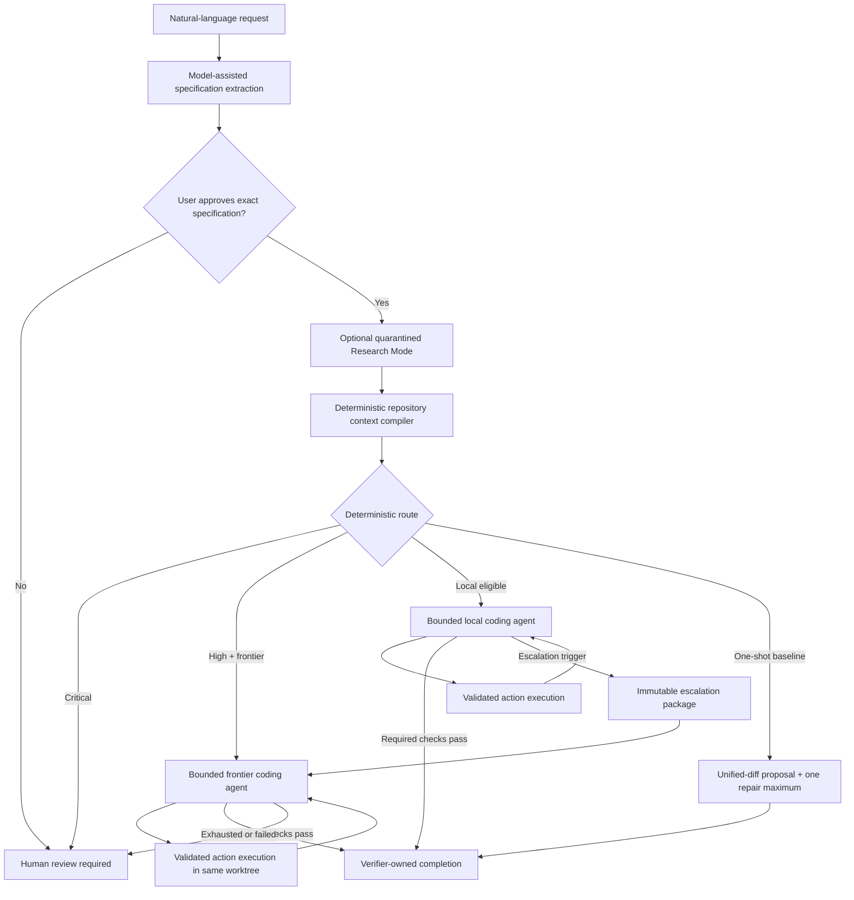

# Apoapsis Harness: Living Architecture and Project Handoff

This is the canonical, living handoff for Apoapsis Harness. Read it before changing
the project. Keep it synchronized with the implementation in the same change
that alters architecture, workflow behavior, configuration, safety policy,
audit artifacts, evaluation evidence, or current project status.

The ADRs in `docs/adr/` are the immutable decision history. This document is
the current system map. `README.md` is the user-facing guide. When they differ,
the implementation and tests are the operational truth, and the documentation
must be corrected before the change is considered complete.

## Snapshot

| Item | Current value |
| --- | --- |
| Last verified | 2026-07-17 |
| Working-tree version | `0.8.0-dev` |
| Checked-out branch | `main` |
| Current committed HEAD | `7c6797b` (`Add bounded local-to-frontier coding workflow`) |
| Preserved substrate tag | `substrate-v0.1` at `4c2e735` |
| Working-tree state | Uncommitted Apoapsis 0.7 namespace migration plus uncommitted Apoapsis 0.8 `apoapsis doctor` and `apoapsis eval` tooling |
| Full deterministic suite | 114 tests, 0 failures, 0 errors, 2 intentional live-network skips |
| Syntax check | `python -m compileall -q src tests` passed |
| Diff check | `git diff --check` passed; Git reported only expected LF-to-CRLF working-copy warnings |
| Live local coding result | Qwen3-Coder-Next Q4 completed the controlled download-service task in 10 turns and 3 verification runs |
| Live hosted escalation result | Not yet run. A repeatable harness (`apoapsis eval download-service --lane forced-escalation` / `--lane hybrid`) now exists to run it once real `[models.frontier_coder]` credentials are configured; the complete two-provider path is otherwise still only covered with fake providers |

Update this table whenever its claims change. Never describe an uncommitted
version as a committed release. Never claim that a provider path was proven
live when only fake-provider coverage exists.

## Product thesis and end goal

Apoapsis is a local-first, auditable control plane for verified AI coding. It should
make smaller or local models useful by giving them bounded opportunities to
inspect, edit, test, and iterate, while reserving a stronger frontier model for
deterministically authorized escalation. Models remain untrusted patch
proposers. Apoapsis—not a model—owns state transitions, context selection, constraint
coverage, tool execution, patch safety, retry budgets, verification, audit
recording, and completion.

The intended user experience is one command:

```bash
apoapsis run "Add resumable downloads without changing the public API"
```

Apoapsis extracts a structured specification, asks the user to approve it, retrieves
reproducible repository context, routes the task, runs the selected bounded
coding stage or stages in an isolated Git worktree, verifies all required
commands, and writes a complete usage and audit report.

## Non-negotiable authority boundary

| Decision or capability | Authority |
| --- | --- |
| Interpret natural language into a candidate specification | Model may propose; Pydantic validation and the user approve |
| Preserve active hard constraints | Deterministic schema validation; exact source text is retained |
| Select repository context | Deterministic context compiler |
| Choose local/frontier/human route | Deterministic risk and configuration rules |
| Request an agent action | Model may propose one typed action |
| Read/search/edit/run checks | Apoapsis validates and executes the action |
| Apply a patch | Unified-diff parser, policy validator, and Git applier |
| Decide whether tests passed | Verification runner |
| Retry or escalate | Fixed configuration and controller rules |
| Mark a task complete | Verification engine after all required checks pass |
| Record evidence and usage | Deterministic audit and reporting layers |

No provider adapter may bypass this boundary. A larger or hosted model receives
more capability only through a separately configured budget and context package;
it does not receive shell, Git, filesystem, network, workflow, or completion
authority.

## End-to-end architecture



### Primary execution sequence

1. `VerticalSliceRunner` creates a task record in SQLite and a per-task audit
   directory.
2. The configured backwards-compatible `models.frontier` provider drafts the
   `TaskSpecification`. Every extracted hard constraint must retain an exact,
   case-sensitive source substring from the user's request.
3. Apoapsis writes the candidate specification and waits for explicit approval unless
   `--yes` was supplied for controlled automation.
4. Optional Research Mode runs after approval and before coding context is
   compiled. Only a compact brief and evidence IDs can enter coding context.
5. The context compiler analyzes the repository at a recorded commit and writes
   provenance-bearing evidence.
6. Agent mode selects a route. A route that requires human review stops before
   creating a worktree. Otherwise Apoapsis creates `.apoapsis/worktrees/<task-id>` on a
   dedicated `apoapsis/<task-id>` branch.
7. The local or frontier agent proposes exactly one typed action per turn. Apoapsis
   validates and executes it, then returns a bounded observation in the next
   immutable request package.
8. Every edit passes the same diff parser, policy checks, and `git apply --check`
   process. The model never writes directly.
9. Required configured verification commands decide success. A model message
   saying it is finished has no effect.
10. If the local stage stops and the selected route permits it, Apoapsis writes the
    escalation package before the first frontier coding call. The frontier stage
    continues in the same worktree with independent budgets.
11. A frontier stop, failure, or exhausted budget requires human review. There
    is no recursive escalation.
12. Apoapsis writes `report.json` with outcome, calls, tokens, cached tokens, estimated
    cost, latency, transmitted files/lines, changed files, verification results,
    and artifact locations.

### Retained one-shot baseline

`execution.mode = "one_shot"` preserves the original controlled comparison. It
requests only a unified diff, validates and applies it, runs verification, and
permits one targeted repair. A rejected first patch consumes that repair budget.
This path is useful as an evaluation baseline, not the preferred local-model
architecture.

## Component map

### CLI and configuration

- `src/apoapsis/cli/app.py` owns `apoapsis init`, `run`, `task`, `approve`, `inspect`,
  `worktree-create`, `verify`, `rollback`, and Research Mode commands.
- `src/apoapsis/config.py` is the strict TOML schema and cross-provider validation.
- `.apoapsis/config.toml` is generated per target repository; `.apoapsis/apoapsis.db` stores
  task state and workflow events.
- The distribution is `apoapsis-harness`, the import package and CLI are
  `apoapsis`, product environment variables use `APOAPSIS_`, and managed task
  branches use `apoapsis/`. No pre-release compatibility alias is provided.
- Legacy `.sol/` audit data remains ignored and excluded from every model,
  patch, context, and research surface. It is immutable history, not active
  Apoapsis state, and is not rewritten during the namespace migration.
- Context profiles `16k`, `32k`, and `64k` jointly change the native Ollama
  context window and deterministic evidence budget. They do not alter Research
  Mode's separate context budget.

### Specification and constraints

- `src/apoapsis/specification/schema.py` defines strict traceable task, acceptance,
  risk, and hard-constraint records.
- `src/apoapsis/specification/extractor.py` builds and validates model-assisted
  extraction.
- `src/apoapsis/models/base.py` rejects model requests that omit a disposition for
  any active hard constraint.
- Constraint wording, interpreted meaning, source, scope, status, verification
  method, and supersession are distinct fields. Do not collapse them.

### Workflow persistence

- `src/apoapsis/workflow/states.py` is the source of truth for allowed transitions.
- `src/apoapsis/workflow/engine.py` persists tasks and append-only events in SQLite
  using atomic transactions and optimistic version checks.
- The normal spine is `INTAKE -> SPEC_DRAFTED -> SPEC_APPROVED ->
  REPOSITORY_ANALYZED -> CONTEXT_COMPILED -> ROUTED -> IMPLEMENTING ->
  PATCH_READY -> VERIFYING -> COMPLETE`.
- Controlled branches include `LOCAL_REPAIR`, `ESCALATION_REQUIRED`,
  `HUMAN_REVIEW_REQUIRED`, `FAILED`, and `ROLLED_BACK`.
- Providers never call the transition API.

### Repository isolation and context

- `src/apoapsis/repository/git.py` is the deterministic Git command wrapper.
- `src/apoapsis/execution/worktree.py` creates managed worktrees below
  `.apoapsis/worktrees/`, validates task slugs and branches, and refuses normal
  cleanup of dirty worktrees.
- `src/apoapsis/context/compiler.py` combines tracked/unignored paths, current Git
  diffs, explicit paths, ripgrep results, deterministic lexical fallback,
  Python AST symbols/imports, bounded import neighbors, and related tests.
- `src/apoapsis/context/provenance.py` gives every excerpt a path, line range,
  commit/worktree provenance, inclusion reason, content digest, evidence kind,
  and transmission policy.
- Default cloud exclusions include `.env`, `.env.*`, keys, PEM files,
  `secrets/**`, `.apoapsis/**`, and `.git/**`.
- Retrieval is bounded by file count, excerpt lines, total characters, search
  terms, match context, and import depth. More VRAM should be used by raising
  explicit reproducible profiles, never by silently transmitting the repository.

### Provider boundary and telemetry

- `src/apoapsis/models/provider.py` defines the narrow `ModelProvider` protocol:
  one invocation in, one untrusted output out.
- Implemented adapters are native loopback-only Ollama in
  `src/apoapsis/models/local.py` and authenticated OpenAI-compatible chat completions
  in `src/apoapsis/models/frontier.py`.
- `src/apoapsis/models/telemetry.py` owns call timing, prompt hashes, token/cache
  counts, configured-price cost estimates, model digests, thinking tokens,
  native duration fields, retry count, and failed-call telemetry.
- Provider roles are `FRONTIER_IMPLEMENTATION`, legacy `CODING_AGENT`,
  `LOCAL_CODING_AGENT`, `FRONTIER_CODING_AGENT`, and
  `LOCAL_RESEARCH_MODEL`.

### Model configuration roles

| Configuration | Current role |
| --- | --- |
| `models.frontier` | Backwards-compatible specification extraction and one-shot implementation/repair provider |
| `models.local_coder` | Optional first stage in agent mode; falls back to `models.frontier` when absent |
| `models.frontier_coder` | Optional, separately authenticated frontier coding stage |
| `models.local_research` | Separate loopback research planner/extractor/synthesizer |

The `models.frontier` name is historical and can be confusing when it points to
local Ollama. Do not silently change its meaning; a cleanup requires a migration
plan, compatibility tests, and an ADR.

### Bounded agent protocol

- `src/apoapsis/agent/actions.py` defines the only permitted actions:
  `search_repository`, `read_file`, `inspect_diff`, `propose_patch`,
  `replace_text`, `run_check`, `submit_for_verification`, and
  `request_escalation`.
- `src/apoapsis/agent/inspection.py` confines search/read/diff operations to safe,
  tracked or unignored text paths. It rejects absolute paths, drive paths,
  parent traversal, `.git`, `.apoapsis`, and binary content.
- `src/apoapsis/agent/session.py` owns turn, patch, verification, search/read, and
  observation budgets; evidence accumulation; check de-duplication; and session
  outcome.
- `replace_text` is allowed only when the exact old text occurs once. Apoapsis turns
  it into a unified diff and sends it through normal patch validation.
- A named configured check can be run. The model cannot construct a command.
- Identical checks are not rerun against an unchanged diff. Individually run
  checks complete the task only if they collectively cover every required
  configured command.
- Budget exhaustion and `request_escalation` produce an escalation outcome, not
  success.

### Patch safety

- `src/apoapsis/patches/parser.py` parses Git unified diffs and handles narrowly
  defined normalization for model formatting and CRLF compatibility.
- `src/apoapsis/patches/validator.py` deterministically rejects:
  - repository path escapes and forbidden `.git`/`.apoapsis` paths;
  - symlink and binary changes;
  - unexpected dependency changes;
  - deleted tests and, by default, all unexpected test changes;
  - modified verification configuration;
  - excessive changed-file or changed-line counts.
- `src/apoapsis/patches/apply.py` runs Git applicability checks, applies only inside
  the managed worktree, and restores original bytes on a failed application.
- Narrow hunk rebasing is permitted only when the complete old side has exactly
  one source match. Ambiguous or semantic repair remains rejected.

### Verification and failure evidence

- `src/apoapsis/verification/runner.py` executes only configured argument vectors
  with `shell=False`, per-command timeouts, a restricted environment, bounded
  output, and structured statuses.
- At least one required command is mandatory for the vertical slice.
- `src/apoapsis/verification/failures.py` extracts a normalized root error and
  relevant failure excerpt for repair or escalation.
- Host-process verification is deterministic but is not a security sandbox.
  Configured commands must currently be trusted.

### Routing and escalation

- `src/apoapsis/workflow/routing.py` implements rule-based routing.
- Explicit routes are `local_only`, `local_then_frontier`, and
  `frontier_only`. `auto` behaves as follows:
  - low, medium, or unclassified risk: local-first when a frontier provider is
    available, otherwise local-only;
  - high risk: frontier-only when available, otherwise human review;
  - critical risk: human review.
- `src/apoapsis/workflow/escalation.py` defines the reproducible local-to-frontier
  package.
- Escalation can be triggered by an explicit model request, deterministic local
  budget exhaustion, unsuccessful local verification, or a local provider
  failure. The route and provider availability still decide whether a frontier
  call is authorized.
- The package contains the approved specification, every active verbatim hard
  constraint, provider identities, exact current diff and digest, complete
  local action history, normalized failures with exact commands and errors, and
  the frontier context digest.
- Frontier context is freshly compiled from the current worktree using changed
  paths and failure terms. The frontier agent uses independent budgets and the
  same policy boundary. It cannot escalate again.

### Research Mode

- `src/apoapsis/research/` is a quarantined, optional sidecar that runs only after
  specification approval.
- Deterministic triggers and budgets select official documentation, GitHub, and
  opt-in Reddit sources. A restricted fetch process owns all network I/O.
- The local research model has no tools. Fetched content is size-limited,
  sanitized, delimited as untrusted external content, injection-scanned,
  provenance-bound, license-classified, and cached with dependency-aware keys.
- External material is advisory. It cannot authorize code changes. Only a
  compact synthesis brief and evidence IDs reach coding context.
- Research documentation lives in `docs/research-mode.md` and ADR 0003.

### Audit and reporting

- `src/apoapsis/audit/store.py` writes audit files atomically below
  `.apoapsis/tasks/<task-id>/`.
- Before every provider call, Apoapsis writes `call-NNN-context.json` and
  `call-NNN-request.json`. The request records role, response schema, prompt,
  inference settings through the model request, context digest, and a canonical
  request-package digest.
- After a call it writes `call-NNN-response.json` and
  `call-NNN-telemetry.json`.
- Other important artifacts include approved specification files,
  `routing-decision.json`, numbered proposed/normalized patches and policy
  results, local `agent-turn-*` records, frontier `frontier-agent-turn-*`
  records, numbered verification results/failures,
  `frontier-escalation-package.json`, and `report.json`.
- `src/apoapsis/reporting/report.py` aggregates both stages while retaining separate
  local/frontier turn, patch, and verification counts.
- Audit directories are reproducibility evidence, not secret stores. Never put
  credentials or excluded project secrets into them.

### Diagnostics and evaluation tooling

- `src/apoapsis/doctor.py` implements `apoapsis doctor`: a read-only preflight
  that never writes to `.apoapsis/` and never prints a credential value, only
  whether a configured environment variable is set. It checks Git, ripgrep
  (advisory; absence is a `warning`, not an `error`, because the deterministic
  lexical fallback still works), Python version, free loopback-only Ollama
  reachability, configured model roles, context-budget-versus-window
  heuristics, and verification-command binary availability. A live
  connectivity/structured-output probe against configured providers only runs
  behind explicit `--probe`, and a hosted (`openai_compatible`) probe result
  says plainly that it may incur cost.
- `src/apoapsis/evaluation/` implements `apoapsis eval <fixture>`. `lanes.py`
  defines the five lanes (`local`, `hybrid`, `forced-escalation`, `frontier`,
  `one-shot`) as pure `execution`-only configuration overlays over the
  caller's real config — no lane ever changes `models.*`. `fixture.py` copies
  a named fixture into a fresh, isolated, committed Git repository per lane.
  `harness.py` runs one lane through the unmodified `VerticalSliceRunner`
  against that isolated copy, with its own fresh task store. `report.py`
  aggregates the resulting `FinalTaskReport`s into one `comparison.json`/
  `comparison.md`. A lane needing an unconfigured `models.frontier_coder` is
  recorded as skipped, with no fixture copy and no provider built for it, so
  absent credentials never imply unauthorized spend. See ADR 0008.

## Current configuration and operation

### Development setup

```bash
python -m venv .venv
.venv/Scripts/python -m pip install -e .
python -m unittest discover -s tests -v
```

Use `.venv/bin/python` on macOS or Linux. Requirements are Python 3.12+, Git,
and preferably ripgrep. The only runtime Python dependency is Pydantic v2.

### Initialize a target repository

```bash
apoapsis init
```

The generated configuration currently selects:

- Qwen3-Coder-Next Q4 through native loopback Ollama for specification and local
  coding;
- a 64K local coding window and 180,000-character repository evidence budget;
- Qwen 3.6 27B through native loopback Ollama for Research Mode;
- agent execution with `route = "auto"`;
- no hosted frontier coder credentials.

Installed model availability is machine state, not a repository guarantee.
Check the local Ollama installation before a live evaluation.

### Run the primary flow

```bash
apoapsis run "Add resumable downloads without changing the public API"
```

Useful controlled overrides:

```bash
apoapsis run "..." --context-profile 64k
apoapsis run "..." --execution-mode one_shot
apoapsis run "..." --agent-route local_only
apoapsis run "..." --agent-route local_then_frontier
apoapsis run "..." --agent-route frontier_only
apoapsis run "..." --research auto
apoapsis run "..." --yes
```

`--yes` should be limited to controlled evaluation because it bypasses
interactive approval, not schema or verification policy.

### Enable frontier escalation

Add a separately authenticated provider to the target repository's
`.apoapsis/config.toml`:

```toml
[models.frontier_coder]
provider = "openai_compatible"
base_url = "https://provider.example/v1"
model = "frontier-coder"
api_key_env = "APOAPSIS_FRONTIER_CODER_API_KEY"
timeout_seconds = 900
max_output_tokens = 16384
temperature = 0.0

[models.frontier_coder.pricing]
input_per_million_usd = 0
output_per_million_usd = 0
cached_input_per_million_usd = 0
```

Set real pricing if cost reporting is meant to be meaningful. Never commit API
keys. Explicit `local_then_frontier` or `frontier_only` configuration is rejected
when no frontier coder is configured.

### Inspect and clean up

```bash
apoapsis inspect TASK-ABC123
apoapsis verify TASK-ABC123
apoapsis rollback TASK-ABC123 --delete-branch
```

Rollback is destructive and explicit. Normal cleanup refuses dirty task
worktrees. Apoapsis does not automatically merge or commit a successful patch.

### Diagnose the environment

```bash
apoapsis doctor
apoapsis doctor --probe
```

`--probe` performs a real minimal completion call against every configured
provider to check connectivity and structured-output support. Loopback Ollama
probes are free; a hosted (`openai_compatible`) probe result explicitly notes
that it may incur real cost. Neither form ever prints a credential value.

### Run controlled evaluation lanes

```bash
apoapsis eval download-service
apoapsis eval download-service --lane local --lane one-shot
apoapsis eval download-service --lane forced-escalation --output-dir .apoapsis-eval/run-1
```

Requires `apoapsis init` in this repository first (it reads the same
`.apoapsis/config.toml`). Each requested lane runs against its own fresh copy
of `examples/download-service` in an isolated Git repository; `hybrid`,
`forced-escalation`, and `frontier` are skipped with a clear reason when
`[models.frontier_coder]` is not configured. Output is a `comparison.json`/
`comparison.md` pair under `--output-dir` (default `.apoapsis-eval/<run-id>/`,
gitignored).

## Evaluation evidence

The controlled repository is `examples/download-service/`. Comparison
instructions are in `docs/evaluation/direct-vs-apoapsis.md`.

- `docs/evaluation/local-qwen-smoke.md` records the earlier local Qwen
  one-shot results.
- `docs/evaluation/qwen3-coder-next-smoke.md` records Coder-Next Q4. The
  one-shot attempts failed, while the bounded agent completed the controlled
  task in 10 turns, 3 patch attempts, and 3 verification runs; all 3 fixture
  tests passed with one source file changed.
- The current local-to-frontier orchestration is proven by deterministic
  fake-provider integration tests, including local failure/frontier repair in
  the same worktree, direct high-risk frontier routing, local provider outage,
  and frontier budget exhaustion.
- `docs/evaluation/apoapsis-0.8-eval-harness-smoke.md` records a real
  `apoapsis eval download-service --lane local` run against the installed
  Qwen3-Coder-Next model, proving the new harness drives a real model through
  an isolated fixture copy end to end. It correctly ended in
  `human_review_required` after exhausting its local-only budget — a
  harness/mechanism smoke test, not the hosted-frontier proof itself.
- A real hosted frontier escalation has not yet been measured. Keep that gap
  explicit until an audited run exists.

Failed evaluations are valuable evidence. Do not delete or rewrite them merely
because a later architecture performs better. Add new dated results and explain
the changed conditions.

## Test map

| Area | Primary coverage |
| --- | --- |
| Schemas and constraints | `tests/test_schemas.py`, `tests/test_provider_and_specification.py` |
| Workflow persistence | `tests/test_workflow.py` |
| Git repository/worktrees | `tests/test_repository_and_worktree.py` |
| Context and provenance | `tests/test_context_compiler.py` |
| Patch parsing/policy/application | `tests/test_patches.py` |
| Verification/failure normalization | `tests/test_verification.py` |
| One-shot vertical slice | `tests/test_vertical_slice.py` |
| Bounded local/frontier flow | `tests/test_agent_loop.py` |
| CLI/configuration | `tests/test_cli.py` |
| Research units/integration | `tests/test_research_units.py`, `tests/test_research_integration.py` |
| Opt-in live research | `tests/test_research_live.py` |
| Diagnostics (`apoapsis doctor`) | `tests/test_doctor.py` |
| Evaluation lanes/harness (`apoapsis eval`) | `tests/test_evaluation.py` |

Fake providers are the mandatory regression mechanism. Live model or network
tests supplement them; they must not replace deterministic coverage.

## Known limitations and open work

1. **No security sandbox.** Git worktrees isolate source state, not processes.
   Verification still needs a container or equivalent adapter with network
   denial, CPU/memory limits, secret controls, and stronger filesystem policy
   before running untrusted commands broadly.
2. **No live hosted escalation evidence.** A repeatable harness now exists
   (`apoapsis eval download-service --lane forced-escalation` / `--lane
   hybrid`); configure a real `[models.frontier_coder]` and run it while
   preserving the full audit report and comparison output.
3. **Evaluation breadth is small.** The successful local-agent result is one
   controlled Python task. Add varied repositories and task classes before
   generalizing model-quality claims.
4. **Historical configuration naming remains.** `models.frontier` still serves
   specification and one-shot roles even when backed by local Ollama.
5. **No automatic merge/commit.** A successful worktree remains for inspection.
6. **Human-review continuation is low-level.** The state model supports review,
   but there is no polished interactive resume experience for every stop case.
7. **Cost is configured, not discovered.** Zero pricing yields a valid but
   economically uninformative report.
8. **Live network tests are intentionally skipped by default.** Run them only
   with explicit credentials, network authorization, and recorded conditions.
9. **Subscription-backed provider adapter is deferred, not built.** A
   `claude_code_cli`/`codex_cli`-style adapter would let a user drive coding
   stages through an existing Claude Pro or ChatGPT Plus allowance instead of
   per-token billing. If built, it must sit behind the existing `ModelProvider`
   protocol, run in an empty temporary directory with no tool or repository
   access beyond the single Apoapsis prompt for that call, return exactly one
   response per invocation, and report telemetry through the normal
   `ProviderCallTelemetry` shape. See ADR 0008. Do not implement or invoke it
   without an explicit request.

The next high-value proof is a real local-failure to hosted-frontier-repair run
on the controlled fixture, followed by broader task evaluation. The next
high-value safety increment is an execution sandbox. Do not add embeddings,
learned routing, autonomous agent swarms, a web interface, arbitrary model
shell access, or general-purpose work automation as an accidental substitute
for those proofs.

## Architecture decisions

| ADR | Decision |
| --- | --- |
| `0001` | Deterministic substrate, schemas, state, worktrees, verification |
| `0002` | One bounded frontier unified-diff vertical slice |
| `0003` | Quarantined local Research Mode |
| `0004` | Native loopback Ollama implementation path and context profiles |
| `0005` | Bounded inspect-edit-test coding-agent action loop |
| `0006` | Deterministic local/frontier roles, routing, and escalation |
| `0007` | Apoapsis product, package, CLI, state, environment, and branch namespace |
| `0008` | Evaluation harness (`apoapsis eval`) and diagnostic tooling (`apoapsis doctor`) |

Add a new ADR for a new architectural decision. Do not rewrite history to make
old decisions appear current; mark an ADR superseded and link its replacement
when necessary.

## Maintenance contract for future models

Every future model or contributor must perform this checklist when a change
touches Apoapsis behavior:

1. Read this file, `README.md`, the relevant ADRs, `git status`, and the tests
   closest to the change before editing.
2. Preserve unrelated and uncommitted user work. Never reset the working tree or
   move the `substrate-v0.1` tag.
3. Keep deterministic authority in Apoapsis. New provider features must return typed,
   untrusted proposals and must not directly execute or decide completion.
4. Add or update fake-provider tests for every workflow branch. Cover both the
   successful path and bounded failure/human-review behavior.
5. Add an ADR when changing trust boundaries, model roles, routing, workflow
   authority, persistence, patch policy, verification authority, or external
   transmission policy.
6. Update this handoff in the same change according to the trigger table below.
7. Update `README.md` when a user-facing command or configuration changes.
8. Record live evaluations in a dated file under `docs/evaluation/`. Include the
   exact model, quantization, inference settings, context profile, task, calls,
   tokens, latency, files changed, verification result, and audit location.
9. Run the focused tests, then the full suite, syntax compilation, and
   `git diff --check`. Report skipped tests explicitly.
10. Refresh the Snapshot table last. Use an exact date. Use the exact hash when
    the handoff is not itself part of that commit; otherwise identify it as
    `this commit` with its exact subject because embedding its own hash is
    impossible. If changes are uncommitted, say so. Do not invent results that
    were not observed.

### Documentation update triggers

| Change | Required handoff update |
| --- | --- |
| Version, branch, commit, tag, or verification result | Snapshot |
| Workflow state or transition | Execution sequence and Workflow persistence |
| Provider, model role, inference setting, or telemetry | Provider boundary and Model configuration roles |
| Agent action or budget | Bounded agent protocol |
| Context source, ranking, limit, or transmission rule | Repository isolation and context |
| Patch rejection or normalization rule | Patch safety |
| Verification command policy or failure normalization | Verification and failure evidence |
| Route, escalation trigger, package field, or retry limit | Routing and escalation |
| Audit filename, digest, or report schema | Audit and reporting |
| Research source, security rule, or synthesis contract | Research Mode |
| CLI/configuration behavior | Current configuration and operation plus `README.md` |
| Test or live model result | Snapshot, Evaluation evidence, and Test map as applicable |
| New unresolved risk or completed limitation | Known limitations and open work |

If no handoff section changes after a meaningful architecture change, explain
why in the change description; silence is not evidence that the document is
still accurate.
