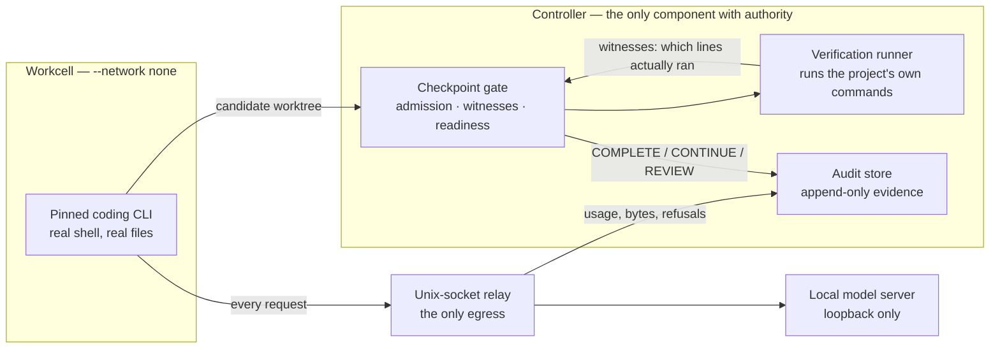

# Apoapsis

**Apoapsis is a control system for untrusted local coding models.** A model
proposes; the harness owns repository access, verification, completion, and the
audit trail, and a slice is only "done" when the harness has watched the
project's own tests execute the code that was written. It runs a pinned coding
agent inside a `--network none` container whose only route out is a
controller-owned relay.

I built it, measured it against an unrestricted baseline, **found the baseline
beat my first protocol**, and rebuilt the architecture around that result.
[The experiment is written up here.](docs/crisis-atlas-experiment.md)

---

## The shape



The agent has a real shell and can write whatever it likes **inside the
container**. It cannot decide whether it succeeded. That judgement is made
outside, by re-running the project's configured commands under a coverage trace
and checking that the new code was actually reached — inherited tests staying
green is not evidence, because they stay green precisely by never touching the
new file.

---

## The headline result, stated honestly

Three findings, in the order they happened.

**1. My bounded protocol was the bottleneck.** I gave the same model the same
approved plan twice: once through Apoapsis's original one-JSON-action-per-turn
loop, once as an unrestricted CLI agent with a real shell in a sandbox. The
unrestricted control was **materially better** — it built and connected every
planned layer, wrote its own tests, and used their failures to repair its own
work. The sliced arm had produced a one-call false completion with an
incompatible skeleton that nothing imported.

**2. And it would have shipped a false success.** The control declared every
acceptance criterion met, including dashboard filtering. Independent browser
verification disproved it: selecting the `Closed` filter still displayed an
`investigating` incident, because the API server passed only `parsed.path` and
the query string never reached the filter. Its own 88 self-authored tests all
passed and missed it. **That is the argument for the harness, and it survived
the result that embarrassed the harness.**

**3. The rebuilt architecture is non-inferior to the unrestricted baseline.**
Six frozen slots, three matched pairs, independently scored: all six first
proposals complete, every pair 1.0 / 1.0, no continuation or external repair
needed.

| | Unrestricted control | Apoapsis sandbox |
| --- | ---: | ---: |
| rep-1 | 1.0 | 1.0 |
| rep-2 | 1.0 | 1.0 |
| rep-3 | 1.0 | 1.0 |

**What that does not say.** Crisis Atlas is not a held-out benchmark and this
is not broad-corpus superiority. Non-inferiority was observed on one regression
benchmark. Detection is a separate claim, established deterministically rather
than live: a zero-model rehearsal injects 17 controls — incomplete work, stale
evidence, truncation, configuration drift, contamination, and an attempt to
hide a pair regression — and **17/17 fired their mapped detector.**

**A negative result I kept.** An earlier six-run comparison of monolithic
versus plan-then-slices execution, on a different local model, completed
**0 of 6**. Every attempt exhausted its 12-turn budget having called a
verification command zero times: the model read a file, made one edit, then
re-read files it had already read until the budget ran out. Every mechanical
part of the harness behaved correctly — budgets enforced, escalation classified,
no false success possible because there were no claimed successes. It was a
model-logic failure, and it is in the docs because deleting it would make the
rest less believable.

---

## Try it in 60 seconds, with no GPU

Everything below runs on CPU with no model, no network and no Docker. The
entire test suite is driven by scripted fake providers, which is what makes
model-driven branches testable at all.

```bash
git clone <repo> && cd apoapsis
python -m venv .venv && .venv/bin/pip install -e .     # Windows: .venv\Scripts\pip
```

**See the harness drive a task end to end against a fake model** — 51 tests,
about six seconds:

```bash
python -m unittest tests.test_vertical_slice \
                   tests.test_capability_sandbox_product \
                   tests.test_workcell_checkpoint
```

**See it set up a real project and tell you what it can and cannot prove:**

```bash
mkdir /tmp/demo && cd /tmp/demo && git init && git commit --allow-empty -m init
python -m apoapsis.cli.app --project-root . init
python -m apoapsis.cli.app --project-root . doctor
```

`doctor` is worth reading. On a fresh project it reports `warning`, and every
warning is a statement about what a passing check would and would not mean —
including `evidence level development_only: passing them means the configured
commands exited zero, it does not mean any acceptance criterion was proven`.
The system is designed to say that out loud rather than let a green tick imply
more than it earned.

**The whole suite**, if you want it: `python -m unittest discover -s tests`.
2,141 tests, 49 skips, no known failures, about 19 minutes (Python 3.14.5,
Windows 11). Every skip names the capability it needs — most want Docker, Node,
or a POSIX Unix socket a Linux container can connect to.

Running a real slice needs a local model, a GPU, WSL2 and Docker. That path is
documented in the full README.

---

## What is actually interesting here

If you have ten minutes and want the parts that are not boilerplate:

- **Witness-gated completion** — `src/apoapsis/workcell/emitters.py`,
  `witness.py`. A slice is complete when the configured commands pass *and*
  coverage tracing proves they executed the changed lines. This exists because
  a live slice wrote 93 passing tests into a directory the test command never
  collected from, and reported success.
- **The relay** — `src/apoapsis/workcell/relay.py`. The contained agent's only
  route to a model. It records every exchange, refuses a request whose output
  budget exceeds the pinned ceiling rather than clamping it, and distinguishes
  "the client hung up" from "the upstream stopped talking", because merging
  those lets an upstream failure be explained away as the reader's doing.
- **Admission** — `src/apoapsis/workcell/admission.py`. A candidate worktree is
  admitted atomically against a policy, or not at all.
- **Deterministic fake-provider coverage** — `tests/fakes.py` and 95 test
  files. Every model-driven branch is exercised by a scripted provider, which
  is why the suite runs without a GPU.
- **The ADR trail** — `docs/adr/`, 109 decisions. Many are post-mortems of live
  failures with the failure quoted. [ADR 0111](docs/adr/0111-a-green-suite-for-strangers.md)
  is representative: the suite was carried at "7 failures, 2 errors" and was
  actually 5 failures and 73 errors, which turned out to be five causes, one of
  which was a real product defect the broken fixture had been hiding.

---

## Honest limitations

- **One benchmark.** Crisis Atlas is not held out. Non-inferiority is one
  result on one task family, not a general claim.
- **One model.** Everything live is Qwen3.6-27B Q4_K_M at 65,536 tokens.
- **Detection is deterministic, not live.** 17/17 injected controls fired. No
  live run has yet produced an incomplete candidate for the gate to catch.
- **The live path needs specific hardware.** WSL2, Docker, a 24GB GPU. The
  fake-provider path needs none of it, which is why that is the quickstart.
- **Windows-first.** It runs on Linux, but the launcher and the evidence trail
  were built on Windows with WSL2 and that shows in places.

---

## Deeper reading

| | |
| --- | --- |
| The experiment | [docs/crisis-atlas-experiment.md](docs/crisis-atlas-experiment.md) |
| Architecture and authority boundary | [HANDOFF.md](HANDOFF.md) |
| Full operator guide | [README.md](README.md) |
| Decisions, 109 of them | [docs/adr/](docs/adr/) |
| Live evidence, dated | [docs/evaluation/](docs/evaluation/) |

## License

[PolyForm Noncommercial 1.0.0](LICENSE.txt) — free for noncommercial use.
