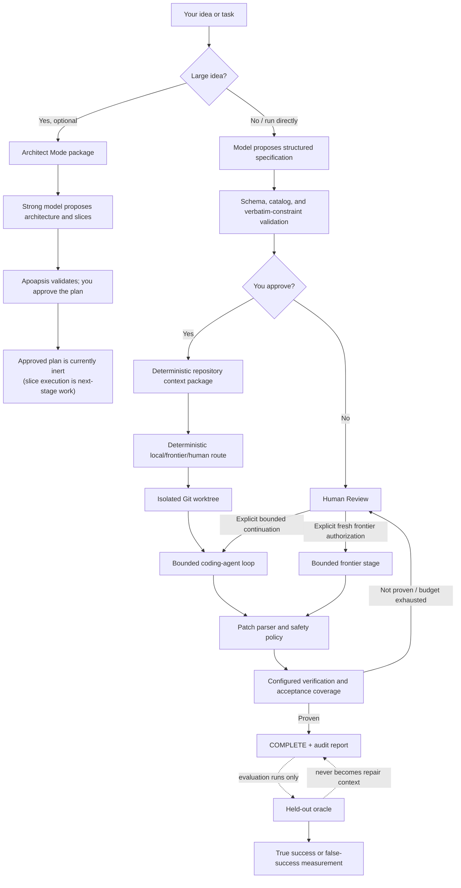

# Apoapsis architecture, explained in plain English

This is the owner's guide to how Apoapsis is meant to work. It explains the
ideas and safety boundaries without assuming you already know the codebase.
`HANDOFF.md` remains the canonical technical record for coding agents; the ADRs
under `docs/adr/` preserve why individual decisions were made.

Current as of 2026-07-19, after ADR 0024 (Commit D2a).

## The short version

Apoapsis is not an AI model. It is a deterministic control system wrapped
around AI models.

Think of the model as a talented contractor:

- The model may inspect evidence, suggest an edit, ask to run a known test, and
  try again when the result is wrong.
- Apoapsis decides what repository the contractor is working in, which tools
  exist, whether an edit is safe, which commands may run, how many attempts are
  allowed, and whether the result is actually complete.
- Git worktrees are the isolated workshop. Verification is the normal
  inspection. Acceptance checks are the owner's stronger definition of done.
  The held-out oracle is a secret exam used only to measure whether the normal
  process declared success incorrectly.
- Every important input, action, result, token count, cost estimate, and
  decision is written to an audit directory.

The central rule is:

> Models propose. Apoapsis validates, executes, verifies, records, and decides.

## Why this exists

Coding models can be useful without being reliably correct. A small local model
may understand most of a task, make a nearly correct edit, or recover after a
test shows the precise mistake. The dangerous approach is to give it an
unrestricted terminal and accept its claim that it is done.

Apoapsis instead tries to make model work:

1. **Iterative** — the model can search, read, edit, test, and revise over
   multiple bounded turns.
2. **Safe** — the real repository is not edited directly, patches are checked,
   and only configured commands can run.
3. **Measurable** — completion is based on recorded evidence, not confidence.
4. **Reproducible** — model requests and repository excerpts are packaged and
   hashed before transmission.
5. **Escalatable** — a local model can stop, and the user can explicitly allow
   a stronger frontier model to continue in the same isolated worktree.

## The big picture

The dotted oracle path is important: the oracle is outside the ordinary coding
workflow. It measures the workflow; it does not secretly control it.

## Who is allowed to decide what

| Part | What it may do | What it may not do |
| --- | --- | --- |
| You | Approve specifications/plans, configure verification, authorize more budget or frontier use, abandon work | Nothing is spent or continued merely because a model asks |
| Specification model | Propose a structured interpretation of your request | Approve the interpretation or alter verbatim constraints |
| Architect model | Propose decisions and small implementation slices | Approve a plan, execute a slice, invent commands, or grant itself authority |
| Local coding model | Request one typed inspect/edit/test action per turn | Run arbitrary shell commands, write files directly, or declare completion |
| Frontier coding model | Use the same bounded action protocol with its own budget | Bypass patch, verification, workflow, or audit policy |
| Apoapsis controller | Validate requests, execute allowed actions, transition state, count budgets, write audits | It should not invent model intent or silently widen authority |
| Verification runner | Execute configured commands and record structured results | Accept a model's statement that tests passed |
| Held-out oracle | Evaluate a completed controlled benchmark against withheld behavior | Help the model repair, run during ordinary product work, or claim universal correctness |

## What happens during a normal task

### 1. The request becomes a specification

You supply natural language such as:

> Add resumable downloads without changing the public API.

A configured model proposes a strict Pydantic `TaskSpecification`: objective,
acceptance criteria, risk, and hard constraints. Apoapsis checks that every hard
constraint preserves an exact, case-sensitive substring of what you wrote. The
model may interpret the sentence, but it cannot quietly soften or rewrite the
source wording.

The model also sees a catalog of real configured verification commands. It may
map an acceptance criterion only to a command from that catalog; invented
command names are rejected. If its first specification is malformed, Apoapsis
allows exactly one mechanical correction call containing the validation
errors. It does not keep trying indefinitely or weaken the schema.

### 2. You approve the specification

Approval is a real, optimistic-version-checked workflow transition. Until it
happens, the coding stage does not begin. Approval means "this is the task I
intend," not "any proposed patch is trusted."

### 3. Apoapsis compiles repository context

The context compiler uses deterministic sources:

- Git-tracked and permitted untracked paths;
- the current diff and changed symbols;
- explicit paths and literal ripgrep matches;
- Python definitions, calls, imports, and one-hop neighbors;
- related tests; and
- validated file/line anchors from failures.

Every transmitted excerpt records its path, line range, commit/worktree source,
reason for inclusion, content hash, evidence kind, and transmission policy.
There are no embeddings or learned retrieval decisions today. Larger context
profiles (`64k`, `128k`, `256k`) raise explicit, reproducible budgets; they do
not silently dump the entire repository into the prompt.

Before every model call, Apoapsis writes the exact context and request package
to `.apoapsis/tasks/<task-id>/`.

### 4. Work happens in an isolated Git worktree

Apoapsis creates a task branch and worktree under `.apoapsis/worktrees/`. The
main checkout is not edited directly. The task worktree has a shared
fingerprint made from:

- the HEAD commit;
- the canonical tracked diff; and
- every permitted untracked path's type, mode, and exact content hash.

That fingerprint answers: "Is this exactly the same code that was previously
verified?" If any tracked or permitted untracked content changes, earlier proof
becomes stale.

### 5. The coding model gets useful freedom, but bounded authority

Agent mode is not one-shot generation. On each turn the model may request one
of these typed actions:

- search the repository;
- read a bounded part of a safe text file;
- inspect the current tracked and untracked diff;
- propose a unified diff;
- replace one exact, uniquely occurring text block;
- run one configured check by name;
- submit the current worktree for full verification; or
- request escalation.

Apoapsis performs the action and returns a bounded observation on the next
turn. The model can therefore inspect, edit, test, learn from the failure, and
try again. It cannot form an arbitrary command, access an unrestricted shell,
choose a workflow transition, increase its budget, or mark itself complete.

`replace_text` is still converted into a unified diff and goes through the same
patch policy as any other edit. A stronger frontier model gets more model
capability and a separate budget, not a weaker safety boundary.

### 6. Every edit passes patch policy

The deterministic parser and validator reject, among other things:

- repository path escapes;
- `.git` or `.apoapsis` changes;
- binary and symlink changes;
- unexpected dependency changes;
- deleted or unexpected test changes;
- verification-configuration changes; and
- excessive file or line counts.

The accepted patch is applied only after Git confirms it is applicable inside
the managed worktree.

### 7. Verification—not the model—decides completion

Only configured argument vectors run, with `shell=False`, bounded output,
timeouts, and a restricted environment. The default host backend is
deterministic but not a security sandbox. The opt-in Docker backend additionally
denies network access and constrains filesystem writes, CPU, memory, and
processes; its real success path still needs to be proven on this machine.

Under the normal strict completion policy, required development checks must
pass and every active acceptance criterion must be **Proven** by an explicitly
owner-designated acceptance command at the current worktree fingerprint.
Changing the code makes that proof stale until the command runs again.

If proof is missing or the model runs out of budget, the task stops for Human
Review instead of being mislabeled complete.

## How the oracle "knows" what is correct

The most important answer is: **it does not know correctness in general.**

The oracle is not another AI judge. It is a human-authored, deterministic test
for a controlled evaluation repository. Its author knows a specific behavior
the implementation must satisfy and encodes that behavior as assertions. The
oracle is only as good and complete as those assertions.

### The three different testing layers

| Layer | Visible to the coding model? | Used to repair? | Can gate ordinary completion? | Purpose |
| --- | --- | --- | --- | --- |
| Required development verification | Yes | Yes | Yes | Basic build, unit tests, lint, type checks |
| Owner-designated acceptance check | Yes | Yes | Yes under `STRICT` | Stronger, user-approved evidence for specific acceptance criteria |
| Held-out oracle | No | No | No—it runs after an evaluation already reports `COMPLETE` | Independently measure false success |

For the controlled download-service task, the hidden oracle asserts two details
that earlier visible development tests did not prove:

1. When six bytes already exist and the server returns `206 Partial Content`,
   the request uses `Range: bytes=6-`, the old and new bytes form
   `hello world`, and the function returns the total size, `11`—not merely the
   five bytes fetched during this call.
2. When the server ignores the Range header and returns `200`, stale partial
   data is replaced rather than appended, and the returned value is the fresh
   file's total size.

Those assertions are how this particular oracle recognizes a correct result.
It has no opinion about unrelated repositories or requirements.

### How Apoapsis keeps it genuinely held out

For `apoapsis eval download-service`:

1. The fixture copier removes `tests/test_resumable_acceptance.py` before the
   evaluation repository is initialized.
2. Before any model call, Apoapsis checks that the declared path is absent and
   that no tracked file has the oracle's exact content hash.
3. The normal model/context/patch/verification workflow runs without the
   oracle's filename or contents.
4. If the workflow does not reach `COMPLETE`, the oracle is recorded as
   `not_run`.
5. Only after `COMPLETE`, the evaluation harness copies the hidden test into
   the finished worktree under a reserved temporary name, runs it once through
   the configured execution backend, records the result and source hash, then
   removes the temporary file.
6. The result never becomes model context, never grants another repair turn,
   and never changes workflow state.

If Apoapsis said `COMPLETE` but a valid oracle run failed, the evaluation counts
that as a **false success**. If the oracle could not run reliably, that sample
is an infrastructure error. If no valid oracle ran, the false-success metric is
**unmeasured**, never silently reported as zero.

### Visible acceptance versus the hidden oracle

The current strict evaluation also contains a model-visible acceptance test for
the same required behaviors, but with different filenames, class names, URLs,
byte strings, and offsets. The model may run that check and repair toward it.
The separate hidden test then asks whether the implementation generalized to
different data rather than merely satisfying the exact visible example.

In a normal real repository, Apoapsis does not magically create a trustworthy
oracle. You provide required and acceptance commands. A held-out test is useful
when deliberately designing a benchmark or evaluation suite, but keeping it
hidden means it cannot help day-to-day repair. That separation is intentional:
acceptance checks improve the product workflow; oracles measure the workflow.

## Architect Mode

Architect Mode addresses a different problem: a local model may perform better
when a large idea has already been decomposed into small, explicit jobs.

Today the flow is manual and subscription-friendly:

1. `apoapsis plan export "<idea>"` writes an immutable planner package containing
   the exact idea, repository identity, deterministic context, documentation
   references, real verification catalog, authority rules, and the required
   output schema.
2. You paste that package into Claude, Codex, Fabel, or another strong model.
3. You save its structured response and run `apoapsis plan import`.
4. Apoapsis verifies the package hash, stores the proposed plan, and validates
   dependencies, constraints, criteria, paths, verification names, and size
   ceilings.
5. You inspect and explicitly approve a valid version.

The plan contains architecture decisions and dependency-ordered implementation
slices, including objectives, exclusions, inherited constraints, acceptance
criteria, verification commands, advisory paths/symbols, risks, and a concise
local-model brief.

Approval is intentionally inert today. No code path turns an approved slice
into a task yet. The planned bridge will require an explicit user selection and
will give the local coder its normal search/read/edit/test freedom; suggested
paths will remain hints, not an allowlist.

## Human Review and frontier rescue

When a task stops, Apoapsis builds a `ReviewCase` from persisted state, current
worktree contents, verification evidence, budgets, configuration, and event
history. The model does not choose the available buttons.

Depending on the exact stop reason, you may:

- inspect without changing anything;
- abandon and roll back;
- retry verification only;
- grant a bounded number of additional local turns;
- grant additional turns to an existing frontier session; or
- explicitly start one fresh configured frontier stage after a local-only stop.

The exact frontier model and full configured frontier budget are shown before
fresh-stage confirmation. Local-to-frontier context is built by the same
function used for automatic escalation, and the package is written before the
first frontier call.

Review actions are durable operations. Only one may be active per task. The
worker reloads the recorded operation and rechecks task version, action
eligibility, worktree fingerprint, and budget immediately before doing work.
After a crash, never-started operations may be reclaimed; stale running
operations become `AMBIGUOUS`, are never automatically repeated, and return a
stranded task to Human Review without pretending to know what the interrupted
provider did.

## What gets audited

The task directory normally contains:

- proposed and approved specifications;
- routing decisions;
- every model request, prompt, context package, response, and telemetry record;
- context measurement and provenance;
- agent turns and bounded observations;
- proposed, normalized, and applied patches plus policy findings;
- verification results and normalized failures;
- continuation and local-to-frontier escalation packages;
- review operations; and
- the final outcome, token/cache counts, cost estimate, latency, files and
  lines transmitted, files changed, verification, and artifact locations.

An evaluation directory may additionally contain `held-out-oracle.json`, which
is written only after normal completion and all model calls.

This record makes it possible to answer not just "did it work?" but also "what
did the model see, what did it try, why was an action rejected, what proved the
result, and how much did it cost?"

## Where the project is now

### Implemented and deterministically tested

- End-to-end CLI execution with specification approval, deterministic context,
  isolated worktrees, bounded local/frontier agents, patch policy,
  verification, telemetry, and reports.
- Architect Mode export/import/validation/approval and Plans UI.
- Human Review CLI/UI, bounded continuation, crash recovery, and explicit fresh
  frontier-stage authorization.
- Durable, crash-safe new-task intake, both as a CLI/service seam
  (`apoapsis intake submit/inspect/recover`) and a New Task UI screen: the
  same model-assisted specification extraction and one bounded correction
  attempt as `apoapsis run`, as a background-safe operation that stops at
  `SPEC_DRAFTED`, approved through the existing, unmodified specification-
  approval action. Live-verified end to end in a browser against a real
  local Ollama model.
- The black/orange/purple offline loopback UI for real project, task,
  specification, plan, review, verification, evaluation, report, and model
  facts.
- Durable, crash-safe post-approval task execution as a CLI/service seam
  (`apoapsis execute start/inspect/recover`), reusing the exact same
  routing/context/agent/patch/verification/reporting implementation
  `apoapsis run` always used -- a UI control-room screen is the next step.
- 433 deterministic tests in the current repository snapshot, with six
  intentional environment-gated skips.

### Proven with real local inference

- Qwen3-Coder-Next Q4 has completed the controlled bounded-agent task.
- In the second three-attempt strict evaluation, one attempt reached
  `COMPLETE` and its held-out oracle passed. The other two received accurate
  failure evidence but exhausted their budgets.
- Earlier baseline runs exposed a real false-success problem: four of five
  apparent completions failed the held-out oracle. That result is why visible
  acceptance coverage and independent oracle measurement both matter.

These are useful results, not a broad model-quality rate. The evaluation set is
still small.

### Still not proven live

- Real hosted-frontier rescue and cost savings;
- the Docker sandbox success path on this machine;
- broad performance across varied repositories and task types; and
- the newly hardened review/fresh-frontier paths with real providers (their
  workflow branches currently have deterministic fake-provider coverage).

## What should be built next

### Done: durable new-task intake, CLI and UI (ADR 0023)

"Type an idea into the app" is built end to end. `IntakeOperationRecord`/
`IntakeOperationStore`/`IntakeWorker` (`src/apoapsis/intake/`) persist an
operation before any model call, run specification extraction (with its
existing one bounded correction attempt) outside any request thread, write the
normal request/context/telemetry audit package before each call, and persist
either a validated `SPEC_DRAFTED` result or a bounded, deterministic failure.
Crash recovery mirrors Human Review's own ledger exactly. The New Task screen
(`#/new`) submits a request, polls the persisted operation (safe to close the
tab and reconnect), and once drafted links to the existing task page for the
full candidate review and the same, unmodified two-step approval action. This
was live-verified in a real browser against a real local Ollama model.

### Done: durable post-approval execution service (ADR 0024)

`VerticalSliceRunner`'s post-approval phases (routing, context, worktree,
agent, patch, verification, escalation, reporting) are now a shared
continuation (`_run_from_approved`/`execute_approved_task()`), reused --
not duplicated -- by both `apoapsis run` and a new durable execution
service (`src/apoapsis/execution/operation_*`). An operation is persisted
before starting, requiring the task id, expected version, and repository
HEAD; marked running before any provider call or worktree mutation;
executed outside any HTTP request; and drives the existing
`REPOSITORY_ANALYZED -> ... -> COMPLETE`/`HUMAN_REVIEW_REQUIRED` edges
unchanged. Crash recovery never touches an in-progress worktree -- it
returns a stranded task to human review, worktree intact, for inspection
through the existing review machinery. Available today only as a
CLI/service seam (`apoapsis execute start/inspect/recover`).

### Next milestone: the control-room UI

The one remaining piece of "type an idea into the app and watch it run" is
the browser side: a "Start coding" action after specification approval,
two-step confirmation showing the route/models/budgets/verification
commands, background submission, reconnect-safe polling, and a live
control-room view (state, stage, turns/budgets, tool actions, diff summary,
verification/acceptance status, escalation/Human-Review status) projected
entirely from persisted events and operation records -- never invented by
browser code. This closes the biggest remaining product gap: typing an idea
into the designed app and watching a real, auditable task run to completion
or a Human Review stop, without ever leaving the browser.

### Following milestone: approved-plan to single-slice execution

For one explicitly selected ready slice:

- verify the plan is still approved and its version/package hashes match;
- verify dependency slices have the required recorded outcomes;
- compile an immutable slice-execution package containing inherited constraints,
  acceptance criteria, interfaces, verification commands, and current repository
  fingerprint;
- ask for explicit user approval to start that slice;
- run it through the same durable operation service and normal bounded agent
  tools; and
- record the slice outcome without automatically starting the next slice.

There should be no autonomous scheduler or agent swarm. The planner suggests
the work breakdown; Apoapsis and the user retain execution authority.

### Then prove whether planning helps

Run the same larger task both ways under identical model/settings:

- one monolithic request; and
- an approved strong-model plan executed one slice at a time.

Compare true success, false success, turns, patch attempts, verification runs,
context transmitted, latency, and any frontier calls/cost. This is the evidence
that determines whether Architect Mode is valuable—not the fact that it can
produce attractive plans.

### Later operational work

- Prove the pinned Docker sandbox success path live.
- Run paired local-first/fresh-frontier/direct-frontier experiments when real
  hosted credentials and spending authorization exist.
- Package the proven loopback app in a native wrapper without hiding Python,
  Git, ripgrep, Ollama, or Docker prerequisites.

## The intended final experience

The finished product should feel like this:

1. You open Apoapsis and select a repository.
2. You describe a small task directly, or ask Architect Mode to break down a
   large idea.
3. You approve the exact specification or plan.
4. Apoapsis runs the local model in an isolated worktree and shows real progress.
5. The model inspects, edits, tests, and iterates within clear limits.
6. If it stalls, you see why and choose whether to grant more local work, use a
   configured frontier model, inspect, or abandon.
7. Apoapsis marks completion only from current verification and acceptance
   evidence.
8. You inspect the diff and full audit report, then decide whether to integrate
   the work.
9. Controlled evaluations use held-out oracles to check whether that process is
   producing false confidence.

That is the product thesis: make local models useful through good context,
tools, iteration, verification, and selective rescue—without ever confusing a
model's confidence with authority.
